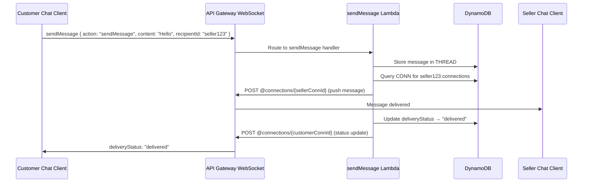
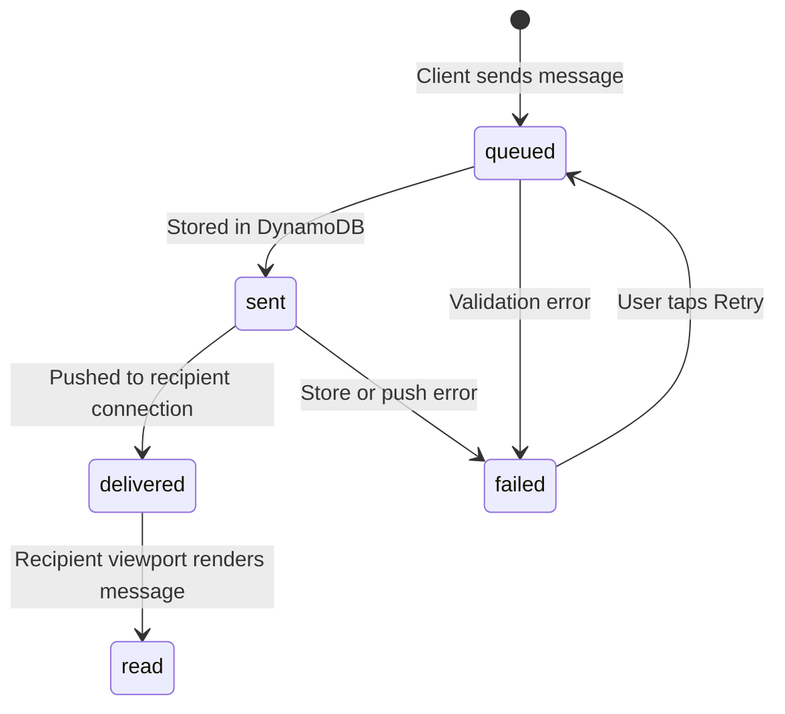

# Design Document: Chat & Messaging Quality

## Overview

This design replaces VyaparGyan's polling-based chat synchronization (`chat-sync-handler.ts` + `sync-client.ts`) with a WebSocket-based real-time messaging system. It adds message delivery receipts with visual status indicators, rich message types (product cards, order status cards, AI suggestion cards, quick-reply buttons), typing indicators, and seller presence tracking.

The system integrates with the existing DynamoDB single-table design, Twilio WhatsApp status webhooks, and Cognito JWT authentication. A new `WebSocketStack` CDK stack provisions the API Gateway WebSocket API and four Lambda handlers. The frontend gains a `useWebSocket` hook that coexists with the existing polling fallback.

### Key Design Decisions

1. **API Gateway WebSocket API** over self-managed WebSocket (e.g., EC2/ECS): zero infrastructure management, native IAM integration, pay-per-message pricing, and automatic scaling.
2. **Connection Registry in existing DynamoDB table** (not a separate table): keeps the single-table design consistent, reuses existing GSIs, and avoids cross-table transactions.
3. **Polling fallback coexistence**: the `useWebSocket` hook suppresses polling when connected but activates `sync-client.ts` after 5 failed reconnection attempts — no message loss during transition.
4. **Rich message schemas stored as JSON in `content` field**: the existing `THREAD#{userId} MSG#{ts}#{id}` pattern already stores `content: unknown`, so rich types are additive with no schema migration.
5. **Heartbeat-based presence** over dedicated presence service: leverages the same Connection Registry TTL mechanism, avoiding additional infrastructure.

## Architecture

```mermaid
graph TB
    subgraph "Frontend (Next.js)"
        WC[useWebSocket Hook]
        SC[sync-client.ts<br/>Polling Fallback]
        ML[MessageList]
        CC[ChatComposer]
        TI[TypingIndicator]
        SI[MessageStatus]
    end

    subgraph "API Gateway"
        WS[WebSocket API<br/>wss://ws.vyapargyan.com]
        HTTP[HTTP API<br/>Existing REST]
    end

    subgraph "Lambda Handlers"
        CON[$connect Handler]
        DIS[$disconnect Handler]
        DEF[$default Handler<br/>heartbeat / typing / markRead / sync]
        SM[sendMessage Handler]
        SWH[status-webhook-handler.ts<br/>Existing - Enhanced]
    end

    subgraph "DynamoDB (Single Table)"
        CR[Connection Registry<br/>CONN#{connectionId}]
        MT[Message Threads<br/>THREAD#{userId}]
        PR[Presence Records<br/>PRESENCE#{userId}]
    end

    subgraph "External"
        TW[Twilio WhatsApp<br/>Status Callbacks]
        EB[EventBridge<br/>Order Status Events]
    end

    WC -->|WebSocket| WS
    SC -->|HTTP Poll| HTTP
    WS --> CON
    WS --> DIS
    WS --> DEF
    WS --> SM

    CON -->|Store connection| CR
    DIS -->|Delete connection| CR
    DEF -->|Update TTL / broadcast typing| CR
    SM -->|Store message| MT
    SM -->|Push to recipients| WS
    SM -->|Update presence| PR

    SWH -->|Update delivery status| MT
    SWH -->|Push status update via WS| WS
    TW --> SWH
    EB -->|Order status change| SM
```

### WebSocket Message Flow



## Components and Interfaces

### 1. WebSocketStack (CDK)

New CDK stack: `infra/cdk/lib/stacks/websocket-stack.ts`

```typescript
interface WebSocketStackProps extends cdk.StackProps {
  config: EnvironmentConfig;
  table: Table;
  userPool: UserPool;
}
```

Resources created:
- `WebSocketApi` — API Gateway WebSocket API with routes: `$connect`, `$disconnect`, `$default`, `sendMessage`
- 4 Lambda functions (Node.js 20, ARM64, 256MB, 30s timeout)
- IAM permissions: DynamoDB read/write, `execute-api:ManageConnections` for `@connections` POST
- Stack output: WebSocket endpoint URL (`wss://{api-id}.execute-api.{region}.amazonaws.com/{stage}`)

### 2. Connect Handler

`services/api/src/handlers/websocket/connect.ts`

```typescript
// Input: APIGatewayProxyEvent (WebSocket $connect)
// Query param: ?token=<JWT>
// Output: 200 (allow) or 401 (deny)

interface ConnectHandler {
  // 1. Extract JWT from queryStringParameters.token
  // 2. Verify JWT against Cognito User Pool
  // 3. Extract userId, role from claims
  // 4. Store Connection Registry item in DynamoDB
  // 5. Return 200
}
```

### 3. Disconnect Handler

`services/api/src/handlers/websocket/disconnect.ts`

```typescript
// Input: APIGatewayProxyEvent (WebSocket $disconnect)
// Output: 200

interface DisconnectHandler {
  // 1. Extract connectionId from requestContext
  // 2. Delete CONN#{connectionId} from DynamoDB
  // 3. Check if user has remaining connections
  // 4. If no connections remain, update PRESENCE#{userId} with lastSeen
  // 5. Return 200
}
```

### 4. Default Handler

`services/api/src/handlers/websocket/default.ts`

Handles: `heartbeat`, `typing`, `markRead`, `sync` actions.

```typescript
interface WebSocketAction {
  action: 'heartbeat' | 'typing' | 'markRead' | 'sync';
  [key: string]: unknown;
}

interface HeartbeatAction {
  action: 'heartbeat';
}

interface TypingAction {
  action: 'typing';
  conversationUserId: string; // The other participant
  isTyping: boolean;
}

interface MarkReadAction {
  action: 'markRead';
  messageId: string;
}

interface SyncAction {
  action: 'sync';
  lastMessageTimestamp: string;
}
```

### 5. SendMessage Handler

`services/api/src/handlers/websocket/send-message.ts`

```typescript
interface SendMessagePayload {
  action: 'sendMessage';
  recipientId: string;
  messageType: MessageType;
  content: RichMessageContent;
  clientMessageId?: string; // Client-generated ID for dedup
}

type MessageType = 'text' | 'image' | 'audio' | 'interactive'
  | 'product_card' | 'order_status' | 'ai_suggestion' | 'quick_reply' | 'system';
```

### 6. Frontend WebSocket Client

`apps/web/lib/websocket-client.ts`

```typescript
interface WebSocketClient {
  connect(token: string): void;
  disconnect(): void;
  send(action: string, payload: Record<string, unknown>): void;
  onMessage(handler: (event: WebSocketEvent) => void): void;
  onStateChange(handler: (state: ConnectionState) => void): void;
  readonly state: ConnectionState;
}

type ConnectionState = 'connecting' | 'connected' | 'reconnecting' | 'disconnected';
```

### 7. useWebSocket React Hook

`apps/web/hooks/useWebSocket.ts`

```typescript
interface UseWebSocketReturn {
  connectionState: ConnectionState;
  sendMessage: (recipientId: string, content: RichMessageContent, messageType?: MessageType) => void;
  sendTyping: (recipientId: string) => void;
  markRead: (messageId: string) => void;
  messages: ChatMessage[];
  typingUsers: Map<string, boolean>;
  presenceMap: Map<string, PresenceInfo>;
}
```

### 8. MessageStatus Component

`apps/web/components/Chat/MessageStatus.tsx`

Renders delivery status icons. Extends the existing `DeliveryStatusIcon` in `MessageList.tsx` with retry capability.

### 9. Rich Message Card Components

- `apps/web/components/Chat/ProductCard.tsx` — product image, name, price, "Add to cart" button
- `apps/web/components/Chat/OrderStatusCard.tsx` — order number, status badge, items, total
- `apps/web/components/Chat/AISuggestionCard.tsx` — title, body, action buttons
- `apps/web/components/Chat/QuickReplyButtons.tsx` — horizontally scrollable pill buttons

## Data Models

### Connection Registry Item

```
PK: CONN#{connectionId}
SK: META
GSI1PK: USER_CONN#{userId}
GSI1SK: CONN#{connectionId}

Fields:
  connectionId: string
  userId: string
  role: 'customer' | 'seller' | 'admin'
  connectedAt: string (ISO 8601)
  expiresAt: number (epoch seconds, 24h TTL)
```

### Presence Record

```
PK: PRESENCE#{userId}
SK: STATUS

Fields:
  userId: string
  online: boolean
  lastSeen: string (ISO 8601)
  connectionCount: number
  updatedAt: string (ISO 8601)
  expiresAt: number (epoch seconds, 7-day TTL)
```

### Extended Message Thread Item (existing pattern, new fields)

```
PK: THREAD#{userId}
SK: MSG#{timestamp}#{messageId}

Existing fields: userId, messageId, direction, channel, senderRole, messageType, content,
                 deliveryStatus, sentAt, deliveredAt, readAt, failedAt, errorCode, createdAt, expiresAt

New messageType values: 'product_card' | 'order_status' | 'ai_suggestion' | 'quick_reply'
```

### Rich Message Content Schemas

```typescript
// text
interface TextContent {
  body: string;
}

// product_card
interface ProductCardContent {
  productId: string;
  name: string;
  price: number;
  imageUrl: string;
  sellerId: string;
  description: string;
}

// order_status
interface OrderStatusContent {
  orderId: string;
  orderNumber: string;
  status: string;
  items: Array<{ name: string; quantity: number }>;
  totalAmount: number;
  updatedAt: string;
}

// ai_suggestion
interface AISuggestionContent {
  suggestionId: string;
  title: string;
  body: string;
  actionType: string;
  actionPayload: Record<string, unknown>;
}

// quick_reply
interface QuickReplyContent {
  prompt: string;
  options: Array<{ label: string; value: string }>;
}
```

### Delivery Status Lifecycle




## Correctness Properties

*A property is a characteristic or behavior that should hold true across all valid executions of a system — essentially, a formal statement about what the system should do. Properties serve as the bridge between human-readable specifications and machine-verifiable correctness guarantees.*

### Property 1: Connection Registry round-trip

*For any* valid connectionId and userId, storing a Connection Registry item via the Connect Handler and then deleting it via the Disconnect Handler should result in no Connection Registry item existing for that connectionId.

**Validates: Requirements 2.1, 2.3**

### Property 2: Connection Registry item structure

*For any* valid connectionId, userId, and role, the Connection Registry item stored by the Connect Handler should have `PK = "CONN#{connectionId}"`, `SK = "META"`, `GSI1PK = "USER_CONN#{userId}"`, `GSI1SK = "CONN#{connectionId}"`, and `expiresAt` within 24 hours (±1 second) of `connectedAt`.

**Validates: Requirements 2.1, 2.5**

### Property 3: Invalid JWT rejection

*For any* string that is not a valid Cognito JWT (empty, whitespace-only, malformed base64, expired, wrong issuer), the Connect Handler should return a 401 status code and not store any Connection Registry item.

**Validates: Requirements 2.4**

### Property 4: Message dual-thread storage

*For any* valid message with a senderId and recipientId, the sendMessage handler should store the message in both `THREAD#{senderId}` and `THREAD#{recipientId}` with `deliveryStatus = "sent"` and a non-null `sentAt` timestamp.

**Validates: Requirements 3.1, 6.1**

### Property 5: Message fan-out to all user connections

*For any* userId with N active connections (N ≥ 0) in the Connection Registry, when a message or status update targets that userId, the system should attempt to push the payload to exactly N connections via the API Gateway Management API.

**Validates: Requirements 3.2, 3.3, 6.4, 7.2**

### Property 6: Delivery status transition on successful push

*For any* message that is successfully pushed to at least one recipient connection, the `deliveryStatus` should transition from `"sent"` to `"delivered"` and `deliveredAt` should be set. For any `markRead` action with a valid messageId, the `deliveryStatus` should transition to `"read"` and `readAt` should be set.

**Validates: Requirements 6.2, 6.3**

### Property 7: Exponential backoff calculation

*For any* reconnection attempt number N (1 ≤ N ≤ 20), the backoff delay should equal `min(2^(N-1) × 1000, 30000)` milliseconds.

**Validates: Requirements 4.3**

### Property 8: Heartbeat TTL refresh

*For any* heartbeat received at time T for a valid connectionId, the Connection Registry item's `expiresAt` should be updated to `T + 86400` seconds (24 hours), within ±1 second tolerance.

**Validates: Requirements 5.1**

### Property 9: Twilio status mapping

*For any* Twilio status string in `{sent, delivered, read, failed, undelivered}`, the mapping function should produce the corresponding DeliveryStatus: `sent → sent`, `delivered → delivered`, `read → read`, `failed → failed`, `undelivered → failed`. For any string not in this set, the mapping should return `undefined`.

**Validates: Requirements 7.3**

### Property 10: Rich message content serialization round-trip

*For any* valid Rich_Message object (of type `text`, `product_card`, `order_status`, `ai_suggestion`, or `quick_reply`), serializing the `content` field to JSON and deserializing it back should produce a deeply equal object.

**Validates: Requirements 12.3**

### Property 11: Message type and content schema validation

*For any* messageType in `{text, image, audio, interactive, product_card, order_status, ai_suggestion, quick_reply, system}` paired with content conforming to its documented schema, validation should pass. For any messageType not in this set, or content missing required fields for its type, validation should fail.

**Validates: Requirements 12.1, 12.2, 9.1, 10.1, 11.1, 11.3**

### Property 12: Typing debounce

*For any* sequence of keystroke events within a 3-second window, the Chat_Client should emit at most one `typing` WebSocket action during that window.

**Validates: Requirements 13.3**

### Property 13: Typing broadcast excludes sender

*For any* typing event from userId A in a conversation with participants {A, B, ...}, the Message_Router should push the typing event to all connections of participants other than A, and to zero connections of A.

**Validates: Requirements 13.5**

### Property 14: Seller presence determination

*For any* seller userId, the seller is considered online if and only if they have at least one Connection Registry item with a heartbeat received within the last 60 seconds. When transitioning from online to offline, the `lastSeen` timestamp on the PRESENCE record should be set to the time of the last heartbeat.

**Validates: Requirements 14.1, 14.2**

### Property 15: Auto-reply to offline seller

*For any* message sent by a customer to a seller who is currently offline (no active connections with recent heartbeat), the system should create a `system` type message in the customer's thread containing an estimated response time.

**Validates: Requirements 14.4**

### Property 16: Message deduplication

*For any* list of messages received from both WebSocket and polling sources containing duplicate messageIds, the deduplicated output list should contain each messageId exactly once, and the total count should equal the number of unique messageIds in the input.

**Validates: Requirements 15.5**

### Property 17: Reconnection sync timestamp

*For any* Chat_Client that reconnects after receiving messages up to timestamp T, the sync action sent on reconnection should contain `lastMessageTimestamp = T`, ensuring no messages are missed.

**Validates: Requirements 4.6**

## Error Handling

### WebSocket Connection Errors

| Error | Handler | Response |
|-------|---------|----------|
| Invalid/missing JWT on `$connect` | Connect Handler | Return 401, connection rejected |
| DynamoDB write failure on connect | Connect Handler | Return 500, connection rejected, log error |
| DynamoDB delete failure on disconnect | Disconnect Handler | Return 200 (best effort), log error, rely on TTL cleanup |
| Malformed WebSocket action payload | Default Handler | Send error frame `{ error: "INVALID_PAYLOAD" }` back to sender |

### Message Delivery Errors

| Error | Handler | Response |
|-------|---------|----------|
| DynamoDB write failure (message store) | sendMessage Handler | Set deliveryStatus=failed, push failure notification to sender |
| GoneException (410) on push | sendMessage Handler | Delete stale connection, continue pushing to remaining connections |
| All recipient connections fail | sendMessage Handler | Set deliveryStatus=sent (not delivered), message available on next sync |
| API Gateway Management API throttle | sendMessage Handler | Exponential backoff retry (3 attempts), then mark as sent-only |

### Client-Side Errors

| Error | Handler | Response |
|-------|---------|----------|
| WebSocket connection refused | Chat_Client | Exponential backoff reconnection (1s → 2s → 4s → 8s → 16s → 30s cap) |
| 5 consecutive reconnection failures | Chat_Client | Activate polling fallback via `sync-client.ts` |
| Heartbeat ack timeout (60s) | Chat_Client | Treat as connection failure, initiate reconnection |
| Message send failure | Chat_Client | Show failed status with Retry button, queue for retry |

### Twilio Status Webhook Errors

| Error | Handler | Response |
|-------|---------|----------|
| Invalid Twilio signature | Status Webhook Handler | Return 403, log error |
| Message not found in THREAD | Status Webhook Handler | Return 200 (prevent Twilio retry), log warning |
| No active sender connections | Status Webhook Handler | Store status in DynamoDB only, client picks up on next sync |
| Duplicate status callback | Status Webhook Handler | Idempotency check via `IDEMPOTENCY#{messageSid}#{status}`, skip if duplicate |

## Testing Strategy

### Property-Based Tests (fast-check)

Property-based tests use [fast-check](https://github.com/dubzzz/fast-check) for TypeScript. Each property test runs a minimum of 100 iterations with randomly generated inputs.

Target test files:
- `services/api/src/handlers/websocket/__tests__/websocket.property.test.ts` — Properties 1-6, 8-9, 13-15
- `services/api/src/handlers/websocket/__tests__/message-schemas.property.test.ts` — Properties 10-11
- `apps/web/lib/__tests__/websocket-client.property.test.ts` — Properties 7, 12, 16-17

Each test is tagged with: `Feature: chat-messaging-quality, Property {N}: {title}`

### Unit Tests (Jest)

- Connect/Disconnect handlers: mock DynamoDB, verify item creation/deletion
- sendMessage handler: mock DynamoDB + API Gateway Management API, verify dual-thread storage and fan-out
- Default handler: mock DynamoDB, verify heartbeat TTL update, typing broadcast, markRead
- Status webhook enhancement: mock Connection Registry query + API Gateway push
- MessageStatus component: render with each deliveryStatus, verify correct icon
- ProductCard/OrderStatusCard/AISuggestionCard/QuickReplyButtons: render with sample data, verify elements
- useWebSocket hook: mock WebSocket, verify state transitions, polling suppression/activation, deduplication
- Chat_Client reconnection: fake timers, verify exponential backoff and fallback activation

### Integration Tests

- End-to-end WebSocket message flow: connect → send → receive → markRead → status update
- Twilio status webhook → DynamoDB update → WebSocket push to sender
- Order status EventBridge event → order_status card in customer thread
- WebSocket → polling fallback → WebSocket reconnection with sync

### CDK Snapshot Tests

- `infra/cdk/test/websocket-stack.test.ts`: verify synthesized template contains WebSocket API, 4 Lambda functions, IAM policies, and stack outputs
