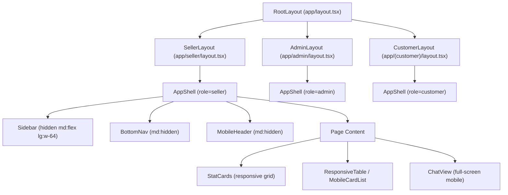
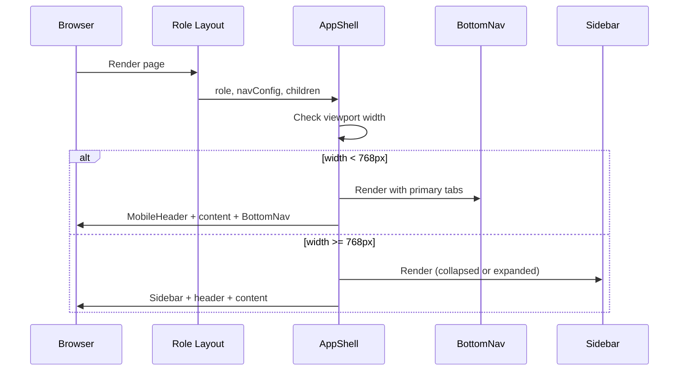

# Design Document: Mobile-First UI

## Overview

This design converts VyaparGyan's desktop-first web application to a mobile-first responsive layout. The current app has three role-specific layouts — seller (8-item sidebar), admin (4-item sidebar), and customer (top nav bar) — all of which degrade poorly on mobile viewports. Indian sellers primarily use budget Android phones on spotty 3G/4G, so the mobile experience is the primary use case.

The approach replaces per-role sidebar/top-nav layouts with a unified `AppShell` component that renders the correct navigation pattern based on viewport width: bottom tab bar on mobile (<768px), collapsible icon sidebar on tablet (768–1024px), and full sidebar on desktop (>1024px). Data tables transform to card lists on mobile, the chat view goes full-screen with proper keyboard handling, and a PWA foundation enables offline access and home screen installation.

No new packages are required beyond Tailwind responsive utilities. The optional `next-pwa` package may be added for service worker generation. No backend changes are needed — this is purely a frontend layout refactor.

## Architecture

### Component Hierarchy



### Breakpoint Strategy

| Breakpoint | Width | Navigation | Layout |
|---|---|---|---|
| Mobile | <768px (`md`) | BottomNav + MobileHeader | Single column, stacked cards |
| Tablet | 768–1024px (`md`–`lg`) | Collapsible icon sidebar | 2-column grids |
| Desktop | >1024px (`lg`) | Full sidebar with labels | Current layout preserved |

These align with Tailwind's default breakpoints (`md: 768px`, `lg: 1024px`) and the existing `sm: 640px` for minor adjustments.

### Navigation Configuration

Each role defines a `NavConfig` with primary tabs (shown in BottomNav) and overflow items (shown in MoreMenu):

```typescript
type NavConfig = {
  role: 'seller' | 'customer' | 'admin';
  primary: NavItem[];   // max 5, shown in BottomNav
  overflow: NavItem[];  // shown in MoreMenu sheet
};

type NavItem = {
  label: string;
  href: string;
  icon: LucideIcon;
};
```

| Role | Primary Tabs (5) | Overflow |
|---|---|---|
| Seller | Overview, Inventory, Orders, Inbox, More | AI Insights, Approvals, Campaigns, Settings |
| Customer | Catalog, Chat, Cart, Orders, Account | — (no overflow) |
| Admin | Overview, Sellers, Audit, Health, More | Settings |

## Components and Interfaces

### New Components (in `apps/web/components/layout/`)

#### `AppShell.tsx`

The unified layout wrapper. Accepts `role` and `navConfig` props. Uses a `useMediaQuery` hook (or Tailwind `md:hidden`/`hidden md:flex` classes) to conditionally render BottomNav vs Sidebar.

```typescript
interface AppShellProps {
  children: React.ReactNode;
  role: 'seller' | 'customer' | 'admin';
  navConfig: NavConfig;
  headerActions?: React.ReactNode; // e.g., store picker, role badge
}
```

Renders:
- **Mobile (<768px)**: `MobileHeader` at top + `children` + `BottomNav` at bottom. Main content gets `pb-16` to avoid BottomNav overlap.
- **Tablet (768–1024px)**: Icon-only sidebar (w-16) that expands to w-64 on hover. Content area shifts with `pl-16` / `pl-64`.
- **Desktop (>1024px)**: Full sidebar (w-64) with icons + labels. Content area with `pl-64`. This matches the current seller/admin layout.

#### `BottomNav.tsx`

Fixed bottom tab bar for mobile viewports.

```typescript
interface BottomNavProps {
  items: NavItem[];
  overflowItems?: NavItem[];
  onMorePress?: () => void;
}
```

Key implementation details:
- `position: fixed; bottom: 0; left: 0; right: 0; z-index: 50`
- `padding-bottom: env(safe-area-inset-bottom)` for notched devices
- Each tab: 48px min height, icon (20px) + label (12px) stacked vertically
- Active tab: `text-indigo-600` + `bg-indigo-50` indicator
- Uses `usePathname()` from Next.js for active route detection
- "More" tab (5th position) toggles `MoreMenu` bottom sheet

#### `MoreMenu.tsx`

Bottom sheet overlay triggered by the "More" tab.

```typescript
interface MoreMenuProps {
  items: NavItem[];
  open: boolean;
  onClose: () => void;
}
```

- Slides up from bottom with `backdrop-blur-sm` overlay
- Each item: icon + label, 48px min tap target
- Closes on item tap or backdrop tap
- Includes logout and switch account actions at bottom

#### `MobileHeader.tsx`

Minimal top bar for mobile viewports.

```typescript
interface MobileHeaderProps {
  title: string;
  showBack?: boolean;
  onBack?: () => void;
  actions?: React.ReactNode;
}
```

- Height: 48px
- Left: back arrow (when `showBack=true`) or brand logo
- Center: page title
- Right: optional action buttons (e.g., store picker, cart badge)

#### `Sidebar.tsx`

Extracted from existing seller/admin layouts. Supports collapsed (icon-only) and expanded (icon + label) modes.

```typescript
interface SidebarProps {
  items: NavItem[];
  collapsed?: boolean;
  onToggle?: () => void;
  headerSlot?: React.ReactNode;
  footerSlot?: React.ReactNode;
}
```

- Collapsed mode: `w-16`, icons only, tooltip on hover
- Expanded mode: `w-64`, icons + labels (current behavior)
- Tablet: starts collapsed, expands on hover (`onMouseEnter`/`onMouseLeave`)
- Desktop: always expanded

### Modified Components

#### `MobileProductCard.tsx` (new, in `apps/web/components/ui/`)

Card representation of a product row for mobile viewports.

```typescript
interface MobileProductCardProps {
  product: Product;
  onTap?: (product: Product) => void;
}
```

Displays: product name, category badge, price (₹ formatted), stock count with color coding, stock age, active/inactive status badge. 16px padding, 8px gap between cards.

#### `MobileOrderCard.tsx` (new, in `apps/web/components/ui/`)

Card representation of an order row for mobile viewports.

```typescript
interface MobileOrderCardProps {
  order: Order;
  onTap?: (order: Order) => void;
}
```

Displays: order ID (truncated), customer name, amount (₹), status badge with icon, date.

### Layout Integration

Each existing role layout (`seller/layout.tsx`, `admin/layout.tsx`, `(customer)/layout.tsx`) will be refactored to use `AppShell` instead of their current inline sidebar/nav implementations. The role-specific nav configuration is defined in each layout and passed to `AppShell`.



## Data Models

No new data models are introduced. This feature is purely a frontend layout refactor. The existing data types (`Product`, `Order`, `ChatMessage`, `Cart`) are reused as-is in the new mobile card components.

### Navigation Configuration Data

```typescript
// apps/web/components/layout/nav-config.ts

import {
  LayoutDashboard, Package, ShoppingBag, MessageSquare,
  Sparkles, ShieldCheck, Megaphone, MoreHorizontal,
  Search, ShoppingCart, User, Users, FileText, Activity, Settings
} from 'lucide-react';

export const SELLER_NAV: NavConfig = {
  role: 'seller',
  primary: [
    { label: 'Overview', href: '/seller', icon: LayoutDashboard },
    { label: 'Inventory', href: '/seller/inventory', icon: Package },
    { label: 'Orders', href: '/seller/orders', icon: ShoppingBag },
    { label: 'Inbox', href: '/seller/inbox', icon: MessageSquare },
    { label: 'More', href: '#more', icon: MoreHorizontal },
  ],
  overflow: [
    { label: 'AI Insights', href: '/seller/insights', icon: Sparkles },
    { label: 'Approvals', href: '/seller/approvals', icon: ShieldCheck },
    { label: 'Campaigns', href: '/seller/campaigns', icon: Megaphone },
  ],
};

export const CUSTOMER_NAV: NavConfig = {
  role: 'customer',
  primary: [
    { label: 'Catalog', href: '/catalog', icon: Search },
    { label: 'Chat', href: '/chat', icon: MessageSquare },
    { label: 'Cart', href: '/cart', icon: ShoppingCart },
    { label: 'Orders', href: '/orders', icon: ShoppingBag },
    { label: 'Account', href: '/account', icon: User },
  ],
  overflow: [],
};

export const ADMIN_NAV: NavConfig = {
  role: 'admin',
  primary: [
    { label: 'Overview', href: '/admin', icon: LayoutDashboard },
    { label: 'Sellers', href: '/admin/sellers', icon: Users },
    { label: 'Audit', href: '/admin/audit', icon: FileText },
    { label: 'Health', href: '/admin/system', icon: Activity },
    { label: 'More', href: '#more', icon: MoreHorizontal },
  ],
  overflow: [
    { label: 'Settings', href: '/admin/settings', icon: Settings },
  ],
};
```

### PWA Manifest

```json
{
  "name": "VyaparGyan",
  "short_name": "VyaparGyan",
  "description": "AI-Powered Marketplace for Indian Retailers",
  "start_url": "/",
  "display": "standalone",
  "background_color": "#ffffff",
  "theme_color": "#4f46e5",
  "icons": [
    { "src": "/icons/icon-192.png", "sizes": "192x192", "type": "image/png" },
    { "src": "/icons/icon-512.png", "sizes": "512x512", "type": "image/png" }
  ]
}
```

### Service Worker Caching Strategy

| Resource | Strategy | Rationale |
|---|---|---|
| JS/CSS bundles | Cache-first | Static export, content-hashed filenames |
| Images/icons | Cache-first | Rarely change |
| API responses | Network-first | Need fresh data when online |
| Offline fallback | Pre-cached | Available immediately when offline |


## Correctness Properties

*A property is a characteristic or behavior that should hold true across all valid executions of a system — essentially, a formal statement about what the system should do. Properties serve as the bridge between human-readable specifications and machine-verifiable correctness guarantees.*

Most acceptance criteria in this feature are UI rendering and layout concerns (breakpoint-conditional rendering, CSS sizing, visual transitions) that are best validated with example-based component tests and visual regression tests. The following properties capture the universal logic that does vary meaningfully with input.

### Property 1: Active tab matches current route

*For any* NavItem in any role's navigation configuration, when the current pathname matches that item's `href`, the BottomNav component shall render that tab with the active highlight style (indigo-600) and no other tab shall have the active style.

**Validates: Requirements 2.5**

### Property 2: Product card displays all required fields

*For any* valid Product object (with non-empty name, a category, a numeric price, a stock quantity, and a status), the MobileProductCard component shall render output containing the product name, category name, formatted price, stock count, and status text.

**Validates: Requirements 4.4**

### Property 3: Order card displays all required fields

*For any* valid Order object (with an ID, customer name, amount, status, and date), the MobileOrderCard component shall render output containing the order ID, customer name, formatted amount, status label, and formatted date.

**Validates: Requirements 4.5**

### Property 4: Card tap navigates to correct detail URL

*For any* Product with id `pid`, tapping its MobileProductCard shall trigger navigation to `/seller/inventory/${pid}`. *For any* Order with id `oid`, tapping its MobileOrderCard shall trigger navigation to `/seller/orders/${oid}`.

**Validates: Requirements 4.7**

### Property 5: Install prompt triggers on third visit

*For any* visit count `n` where `n >= 3`, the PWA install prompt logic shall return `true` (show prompt). *For any* visit count `n` where `n < 3`, it shall return `false`.

**Validates: Requirements 8.5**

## Error Handling

### Navigation Errors

- If `usePathname()` returns an unexpected route not in the nav config, no tab is highlighted (graceful degradation, no crash).
- If the MoreMenu overflow items array is empty (e.g., customer role), the "More" tab is not rendered — the 5th primary tab is used directly.

### Viewport Detection Errors

- If `window.matchMedia` is unavailable (SSR), default to desktop layout. The AppShell uses a `useMediaQuery` hook that returns `false` during SSR, so the sidebar renders by default and the BottomNav hydrates on the client.
- Rapid resize events are debounced to prevent layout thrashing.

### Chat Keyboard Handling

- If `visualViewport` API is unavailable (older browsers), fall back to `window.innerHeight` for keyboard detection.
- If `100dvh` is unsupported, fall back to `100vh` with a JS-based resize listener.

### PWA Errors

- If service worker registration fails (e.g., non-HTTPS in dev), log a warning and continue without offline support.
- If `manifest.json` fails to load, the app continues functioning as a normal web app.
- If `beforeinstallprompt` event never fires (unsupported browser), the install prompt logic is silently skipped.

### Camera/OCR Errors

- If camera access is denied via permissions API, fall back to standard `<input type="file">` without `capture` attribute (Requirement 6.6).
- If image file is too large (>10MB), show an error toast and prevent upload.

### Data Rendering Errors

- If a product or order has missing fields (e.g., null category), the MobileCard renders a fallback placeholder ("—") instead of crashing.
- If the product list or order list is empty, an EmptyState component is shown (existing pattern).

## Testing Strategy

### Unit Tests (Example-Based)

Focus on specific rendering scenarios at key breakpoints:

- **AppShell breakpoint rendering**: Verify BottomNav renders at 767px, sidebar at 768px, full sidebar at 1025px (Requirements 1.1–1.3)
- **Role-specific nav configs**: Verify seller/customer/admin each get correct tab labels and icons (Requirements 2.2–2.4)
- **BottomNav tab count**: Verify exactly 5 tabs rendered for each role (Requirement 2.1)
- **MoreMenu interaction**: Verify More tab opens sheet with overflow items (Requirement 2.8)
- **Stat card layout**: Verify stacked/2-col/4-col at mobile/tablet/desktop (Requirements 3.1–3.3)
- **Table vs card rendering**: Verify table at desktop, cards at mobile for inventory and orders pages (Requirements 4.1–4.3)
- **Chat full-screen mode**: Verify 100dvh layout at mobile, standard layout at desktop (Requirements 5.1, 5.7)
- **Camera capture attribute**: Verify `capture="environment"` on mobile OCR input (Requirement 6.1)
- **CSV modal full-screen**: Verify full-screen at mobile, centered modal at desktop (Requirement 7.1)
- **Manifest validation**: Verify manifest.json contains required fields (Requirement 8.1)

### Property-Based Tests

Using `fast-check` for property-based testing with minimum 100 iterations per property:

- **Property 1** (Active tab highlighting): Generate random NavItem selections from all role configs, set pathname to match, verify only that tab is active.
  - Tag: `Feature: mobile-first-ui, Property 1: Active tab matches current route`
- **Property 2** (Product card fields): Generate random Product objects with arbitrary names, prices, categories, verify all fields present in rendered output.
  - Tag: `Feature: mobile-first-ui, Property 2: Product card displays all required fields`
- **Property 3** (Order card fields): Generate random Order objects with arbitrary IDs, names, amounts, statuses, verify all fields present in rendered output.
  - Tag: `Feature: mobile-first-ui, Property 3: Order card displays all required fields`
- **Property 4** (Card tap navigation): Generate random product/order IDs, tap card, verify navigation URL matches expected pattern.
  - Tag: `Feature: mobile-first-ui, Property 4: Card tap navigates to correct detail URL`
- **Property 5** (Install prompt logic): Generate random visit counts (0–100), verify prompt shows iff count >= 3.
  - Tag: `Feature: mobile-first-ui, Property 5: Install prompt triggers on third visit`

### Integration Tests

- **PWA offline behavior**: Load app, enable offline mode, verify cached assets load and offline fallback page displays for uncached routes (Requirements 8.2–8.4)
- **Service worker registration**: Verify service worker registers successfully in production build (Requirement 8.2)

### Visual/Manual Testing

- **Safe area insets**: Test on iPhone (notch) and Android (gesture nav) for correct bottom padding (Requirements 2.7, 5.3)
- **Virtual keyboard**: Test chat input stays visible when keyboard opens on iOS Safari and Android Chrome (Requirement 5.2)
- **Lighthouse PWA audit**: Run Lighthouse and verify score >= 80 (Requirement 8.6)
- **Android install**: Test home screen installation on Android Chrome (Requirement 8.7)
- **Pull-to-refresh**: Test on real mobile devices for card list refresh (Requirement 4.6)
