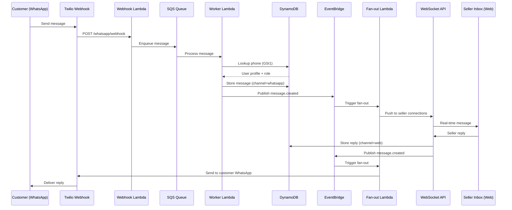
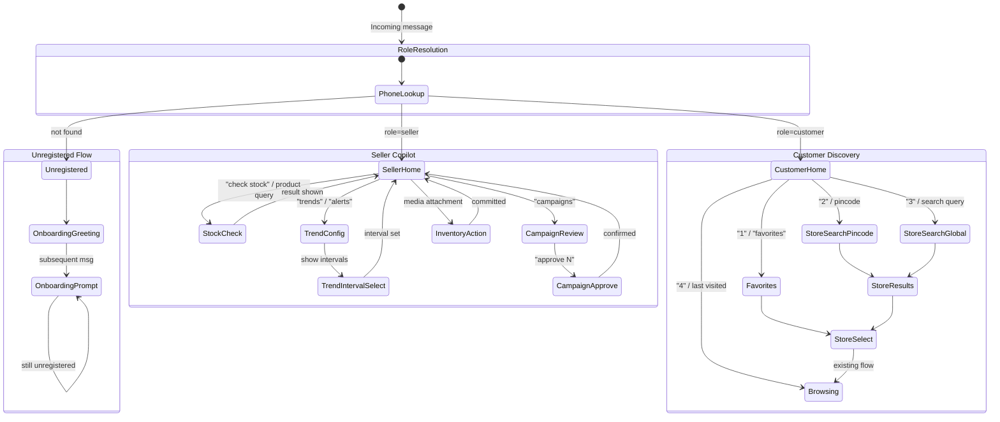
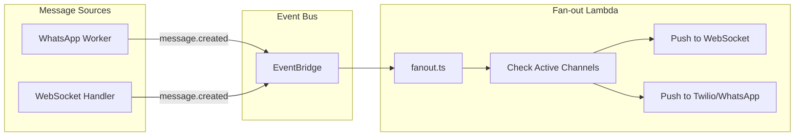
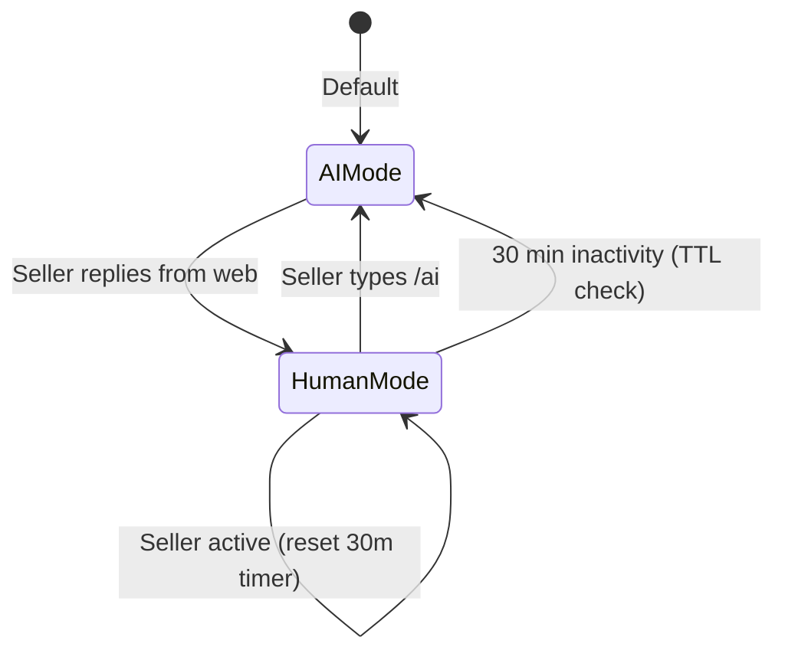
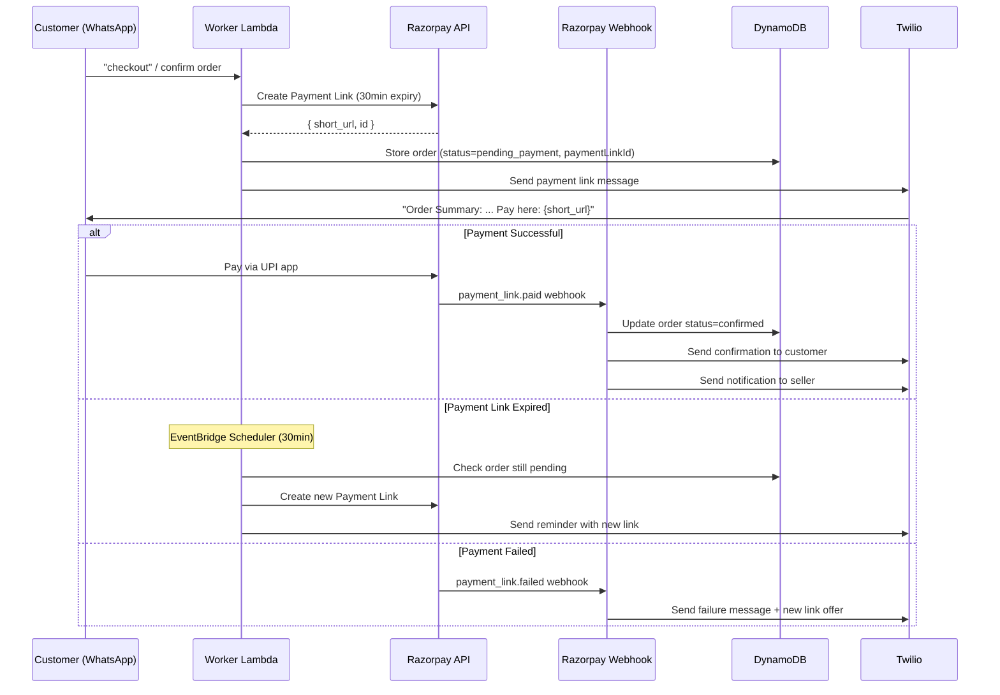
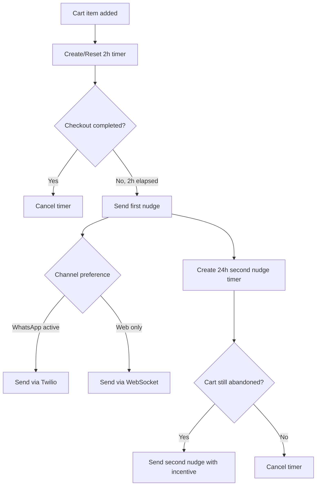
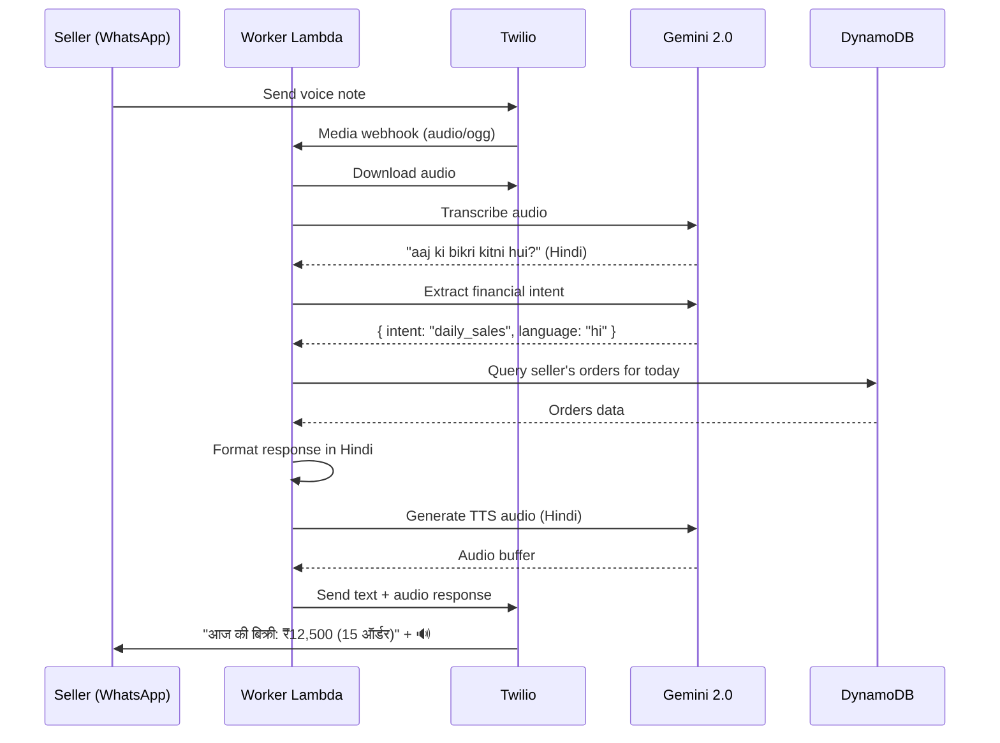

# Design Document — VyaparGyan Next Features

## Overview

This design covers seven features that extend VyaparGyan from a basic WhatsApp-enabled marketplace into a fully omnichannel, AI-driven commerce platform for Indian local retailers. The features integrate deeply with the existing single-table DynamoDB design, EventBridge event bus, Twilio messaging, Razorpay Route payments, and Gemini/Grok AI services.

The seven features are:

1. **Role-Based Smart WhatsApp Routing** — Dynamic bot behavior based on user role (seller/customer/unregistered)
2. **Real-Time Omnichannel Chat Synchronization** — Unified message storage and bi-directional push across WhatsApp and Web Chat
3. **AI-Powered Inventory & Campaign Operations** — WhatsApp media uploads for inventory and omnichannel campaign dispatch
4. **Admin Dashboard Expansion** — Five new admin pages (Customers, Disputes, Financials, Campaigns, Catalog)
5. **UPI Intent Integration** — Razorpay Payment Link generation for WhatsApp checkout
6. **Automated Abandoned Cart Nudges** — EventBridge Scheduler-based cart recovery
7. **Voice-Activated Financial Reports** — Voice pipeline extension for financial queries in 8 Indian languages

### Current System State

- **55+ Lambda handlers** across 8 CDK stacks
- WhatsApp webhook handler with SQS-backed worker processing
- Session service managing state machine: `greeting → browsing → product_detail → cart → checkout`
- DynamoDB single-table design with GSIs for phone lookup, seller orders, customer orders, category index, seller stock
- Twilio adapter with WhatsApp send/receive and retry logic
- Razorpay adapter with payment link creation and Route transfers
- Gemini adapter for OCR (Khata book), voice transcription, TTS, and product image analysis
- Grok adapter for market trend analysis
- EventBridge for domain events and scheduled workers
- Next.js 14 web app with admin, seller, and customer portals

## Architecture

### System-Level Integration Diagram

```mermaid
graph TB
    subgraph "Inbound Channels"
        WA[WhatsApp / Twilio]
        WEB[Web Chat / WebSocket]
    end

    subgraph "API Layer"
        APIGW[API Gateway HTTP + WebSocket]
        WEBHOOK[WhatsApp Webhook Lambda]
        WSHANDLER[WebSocket Handler Lambda]
    end

    subgraph "Core Processing"
        SQS_WA[SQS: WhatsApp Queue]
        WORKER[WhatsApp Worker Lambda]
        ROLE[Role Resolver]
        INTENT[Intent Extractor - Gemini]
        HANDOFF[Handoff Controller]
    end

    subgraph "Role-Based Flows"
        ONBOARD[Onboarding Flow]
        SELLER_COP[Seller Copilot]
        CUST_DISC[Customer Discovery]
    end

    subgraph "Seller Copilot Services"
        STOCK[Stock Check]
        TREND[Trend Scheduler - EventBridge]
        CAMP_APPROVE[Campaign Approval]
        INV_UPLOAD[Inventory Upload]
    end

    subgraph "Omnichannel Messaging"
        EB[EventBridge: message.created]
        FANOUT[Fan-out Lambda]
        MSG_ROUTER[Message Router]
    end

    subgraph "Data Layer"
        DDB[(DynamoDB Single Table)]
        OS[(OpenSearch)]
        S3[(S3 Media Bucket)]
    end

    subgraph "External Services"
        TWILIO[Twilio API]
        RAZORPAY[Razorpay Route]
        GEMINI[Gemini 2.0]
        GROK[Grok API]
        BEDROCK[Amazon Bedrock]
    end

    subgraph "Admin Dashboard"
        ADMIN_CUST[/admin/customers]
        ADMIN_DISP[/admin/disputes]
        ADMIN_FIN[/admin/financials]
        ADMIN_CAMP[/admin/campaigns]
        ADMIN_CAT[/admin/catalog]
    end

    WA --> APIGW --> WEBHOOK --> SQS_WA --> WORKER
    WEB --> APIGW --> WSHANDLER

    WORKER --> ROLE --> DDB
    ROLE -->|unregistered| ONBOARD
    ROLE -->|seller| SELLER_COP
    ROLE -->|customer| CUST_DISC

    SELLER_COP --> STOCK --> DDB
    SELLER_COP --> TREND --> GROK
    SELLER_COP --> CAMP_APPROVE --> EB
    SELLER_COP --> INV_UPLOAD --> GEMINI

    CUST_DISC --> DDB
    CUST_DISC --> OS

    WORKER --> INTENT --> GEMINI
    WORKER --> HANDOFF --> DDB

    WORKER --> EB
    WSHANDLER --> EB
    EB --> FANOUT
    FANOUT --> TWILIO
    FANOUT --> WSHANDLER

    ADMIN_CUST --> DDB
    ADMIN_DISP --> DDB
    ADMIN_DISP --> RAZORPAY
    ADMIN_FIN --> RAZORPAY
    ADMIN_CAMP --> DDB
    ADMIN_CAT --> DDB
```

### Event Flow Architecture




## Components and Interfaces

### Feature 1: Role-Based Smart WhatsApp Routing

#### 1.1 Phone Normalization Utility

New file: `services/api/src/utils/phone-normalize.ts`

```typescript
/**
 * normalizeIndianPhone(raw: string): string
 *
 * Normalization rules:
 * - Strip "+91" prefix → "7001124396"
 * - Strip "91" prefix if 12 digits → "7001124396"
 * - Strip leading "0" if 11 digits → "7001124396"
 * - Strip all spaces, dashes, parentheses
 * - Validate result is exactly 10 digits starting with 6-9
 * - International numbers: store with country code as-is
 *
 * Returns: 10-digit normalized phone or original with country code
 * Throws: Error if phone cannot be normalized
 */
```

#### 1.2 Role Resolver Service

New file: `services/api/src/services/user-lookup.ts`

```typescript
interface ResolvedUser {
  userId: string;
  role: 'seller' | 'customer' | 'admin';
  profile: UserProfile;
}

/**
 * resolveUserByPhone(phone: string): Promise<ResolvedUser | null>
 *
 * 1. Normalize phone via normalizeIndianPhone()
 * 2. Query GSI1: GSI1PK = PHONE#{normalized}, GSI1SK = PROFILE
 * 3. Return { userId, role, profile } or null
 */
```

**DynamoDB Access Pattern — Phone Lookup GSI:**
```
GSI1PK: PHONE#{normalized_phone}    (e.g., PHONE#7001124396)
GSI1SK: PROFILE
Projection: ALL
```

#### 1.3 Session State Machine Extension

Current states: `greeting → browsing → product_detail → cart → checkout → closed`

Extended state machine per role:



#### 1.4 Seller Copilot Architecture

New file: `services/api/src/handlers/whatsapp/seller-copilot.ts`

**Stock Check Flow:**
1. Seller sends natural language query (e.g., "how much Amul Butter left?")
2. Gemini extracts product intent → `{ productName: "Amul Butter" }`
3. Query DynamoDB `SellerStockIndex` (GSI PK: `sellerId`, SK: `stockAddedDate`) with filter on product name
4. Return: product name, stock quantity, last restock date

**Gemini Stock Query Prompt:**
```
Extract the product name from this seller's stock query. Return JSON:
{
  "productName": string,
  "action": "check_stock" | "restock" | "summary"
}
Message: "{seller_message}"
```

#### 1.5 Trend Scheduler Service

New file: `services/api/src/services/trend-scheduler.ts`

```typescript
interface TrendConfig {
  sellerId: string;
  interval: '30m' | '1h' | '8h' | '24h';
  enabled: boolean;
  schedulerRuleArn?: string;
  lastUpdated: string;
}

/**
 * createOrUpdateSchedule(sellerId, interval): Promise<void>
 * - Maps interval to EventBridge Scheduler rate expression:
 *   30m → rate(30 minutes), 1h → rate(1 hour), 8h → rate(8 hours), 24h → rate(24 hours)
 * - Creates/updates EventBridge Scheduler rule targeting trend-analyzer-worker Lambda
 * - Stores config in DynamoDB: PK=SELLER#{id}, SK=TREND_CONFIG
 *
 * disableSchedule(sellerId): Promise<void>
 * - Deletes the EventBridge Scheduler rule
 * - Updates DynamoDB config: enabled=false
 */
```

**DynamoDB Record:**
```json
{
  "PK": "SELLER#seller-456",
  "SK": "TREND_CONFIG",
  "interval": "8h",
  "enabled": true,
  "schedulerRuleArn": "arn:aws:scheduler:...",
  "phoneNumber": "+917001124396",
  "lastUpdated": "2024-01-15T10:30:00.000Z"
}
```

#### 1.6 Customer Discovery Handler

New file: `services/api/src/handlers/whatsapp/customer-discovery.ts`

**Favorites Access Pattern:**
```
PK: CUSTOMER#{customerId}
SK: FAVORITE#{sellerId}
Attributes: storeName, addedAt
```

**Pincode/City Search — Seller Location GSI:**
```
GSI2PK: LOCATION#{pincode}   (e.g., LOCATION#400001)
GSI2SK: SELLER
Projection: sellerId, storeName, city, pincode
```

For city search, use a scan with filter on `city` attribute (case-insensitive) or maintain a separate GSI:
```
GSI3PK: CITY#{city_lowercase}   (e.g., CITY#mumbai)
GSI3SK: SELLER
```

**Global Search:** Forward to OpenSearch `sellers` index with fuzzy matching on `storeName`.

---

### Feature 2: Real-Time Omnichannel Chat Synchronization

#### 2.1 Unified Message Storage Schema

All messages stored in a single thread structure regardless of channel:

```
PK: THREAD#{userId}
SK: MSG#{timestamp}#{messageId}
```

**Message Record Attributes:**
```json
{
  "PK": "THREAD#cust-123",
  "SK": "MSG#1705315800000#msg-abc",
  "messageId": "msg-abc",
  "sessionId": "sess-456",
  "content": "I want 2 packets of Maggi",
  "senderType": "customer",
  "senderUserId": "cust-123",
  "channel": "whatsapp",
  "metadata": {
    "waMessageId": "wamid.abc123",
    "twilioSid": "SM123..."
  },
  "deliveryStatus": "delivered",
  "createdAt": "2024-01-15T10:30:00.000Z",
  "ttl": 1707907800
}
```

**Channel Values:** `"whatsapp"` | `"web"` | `"system"`

The `channel` field is added to the existing `MessageThread` interface in `dynamodb-adapter.ts`. Both web chat and WhatsApp UI render the same thread, with a channel indicator icon per message.

#### 2.2 EventBridge Fan-out Architecture

New file: `services/api/src/handlers/messaging/fanout.ts`



**EventBridge Event Schema:**
```json
{
  "source": "vyapargyan.messaging",
  "detail-type": "message.created",
  "detail": {
    "messageId": "msg-abc",
    "threadId": "THREAD#cust-123",
    "senderUserId": "cust-123",
    "senderType": "customer",
    "recipientUserId": "seller-456",
    "channel": "whatsapp",
    "content": "I want 2 packets of Maggi",
    "metadata": {}
  }
}
```

**Fan-out Logic:**
1. Receive `message.created` event
2. Determine recipient(s) — seller for customer messages, customer for seller replies
3. Check recipient's active connections:
   - WebSocket: query `CONNECTION#{userId}` records in DynamoDB
   - WhatsApp: check if recipient has a phone number and active session
4. Push to each active channel (skip the originating channel to avoid echo)

#### 2.3 Message Router Service

New file: `services/api/src/services/message-router.ts`

```typescript
interface RouteMessageParams {
  messageId: string;
  threadId: string;
  senderUserId: string;
  senderType: 'customer' | 'seller' | 'system';
  recipientUserId: string;
  channel: 'whatsapp' | 'web' | 'system';
  content: string;
  metadata?: Record<string, any>;
}

/**
 * routeMessage(params): Promise<void>
 * 1. Store message in DynamoDB (THREAD#{userId} / MSG#{ts}#{id})
 * 2. Publish message.created to EventBridge
 * 3. Return immediately (fan-out is async)
 *
 * Deduplication: Use messageId as idempotency key
 */
```

#### 2.4 Gemini Intent Extraction

New file: `services/api/src/services/intent-extraction.ts`

**Prompt Template:**
```
Extract shopping intent from this customer message. Return JSON only, no markdown:
{
  "product": {
    "name": string | null,
    "quantity": number | null,
    "action": "search" | "buy" | "check_price" | null
  },
  "store": {
    "name": string | null
  },
  "language": "en" | "hi" | "ta" | "te" | "mr" | "bn" | "gu" | "kn"
}

Rules:
- Extract product names in their original language
- Quantity defaults to 1 if mentioned but not specified
- Store name should match the seller's store name as closely as possible
- If no shopping intent, return all nulls
- Detect the primary language of the message

Message: "{customer_message}"
```

**Routing Logic:**
1. If `store.name` is detected → query OpenSearch for matching seller → route to seller context
2. If `product.name` detected without store → search all sellers via OpenSearch
3. Store intent results in session: `context.lastIntent = { product, store, language }`

#### 2.5 Human Handoff Protocol

Modify: `services/api/src/services/session-service.ts`

**Session Record Extension:**
```json
{
  "PK": "SESSION#cust-123",
  "SK": "ACTIVE",
  "isHumanHandoff": true,
  "handoffSellerId": "seller-456",
  "handoffStartedAt": "2024-01-15T10:30:00.000Z",
  "handoffExpiresAt": 1705319400
}
```

**Handoff State Machine:**


**Implementation:**
- `isHumanHandoff` flag on session record
- `handoffExpiresAt` = current time + 30 minutes (Unix epoch seconds)
- On each seller reply: update `handoffExpiresAt` to now + 30 min
- WhatsApp worker checks: if `isHumanHandoff && handoffExpiresAt > now` → skip AI, pipe to seller inbox
- If `handoffExpiresAt <= now` → auto-reset to AI mode
- `/ai` command: set `isHumanHandoff = false`

---

### Feature 3: AI-Powered Inventory & Campaign Operations

#### 3.1 WhatsApp Media Detection and Routing

Modify: `services/api/src/handlers/whatsapp/worker.ts`

**Media Detection Logic:**
```typescript
// In worker.ts processRecord():
const mediaContentType = message.MediaContentType0;
const mediaUrl = message.MediaUrl0;

if (mediaContentType && mediaUrl && session.role === 'seller') {
  if (mediaContentType.includes('csv') || mediaContentType.includes('excel') ||
      mediaContentType.includes('spreadsheet')) {
    return handleInventoryUpload(context, 'csv', mediaUrl);
  }
  if (mediaContentType.startsWith('image/')) {
    return handleInventoryUpload(context, 'image', mediaUrl);
  }
}
```

#### 3.2 Inventory Upload Handler

New file: `services/api/src/handlers/whatsapp/inventory-upload.ts`

**Flow:**
1. Download media from Twilio URL (authenticated with Twilio credentials)
2. Upload to S3: `s3://media-bucket/inventory-uploads/{sellerId}/{timestamp}/{filename}`
3. Route by type:
   - CSV/Excel → invoke existing Smart CSV mapping Lambda (via `gemini-adapter.mapCsvColumns()`)
   - Image → invoke existing Khata OCR Lambda (via `gemini-adapter.parseKhataBookImage()`)
4. Store pending extraction in session context
5. Send numbered item list to seller via WhatsApp
6. Wait for confirmation ("looks good") or edit ("change item 3 price to 250")
7. On confirm → batch write to DynamoDB product records

**Twilio Media Download:**
```typescript
async function downloadTwilioMedia(mediaUrl: string): Promise<Buffer> {
  const config = await getConfig();
  const response = await fetch(mediaUrl, {
    headers: {
      Authorization: `Basic ${Buffer.from(
        `${config.twilioAccountSid}:${config.twilioAuthToken}`
      ).toString('base64')}`,
    },
  });
  return Buffer.from(await response.arrayBuffer());
}
```

#### 3.3 Omnichannel Campaign Dispatch

Modify: `services/api/src/services/campaign-service.ts`

**Campaign Delivery Schema Extension:**
```json
{
  "PK": "CAMPAIGN#camp-123",
  "SK": "DELIVERY#cust-456",
  "customerId": "cust-456",
  "channel": "whatsapp",
  "sentAt": "2024-01-15T10:30:00.000Z",
  "deliveredAt": "2024-01-15T10:30:02.000Z",
  "readAt": null,
  "convertedAt": null,
  "twilioSid": "SM123...",
  "status": "delivered"
}
```

**Dispatch Logic:**
```typescript
async function dispatchCampaign(campaignId: string, channel: 'web' | 'whatsapp' | 'both') {
  const campaign = await getCampaign(campaignId);
  const customers = await getTargetedCustomers(campaign.audienceFilters);

  for (const customer of customers) {
    if (channel === 'web' || channel === 'both') {
      await createSystemMessage(customer.userId, campaign.message);
      await pushToWebSocket(customer.userId, campaign.message);
    }
    if (channel === 'whatsapp' || channel === 'both') {
      await twilioAdapter.sendWhatsAppMessage(customer.phoneNumber, campaign.message);
    }
    await trackDelivery(campaignId, customer.userId, channel);
  }
}
```

---

### Feature 4: Admin Dashboard Expansion

#### 4.1 Customer Directory Lambda Handler

New file: `services/api/src/handlers/admin/customers.ts`

**Endpoints:**
```
GET  /admin/customers?search=&page=&size=&sort=&ltv_min=&ltv_max=&date_from=&date_to=
GET  /admin/customers/:id
```

**DynamoDB Access Pattern — Customer LTV Aggregation:**
```typescript
// Step 1: Query all CUSTOMER# records (paginated scan with filter)
// PK begins_with CUSTOMER#, SK = PROFILE

// Step 2: For each customer, query CustomerOrdersIndex
// GSI PK: customerId, SK: createdAt
// Aggregate: sum(order.subtotal) = LTV, count = totalOrders

// Step 3: Cross-pollination = count(distinct sellerId) from orders
```

**Summary Cards Computation:**
```typescript
interface CustomerSummary {
  totalCustomers: number;
  newThisMonth: number;
  averageLTV: number;
  averageOrdersPerCustomer: number;
}
```

#### 4.2 Dispute Resolution Lambda Handler

New file: `services/api/src/handlers/admin/disputes.ts`

**Endpoints:**
```
GET    /admin/disputes?status=&issue_type=&page=&size=
GET    /admin/disputes/:id
POST   /admin/disputes/:id/resolve
PUT    /admin/disputes/:id/notes
```

**DynamoDB Schema — Dispute Records:**
```json
{
  "PK": "DISPUTE#disp-789",
  "SK": "METADATA",
  "disputeId": "disp-789",
  "orderId": "order-123",
  "customerId": "cust-456",
  "sellerId": "seller-789",
  "issueType": "wrong_item",
  "status": "open",
  "adminNotes": "Customer reported wrong color",
  "resolution": null,
  "evidenceUrls": ["s3://..."],
  "createdAt": "2024-01-15T10:30:00.000Z",
  "updatedAt": "2024-01-15T10:30:00.000Z"
}
```

**Auto-Flag Rules (EventBridge Rule):**
```json
{
  "source": ["vyapargyan.orders"],
  "detail-type": ["order.payment_failed", "order.delivery_delayed", "order.feedback_negative"],
  "detail": {}
}
```

When triggered, create a DISPUTE record with appropriate `issueType`.

#### 4.3 Financials Lambda Handler

New file: `services/api/src/handlers/admin/financials.ts`

**Endpoints:**
```
GET  /admin/financials/summary
GET  /admin/financials/transactions?date_from=&date_to=&seller=&status=&page=&size=
POST /admin/financials/transactions/:id/retry
GET  /admin/financials/export?date_from=&date_to=&seller=&status=
```

**DynamoDB Access Pattern — Commission Tracking:**
```
PK: TRANSFER#{transferId}
SK: METADATA
Attributes: orderId, sellerId, orderAmount, commissionRate, commissionAmount,
            sellerAmount, transferStatus, razorpayTransferId, createdAt
```

**GSI for Seller Transfers:**
```
GSI PK: sellerId
GSI SK: createdAt
```

**Razorpay Retry Logic:**
```typescript
async function retryFailedTransfer(transferId: string): Promise<void> {
  const transfer = await getTransfer(transferId);
  const razorpay = new RazorpayAdapter();
  // Re-create transfer via Razorpay Route API
  // Update transfer status in DynamoDB
}
```

#### 4.4 Campaign Oversight Lambda Handler

New file: `services/api/src/handlers/admin/campaigns.ts`

**Endpoints:**
```
GET  /admin/campaigns?seller=&channel=&status=&date_from=&date_to=&page=&size=
GET  /admin/campaigns/:id
POST /admin/campaigns/:id/flag
POST /admin/campaigns/:id/block
```

**DynamoDB Access Pattern — All Campaigns:**
```
// Scan CAMPAIGN# records with filters
// Or use GSI: GSI PK = CAMPAIGN_STATUS#{status}, SK = createdAt
```

#### 4.5 Catalog Manager Lambda Handler

New file: `services/api/src/handlers/admin/catalog-manager.ts`

**Endpoints:**
```
GET    /admin/catalog/categories
POST   /admin/catalog/categories
PUT    /admin/catalog/categories/:id
POST   /admin/catalog/categories/merge
DELETE /admin/catalog/categories/:id  (soft delete / deactivate)
GET    /admin/catalog/categories/:id/aliases
POST   /admin/catalog/categories/:id/aliases
DELETE /admin/catalog/categories/:id/aliases/:alias
GET    /admin/catalog/categories/merge-preview?source=&target=
```

**Category Alias Schema:**
```json
{
  "PK": "CATEGORY#cat-1",
  "SK": "ALIAS#kirana",
  "alias": "kirana",
  "language": "hi",
  "canonicalName": "Groceries",
  "createdAt": "2024-01-15T10:30:00.000Z"
}
```

**Merge Impact Preview Query:**
```typescript
async function getMergePreview(sourceId: string, targetId: string) {
  // Count products with categoryId = sourceId
  // Count distinct sellerIds from those products
  // Return: { affectedProducts: 45, affectedSellers: 3, sourceName, targetName }
}
```

**Merge Execution:**
1. Show preview: "Merging 'Dairy' into 'Groceries' will affect 45 products from 3 sellers"
2. On confirm: batch update all products with `categoryId = sourceId` → `categoryId = targetId`
3. Move all aliases from source to target
4. Deactivate source category


---

### Feature 5: UPI Intent Integration

#### 5.1 Payment Link Service

Modify: `services/api/src/adapters/razorpay-adapter.ts`

The existing `RazorpayAdapter.createPaymentLink()` already supports payment link creation with Route transfers. The extension adds:

```typescript
interface WhatsAppPaymentLinkOptions extends PaymentLinkOptions {
  expiryMinutes: number;  // Default: 30
  upiEnabled: boolean;    // Default: true
  callbackUrl: string;    // Webhook URL for payment_link.paid
}
```

**WhatsApp Checkout Flow:**


**Razorpay Webhook Handler Extension:**

Modify: `services/api/src/handlers/payment/razorpay-webhook.ts`

Add handler for `payment_link.paid` event:
```typescript
case 'payment_link.paid':
  const paymentLinkId = event.payload.payment_link.entity.id;
  const orderId = event.payload.payment_link.entity.reference_id;
  // 1. Update order status to confirmed
  // 2. Deduct inventory (existing logic)
  // 3. Send confirmation to customer (WhatsApp + Web)
  // 4. Send notification to seller (WhatsApp + Web)
  break;
```

---

### Feature 6: Automated Abandoned Cart Nudges

#### 6.1 Cart Abandonment Scheduler

New file: `services/api/src/services/cart-abandonment-scheduler.ts`

**EventBridge Scheduler Integration:**
```typescript
interface CartTimer {
  userId: string;
  cartId: string;
  schedulerRuleName: string;
  timerType: 'first_nudge' | 'second_nudge';
  scheduledAt: string;
}

/**
 * createOrResetTimer(userId, cartId): Promise<void>
 * - Create EventBridge Scheduler one-time rule: fire in 2 hours
 * - Rule name: `cart-nudge-{userId}-{cartId}`
 * - Target: cart-abandonment-worker Lambda
 * - Store timer reference in DynamoDB: PK=CART#{userId}, SK=NUDGE_TIMER
 *
 * cancelTimer(userId, cartId): Promise<void>
 * - Delete EventBridge Scheduler rule
 * - Remove timer record from DynamoDB
 */
```

**DynamoDB Timer Record:**
```json
{
  "PK": "CART#cust-123",
  "SK": "NUDGE_TIMER",
  "schedulerRuleName": "cart-nudge-cust-123-cart-456",
  "firstNudgeSentAt": null,
  "secondNudgeSentAt": null,
  "cartRecovered": false,
  "channel": "whatsapp",
  "createdAt": "2024-01-15T10:30:00.000Z"
}
```

#### 6.2 Cart Abandonment Worker

Modify: `services/api/src/handlers/workers/cart-abandonment-worker.ts`

**Nudge Flow:**


**First Nudge Message:**
```
🛒 You have {n} items in your cart worth ₹{amount}. Ready to checkout?

Tap here to complete your order: {checkout_link}
```

**Second Nudge Message (24h later):**
```
🛒 Your cart is still waiting! {n} items worth ₹{amount}.

Complete your order now and get free delivery! 🚚

{checkout_link}
```

**Nudge Tracking Schema:**
```json
{
  "PK": "CART#cust-123",
  "SK": "NUDGE#2024-01-15T10:30:00.000Z",
  "nudgeType": "first",
  "channel": "whatsapp",
  "sentAt": "2024-01-15T12:30:00.000Z",
  "cartRecovered": false,
  "recoveredAt": null,
  "cartValue": 2500,
  "itemCount": 3
}
```

---

### Feature 7: Voice-Activated Financial Reports

#### 7.1 Voice Pipeline Extension

The existing voice pipeline in `worker.ts` handles voice note transcription and TTS. This feature extends it with financial query intent extraction and DynamoDB query execution.

**Extended Voice Pipeline Flow:**


#### 7.2 Financial Query Intent Extraction

**Gemini Prompt Template:**
```
You are a financial query parser for an Indian marketplace seller.
Extract the financial query intent from this transcribed voice message.

Return JSON only, no markdown:
{
  "intent": "daily_sales" | "weekly_revenue" | "monthly_revenue" | "best_sellers" | "pending_orders" | "stock_summary" | "unknown",
  "timeRange": {
    "type": "today" | "this_week" | "this_month" | "last_month" | "custom",
    "startDate": "YYYY-MM-DD" | null,
    "endDate": "YYYY-MM-DD" | null
  },
  "language": "en" | "hi" | "ta" | "te" | "mr" | "bn" | "gu" | "kn",
  "confidence": 0.0-1.0
}

Transcription: "{transcribed_text}"
Detected language: "{detected_language}"
```

#### 7.3 DynamoDB Query Mapping

```typescript
const QUERY_MAP: Record<string, (sellerId: string, timeRange: TimeRange) => Promise<QueryResult>> = {
  daily_sales: async (sellerId, range) => {
    // Query SellerOrdersIndex: GSI PK=sellerId, SK between startOfDay and endOfDay
    // Aggregate: sum(subtotal), count(orders)
    return { totalAmount, orderCount };
  },
  weekly_revenue: async (sellerId, range) => {
    // Query SellerOrdersIndex: GSI PK=sellerId, SK between startOfWeek and now
    return { totalRevenue, orderCount, avgOrderValue };
  },
  monthly_revenue: async (sellerId, range) => {
    // Query SELLER#{sellerId} / METRICS#{year}-{month}
    return { totalRevenue, totalOrders, commission, netRevenue };
  },
  best_sellers: async (sellerId, range) => {
    // Query SellerOrdersIndex, aggregate by productId
    // Sort by quantity sold descending, take top 5
    return { products: [{ name, quantitySold, revenue }] };
  },
  pending_orders: async (sellerId, range) => {
    // Query SellerOrdersIndex with filter: status = 'pending'
    return { pendingCount, totalValue, oldestOrder };
  },
  stock_summary: async (sellerId, range) => {
    // Query SellerStockIndex: GSI PK=sellerId
    // Aggregate: total products, low stock items, out of stock
    return { totalProducts, lowStock, outOfStock, totalValue };
  },
};
```

#### 7.4 Multilingual Response Formatting

**Supported Languages (8):** Hindi, English, Tamil, Telugu, Marathi, Bengali, Gujarati, Kannada

**Response Templates (example for daily_sales):**
```typescript
const RESPONSE_TEMPLATES: Record<string, Record<string, string>> = {
  daily_sales: {
    en: "Today's sales: ₹{amount} from {count} orders",
    hi: "आज की बिक्री: ₹{amount} ({count} ऑर्डर)",
    ta: "இன்றைய விற்பனை: ₹{amount} ({count} ஆர்டர்கள்)",
    te: "ఈ రోజు అమ్మకాలు: ₹{amount} ({count} ఆర్డర్లు)",
    mr: "आजची विक्री: ₹{amount} ({count} ऑर्डर)",
    bn: "আজকের বিক্রি: ₹{amount} ({count}টি অর্ডার)",
    gu: "આજનું વેચાણ: ₹{amount} ({count} ઓર્ડર)",
    kn: "ಇಂದಿನ ಮಾರಾಟ: ₹{amount} ({count} ಆರ್ಡರ್‌ಗಳು)",
  },
  // ... similar templates for other intents
};
```

**TTS Generation:** Uses existing `gemini-adapter.textToSpeech()` with the detected language.

---

## Data Models

### New DynamoDB Access Patterns Summary

| Pattern | PK | SK | GSI | Purpose |
|---------|----|----|-----|---------|
| Phone Lookup | — | — | GSI1PK: `PHONE#{phone}`, GSI1SK: `PROFILE` | Role resolution |
| Favorites | `CUSTOMER#{id}` | `FAVORITE#{sellerId}` | — | Customer favorites |
| Trend Config | `SELLER#{id}` | `TREND_CONFIG` | — | Alert scheduling |
| Unified Messages | `THREAD#{userId}` | `MSG#{ts}#{msgId}` | — | Omnichannel chat |
| Campaign Delivery | `CAMPAIGN#{id}` | `DELIVERY#{custId}` | — | Per-customer tracking |
| Disputes | `DISPUTE#{id}` | `METADATA` | — | Dispute records |
| Transfers | `TRANSFER#{id}` | `METADATA` | GSI: sellerId/createdAt | Commission tracking |
| Category Aliases | `CATEGORY#{id}` | `ALIAS#{alias}` | — | OCR/intent alignment |
| Cart Nudge Timer | `CART#{userId}` | `NUDGE_TIMER` | — | Abandonment tracking |
| Nudge History | `CART#{userId}` | `NUDGE#{timestamp}` | — | Nudge effectiveness |
| Seller Location | — | — | GSI2PK: `LOCATION#{pincode}` | Pincode search |
| City Search | — | — | GSI3PK: `CITY#{city}` | City search |
| WebSocket Connections | `CONNECTION#{userId}` | `{connectionId}` | — | Active WS tracking |

### New GSI Definitions

| GSI Name | PK | SK | Purpose |
|----------|----|----|---------|
| GSI1 (existing) | `PHONE#{phone}` | `PROFILE` | Phone → user lookup |
| GSI2 (new) | `LOCATION#{pincode}` | `SELLER` | Pincode → sellers |
| GSI3 (new) | `CITY#{city_lower}` | `SELLER` | City → sellers |
| TransferSellerIndex (new) | `sellerId` | `createdAt` | Seller → transfers |
| CampaignStatusIndex (new) | `CAMPAIGN_STATUS#{status}` | `createdAt` | Campaign filtering |

### Session Record Extension

```typescript
interface UnifiedSession {
  // Existing fields
  userId: string;
  state: string;
  lastActiveChannel: 'whatsapp' | 'web';
  lastActivityAt: string;
  phoneNumber: string;
  createdAt: string;
  expiresAt: number;

  // New fields for role-based routing
  resolvedRole?: 'seller' | 'customer' | 'admin' | null;
  roleCachedAt?: string;

  // New fields for human handoff
  isHumanHandoff?: boolean;
  handoffSellerId?: string;
  handoffStartedAt?: string;
  handoffExpiresAt?: number;

  // New fields for intent context
  lastIntent?: {
    product?: { name: string; quantity: number; action: string };
    store?: { name: string; sellerId: string };
    language?: string;
  };

  // New fields for inventory upload
  pendingInventory?: {
    items: Array<{ name: string; price: number; quantity: number; unit?: string }>;
    sourceType: 'csv' | 'image';
    s3Key: string;
  };
}
```


## Correctness Properties

*A property is a characteristic or behavior that should hold true across all valid executions of a system — essentially, a formal statement about what the system should do. Properties serve as the bridge between human-readable specifications and machine-verifiable correctness guarantees.*

### Property 1: Phone normalization produces valid 10-digit output

*For any* string representing an Indian phone number in any common format (+91XXXXXXXXXX, 91XXXXXXXXXX, 0XXXXXXXXXX, XXXXXXXXXX, with spaces or dashes), `normalizeIndianPhone()` SHALL return exactly 10 digits starting with 6-9, or throw an error for invalid input.

**Validates: Requirements 1.1**

### Property 2: Role-based routing is exhaustive and correct

*For any* resolved user with role ∈ {seller, customer, null}, the routing function SHALL map seller → Seller_Copilot, customer → Customer_Discovery, and null → Onboarding, with no unhandled role values.

**Validates: Requirements 1.5, 1.6, 1.7**

### Property 3: Registration link contains correct query parameters

*For any* normalized phone number, the generated registration link SHALL contain `?ref=whatsapp&phone={phone}` with the exact phone value URL-encoded.

**Validates: Requirements 2.2**

### Property 4: Onboarding session TTL is exactly 24 hours

*For any* session creation timestamp, the computed TTL SHALL equal `floor(createdAt / 1000) + 86400` (24 hours in seconds).

**Validates: Requirements 2.4**

### Property 5: Stock check response contains all required fields

*For any* non-empty list of product records, the formatted stock check response SHALL contain the product name, current stock quantity, and last restock date for every product in the list.

**Validates: Requirements 3.3**

### Property 6: Campaign list formatting preserves all campaign details

*For any* non-empty list of pending campaigns, the formatted WhatsApp message SHALL contain a numbered entry for each campaign with: campaign name, affected products, suggested discount, and expected revenue impact. For an empty list, the response SHALL be "All caught up! No pending campaigns."

**Validates: Requirements 5.1, 5.5**

### Property 7: Campaign command parsing extracts correct action and index

*For any* seller reply matching the patterns "N", "approve N", "approve #N", "dismiss N", or "dismiss #N" (where N is a positive integer), the parser SHALL extract the correct action (approve/dismiss) and campaign index. Invalid patterns SHALL be rejected.

**Validates: Requirements 5.2, 5.3**

### Property 8: Location input correctly classified as pincode or city

*For any* input string, if it consists of exactly 6 digits, it SHALL be classified as a pincode search. Otherwise, it SHALL be classified as a city name search, and the city search SHALL be case-insensitive (i.e., "Mumbai" and "mumbai" produce the same results).

**Validates: Requirements 6.3, 6.4**

### Property 9: Store selection transitions session to BROWSING with correct sellerId

*For any* store selection from search results, the session state SHALL transition to BROWSING and the session context SHALL contain the selected store's `sellerId`.

**Validates: Requirements 6.6**

### Property 10: Message thread query returns all channels in chronological order

*For any* set of messages across channels (whatsapp, web, system) with varying timestamps, querying the thread SHALL return all messages sorted by timestamp ascending, regardless of channel origin.

**Validates: Requirements 7.4**

### Property 11: Message deduplication prevents duplicate storage

*For any* message with a given messageId, attempting to store it twice in the same thread SHALL result in exactly one message record (idempotent write).

**Validates: Requirements 7.6**

### Property 12: Fan-out routes to all active channels except originator

*For any* message.created event with a known originating channel and a set of recipient active channels, the fan-out Lambda SHALL push to every active channel except the originating channel.

**Validates: Requirements 8.4**

### Property 13: Store intent routes session to correct seller

*For any* detected store name that matches a seller in the database, the session SHALL be routed to that seller's catalog context with the correct `sellerId`.

**Validates: Requirements 9.2**

### Property 14: Intent extraction response conforms to schema

*For any* JSON response from Gemini intent extraction, the parsed result SHALL contain: product (with name, quantity, action — each nullable), store (with name — nullable), and language (one of the 8 supported codes).

**Validates: Requirements 9.6**

### Property 15: Human handoff controls AI bypass

*For any* session where `isHumanHandoff` is true AND `handoffExpiresAt > now`, incoming customer messages SHALL skip AI processing. When `handoffExpiresAt <= now`, the handoff SHALL auto-reset to false.

**Validates: Requirements 10.2, 10.4**

### Property 16: File type detection classifies media correctly

*For any* Twilio media content type string, the detector SHALL classify it as: csv (for text/csv, application/csv), excel (for application/vnd.ms-excel, application/vnd.openxmlformats-officedocument.spreadsheetml.sheet), image (for image/jpeg, image/png, image/webp), or unknown.

**Validates: Requirements 11.1**

### Property 17: Inventory extraction formatted as numbered list

*For any* non-empty list of extracted inventory items, the formatted WhatsApp message SHALL contain a sequentially numbered entry for each item with name, price, and quantity.

**Validates: Requirements 11.4**

### Property 18: Inventory edit command parsing extracts item, field, and value

*For any* edit command matching patterns like "change item N price to X" or "update item N quantity to X", the parser SHALL extract the correct item index, field name, and new value.

**Validates: Requirements 11.6**

### Property 19: "Both" channel dispatch executes both delivery paths

*For any* campaign with channel = "both" and a list of target customers, the dispatcher SHALL execute both Web Chat and WhatsApp delivery for every customer in the target list.

**Validates: Requirements 12.4**

### Property 20: Category rename propagates to all products

*For any* category rename operation, all product records referencing the old category name SHALL be updated to reference the new category name, and the count of updated products SHALL equal the count of products that had the old category.

**Validates: Requirements 18.3**

### Property 21: Merge preview correctly counts affected products and sellers

*For any* two categories (source and target), the merge preview SHALL return the exact count of products with `categoryId = sourceId` and the exact count of distinct sellers among those products.

**Validates: Requirements 18.4**

### Property 22: Category aliases resolve to canonical name

*For any* set of aliases mapped to a canonical category, looking up any alias SHALL return the same canonical category name.

**Validates: Requirements 18.5**

### Property 23: Deactivated categories excluded from customer queries

*For any* set of categories where some are deactivated, a customer-facing category query SHALL return only active categories and SHALL NOT include any deactivated ones.

**Validates: Requirements 18.6**

### Property 24: Payment message contains order summary and link

*For any* order with items, quantities, and a total amount, the formatted WhatsApp payment message SHALL contain all item names, quantities, the total amount in ₹ format, and the payment link URL.

**Validates: Requirements 20.2**

### Property 25: Cart nudge message contains correct item count and amount

*For any* non-empty cart, the nudge message SHALL contain the exact item count and the total cart value formatted in ₹.

**Validates: Requirements 21.3**

### Property 26: Nudge channel selection follows preference rules

*For any* customer, if the customer has an active WhatsApp session, the nudge SHALL be sent via WhatsApp. Otherwise, it SHALL be sent via Web Chat.

**Validates: Requirements 21.4**

### Property 27: Financial query intent maps to correct DynamoDB query

*For any* valid financial query intent ∈ {daily_sales, weekly_revenue, monthly_revenue, best_sellers, pending_orders, stock_summary}, the query mapper SHALL select the correct DynamoDB query function with appropriate date range parameters.

**Validates: Requirements 22.3**

### Property 28: Financial response formatted in detected language

*For any* query result and detected language ∈ {en, hi, ta, te, mr, bn, gu, kn}, the formatted response SHALL use the correct language template and contain the numeric values from the query result.

**Validates: Requirements 22.4, 22.6**


## Error Handling

### WhatsApp Webhook Errors

| Error Scenario | Handling Strategy |
|---|---|
| Phone normalization fails (invalid format) | Log warning, treat as unregistered, send onboarding |
| GSI1 lookup fails (DynamoDB error) | Return 500, SQS retry with backoff (3 attempts) |
| Gemini intent extraction timeout | Fall back to keyword-based routing, log degradation |
| Gemini intent extraction returns invalid JSON | Parse error → treat as no intent, continue with default flow |
| Twilio media download fails | Send error message to seller: "Could not download your file. Please try again." |
| CSV/Excel parsing fails | Send specific row errors: "Row 5: missing price" |
| Khata OCR returns low confidence | Send extracted items with warning: "Some items may need correction" |
| EventBridge Scheduler creation fails | Log error, inform seller: "Could not set up alerts. Please try again." |
| Campaign approval for non-existent campaign | Send: "Campaign not found. Type 'campaigns' to see current list." |

### Omnichannel Messaging Errors

| Error Scenario | Handling Strategy |
|---|---|
| Fan-out Lambda fails for one channel | Continue with other channels, log failure, retry failed channel via DLQ |
| WebSocket connection stale | Remove stale connection record, message delivered on next poll |
| Twilio send fails (rate limit) | Exponential backoff retry (existing TwilioAdapter logic) |
| Duplicate message detected | Idempotency check via messageId, skip duplicate silently |
| Human handoff expiry race condition | Use DynamoDB conditional update on `handoffExpiresAt` |

### Payment Errors

| Error Scenario | Handling Strategy |
|---|---|
| Razorpay Payment Link creation fails | Log error, send: "Payment link could not be generated. Please try again." |
| Payment link expires (30 min) | EventBridge Scheduler triggers reminder with new link |
| Razorpay webhook signature invalid | Return 401, log security event in audit log |
| Payment fails (insufficient funds, etc.) | Send failure reason to customer, offer new payment link |
| Transfer to seller fails | Mark transfer as "failed" in DynamoDB, admin can retry from Financials page |

### Admin Dashboard Errors

| Error Scenario | Handling Strategy |
|---|---|
| Customer LTV aggregation timeout | Use cached/pre-computed metrics, show "data may be delayed" |
| Razorpay refund API fails | Show error in UI, log to audit, admin can retry |
| Category merge with large product count | Use SQS batch processing, show progress indicator |
| CSV export exceeds Lambda timeout | Stream to S3, return pre-signed download URL |

### Cart Abandonment Errors

| Error Scenario | Handling Strategy |
|---|---|
| EventBridge Scheduler rule creation fails | Log error, fall back to periodic scan worker |
| Cart already checked out when nudge fires | Check cart status before sending, skip if completed |
| Customer has no active channel | Store nudge for delivery on next session start |

### Voice Pipeline Errors

| Error Scenario | Handling Strategy |
|---|---|
| Audio download fails | Send: "Could not process your voice note. Please try again." |
| Transcription fails or returns empty | Send: "I couldn't understand that. Try asking about sales, orders, or stock." |
| Intent extraction returns "unknown" | Send helpful message with example queries |
| DynamoDB query fails | Send: "Could not fetch your data right now. Please try again in a moment." |
| TTS generation fails | Send text response only, log TTS failure |
| End-to-end exceeds 8 second target | Send text response immediately, send audio as follow-up |

## Testing Strategy

### Property-Based Testing

**Library:** [fast-check](https://github.com/dubzzz/fast-check) (TypeScript)

**Configuration:** Minimum 100 iterations per property test.

**Tag Format:** `Feature: next-features, Property {N}: {title}`

Property-based tests cover the 28 correctness properties defined above. Each property maps to a single `fc.assert(fc.property(...))` test with custom generators for domain types (phone numbers, campaign records, cart items, intent results, etc.).

**Key Generators:**
```typescript
// Indian phone number generator (various formats)
const indianPhoneArb = fc.oneof(
  fc.integer({ min: 6000000000, max: 9999999999 }).map(n => `+91${n}`),
  fc.integer({ min: 6000000000, max: 9999999999 }).map(n => `91${n}`),
  fc.integer({ min: 6000000000, max: 9999999999 }).map(n => `0${n}`),
  fc.integer({ min: 6000000000, max: 9999999999 }).map(n => `${n}`),
);

// Campaign command generator
const campaignCommandArb = fc.record({
  action: fc.constantFrom('approve', 'dismiss'),
  index: fc.integer({ min: 1, max: 50 }),
}).chain(({ action, index }) =>
  fc.constantFrom(`${index}`, `${action} ${index}`, `${action} #${index}`)
);

// Cart item generator
const cartItemArb = fc.record({
  productId: fc.uuid(),
  name: fc.string({ minLength: 1, maxLength: 100 }),
  price: fc.integer({ min: 1, max: 100000 }),
  quantity: fc.integer({ min: 1, max: 100 }),
});
```

### Unit Tests (Example-Based)

Unit tests cover specific scenarios, edge cases, and integration points:

- **Onboarding flow:** First message → welcome, second message → reminder, 24h expiry → re-trigger
- **Seller Copilot:** Menu display, "menu"/"home" navigation, stock check with no results
- **Customer Discovery:** Favorites list, pincode search with no results, global search
- **Human Handoff:** Seller reply activates, `/ai` deactivates, mode indicator display
- **Campaign Approval:** Approve confirmation, dismiss confirmation, empty list
- **Admin Pages:** Page renders, filters work, detail views load
- **Payment Flow:** Link creation, expiry reminder, webhook handling
- **Voice Pipeline:** Transcription, unknown intent fallback, 8-second timeout handling

### Integration Tests

Integration tests verify end-to-end flows with mocked external services:

- **WhatsApp → DynamoDB → EventBridge → Fan-out → WebSocket:** Full message flow
- **WhatsApp media → S3 → Gemini OCR → DynamoDB:** Inventory upload pipeline
- **EventBridge Scheduler → Trend Worker → Twilio:** Trend alert delivery
- **Razorpay webhook → Order update → Notifications:** Payment confirmation flow
- **Cart add → Scheduler → Nudge → Channel selection:** Abandonment recovery flow
- **Voice note → Transcription → Intent → Query → TTS → Delivery:** Voice pipeline

### Test File Organization

```
services/api/src/__tests__/
  properties/
    phone-normalize.property.test.ts
    role-routing.property.test.ts
    campaign-commands.property.test.ts
    message-thread.property.test.ts
    intent-extraction.property.test.ts
    handoff.property.test.ts
    file-detection.property.test.ts
    inventory-formatting.property.test.ts
    category-operations.property.test.ts
    payment-formatting.property.test.ts
    cart-nudge.property.test.ts
    voice-query.property.test.ts
  unit/
    onboarding-flow.test.ts
    seller-copilot.test.ts
    customer-discovery.test.ts
    fanout-lambda.test.ts
    campaign-dispatch.test.ts
    admin-handlers.test.ts
  integration/
    omnichannel-flow.test.ts
    inventory-upload-flow.test.ts
    payment-flow.test.ts
    voice-pipeline-flow.test.ts
```
