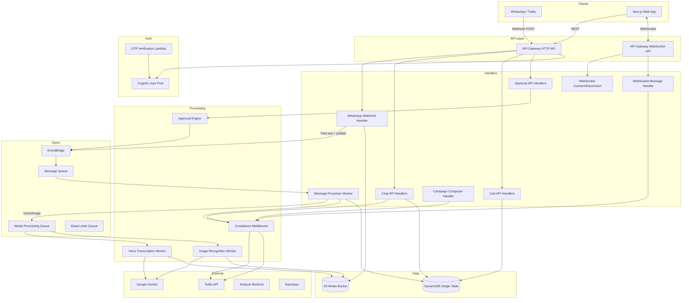
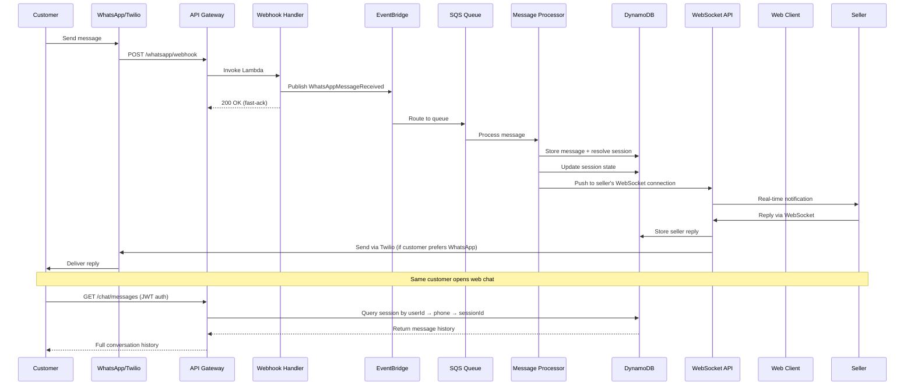
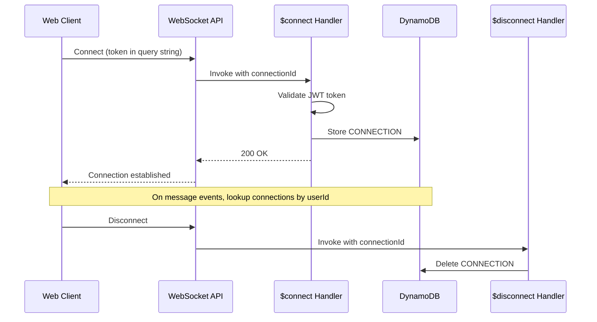

# Design Document: Omnichannel Commerce MVP

## Overview

This design defines the architecture for VyaparGyan's unified omnichannel commerce experience — enabling customers and sellers to interact seamlessly across WhatsApp and web chat with synchronized sessions, carts, and messaging. The system extends the existing serverless platform (Lambda, DynamoDB, API Gateway, Cognito, Twilio, Razorpay) with new capabilities: phone-verified unified identity, cross-channel session continuity, seller approval workflows for AI actions, voice/image-based ordering, policy-compliant messaging, and a modern chat UX.

The design preserves the existing single-table DynamoDB pattern, event-driven async processing via EventBridge/SQS, and thin Lambda handler architecture. New components are additive — they extend existing adapters and introduce new entity types without breaking current access patterns.

### Key Design Decisions

1. **Unified Session by Phone Number**: Sessions are keyed by verified phone number, enabling cross-channel continuity. A customer's WhatsApp and web sessions resolve to the same session record.
2. **API Gateway WebSocket API for Real-Time Web Chat**: A separate WebSocket API (alongside the existing HTTP API) handles real-time message delivery to web clients. WhatsApp continues through Twilio webhooks.
3. **Cart as a First-Class DynamoDB Entity**: Cart is extracted from session context into its own entity (`CART#{customerId}`) for independent synchronization and TTL management.
4. **Approval Engine as DynamoDB Workflow**: AI recommendations flow through a state machine (pending_review → approved/rejected/edited_approved) stored in DynamoDB with EventBridge triggers for downstream actions.
5. **Media Processing via SQS with DLQ**: Voice notes and images are processed asynchronously through dedicated SQS queues with retry logic and dead letter queues.
6. **Compliance Layer as Middleware**: WhatsApp policy checks (service window, quiet hours, frequency caps, opt-out) are enforced in a reusable compliance middleware before any outbound message send.

## Architecture

### High-Level System Architecture



### Cross-Channel Message Flow



### WebSocket Connection Management



## Components and Interfaces

### New Lambda Handlers

| Handler | Trigger | Purpose |
|---------|---------|---------|
| `otp-send-handler` | HTTP POST `/auth/otp/send` | Send OTP via Twilio SMS |
| `otp-verify-handler` | HTTP POST `/auth/otp/verify` | Verify OTP, mark phone verified |
| `ws-connect-handler` | WebSocket `$connect` | Validate JWT, store connection |
| `ws-disconnect-handler` | WebSocket `$disconnect` | Remove connection record |
| `ws-message-handler` | WebSocket `$default` | Route incoming web chat messages |
| `chat-messages-handler` | HTTP GET `/chat/{sessionId}/messages` | Fetch message history |
| `chat-send-handler` | HTTP POST `/chat/{sessionId}/messages` | Send message from web |
| `cart-get-handler` | HTTP GET `/cart` | Get current cart |
| `cart-update-handler` | HTTP POST/PUT `/cart` | Add/remove/update cart items |
| `cart-checkout-handler` | HTTP POST `/cart/checkout` | Validate stock, create order |
| `approval-list-handler` | HTTP GET `/seller/approvals` | List pending AI approvals |
| `approval-action-handler` | HTTP PUT `/seller/approvals/{id}` | Approve/reject/edit recommendation |
| `campaign-compose-handler` | HTTP POST `/seller/campaigns` | Create and schedule campaign |
| `campaign-send-worker` | SQS (scheduled) | Execute campaign sends with compliance |
| `voice-transcription-worker` | SQS (media queue) | Transcribe voice notes via Gemini |
| `image-recognition-worker` | SQS (media queue) | Analyze images via Gemini Vision |
| `session-cleanup-worker` | EventBridge (scheduled) | Expire inactive sessions |
| `cart-reminder-worker` | EventBridge (scheduled) | Send cart abandonment reminders |
| `payment-reminder-worker` | EventBridge (scheduled) | Send payment reminders for unpaid orders |
| `delivery-status-handler` | HTTP POST `/whatsapp/status` | Process Twilio delivery status callbacks |
| `account-settings-handler` | HTTP GET/PUT `/account/settings` | Manage user preferences |
| `account-delete-handler` | HTTP DELETE `/account` | Soft-delete account, anonymize data |
| `seller-inbox-handler` | HTTP GET `/seller/inbox` | Unified inbox with search and filters |
| `audit-log-handler` | HTTP GET `/admin/audit-logs` | Search audit logs |

### Modified Existing Handlers

| Handler | Changes |
|---------|---------|
| `whatsapp/webhook.ts` | Add voice note and image detection, route to media queue |
| `whatsapp/worker.ts` | Resolve unified session by phone, push to WebSocket connections |
| `seller/get-chats.ts` | Add channel indicators, unread counts, search |
| `payment/razorpay-webhook.ts` | Publish order status events for timeline |

### New Adapters

| Adapter | Purpose |
|---------|---------|
| `websocket-adapter.ts` | Send messages to WebSocket connections via API Gateway Management API |
| `otp-adapter.ts` | Generate, store, and verify OTPs using DynamoDB + Twilio SMS |
| `compliance-adapter.ts` | Enforce WhatsApp messaging policies (service window, quiet hours, frequency caps, opt-out) |
| `media-processor-adapter.ts` | Orchestrate voice transcription and image recognition via SQS |

### New Services

| Service | Purpose |
|---------|---------|
| `session-service.ts` | Unified session resolution across channels (phone → userId → session) |
| `cart-service.ts` | Cart CRUD with cross-channel sync, stock validation, and WebSocket broadcast |
| `approval-service.ts` | Approval workflow state machine with audit logging |
| `campaign-service.ts` | Campaign composition, scheduling, compliance validation, and send execution |
| `timeline-service.ts` | Build event timelines for orders and conversations |

### API Endpoints (New)

```
# Auth / OTP
POST   /auth/otp/send              # Send OTP to phone number
POST   /auth/otp/verify            # Verify OTP code

# Chat (authenticated)
GET    /chat/sessions               # List customer's sessions
GET    /chat/{sessionId}/messages   # Get message history (paginated)
POST   /chat/{sessionId}/messages   # Send message from web

# Cart (authenticated)
GET    /cart                        # Get current cart
POST   /cart/items                  # Add item to cart
PUT    /cart/items/{productId}      # Update quantity
DELETE /cart/items/{productId}      # Remove item
POST   /cart/checkout               # Proceed to checkout

# Seller Inbox (authenticated, seller role)
GET    /seller/inbox                # Unified inbox with filters
GET    /seller/inbox/{sessionId}    # Conversation detail with context

# Approvals (authenticated, seller role)
GET    /seller/approvals            # List pending approvals
GET    /seller/approvals/{id}       # Approval detail
PUT    /seller/approvals/{id}       # Approve/reject/edit

# Campaigns (authenticated, seller role)
POST   /seller/campaigns            # Create campaign
GET    /seller/campaigns/{id}       # Campaign detail with metrics
PUT    /seller/campaigns/{id}/schedule  # Schedule send

# Account (authenticated)
GET    /account/settings            # Get preferences
PUT    /account/settings            # Update preferences
PUT    /account/phone               # Change phone number
DELETE /account                     # Delete account

# Admin
GET    /admin/audit-logs            # Search audit logs

# WebSocket
WSS    /ws?token={jwt}              # Real-time connection
```

### Compliance Middleware Interface

```typescript
interface ComplianceCheck {
  customerId: string;
  messageType: 'promotional' | 'transactional';
  templateId?: string;
}

interface ComplianceResult {
  allowed: boolean;
  reason?: 'no_service_window' | 'quiet_hours' | 'frequency_cap' | 'opted_out' | 'deleted_user';
  useTemplate: boolean;
  templateId?: string;
  delayUntil?: string; // ISO timestamp if quiet hours
}

// Usage in any outbound message flow:
const result = await complianceAdapter.check(check);
if (!result.allowed) {
  logger.info('Message suppressed', { reason: result.reason });
  return;
}
if (result.useTemplate) {
  await twilioAdapter.sendTemplateMessage(phone, result.templateId, params);
} else {
  await twilioAdapter.sendWhatsAppMessage(phone, body);
}
```

## Data Models

### DynamoDB Entity Patterns (Single-Table Design)

All new entities follow the existing single-table pattern in `vyapargyan-{env}-main`.

#### User Profile (Extended)

```
PK: USER#{userId}
SK: PROFILE
Attributes:
  - userId: string (Cognito sub)
  - email: string
  - phoneNumber: string (E.164, verified)
  - phoneVerified: boolean
  - roles: string[] (["customer"], ["seller"], ["admin"])
  - sellerId: string | null
  - customerId: string | null
  - preferredChannel: "whatsapp" | "web"
  - optOutPromotional: boolean (default false)
  - isDeleted: boolean (default false)
  - deletedAt: string | null
  - createdAt: string (ISO)
  - updatedAt: string (ISO)

GSI: PhoneUserIndex
  GSI PK: phoneNumber
  GSI SK: userId
```

#### OTP Records

```
PK: OTP#{phoneNumber}
SK: LATEST
Attributes:
  - code: string (6-digit hashed)
  - attempts: number (max 3)
  - expiresAt: number (Unix epoch, 10 minutes)
  - createdAt: string (ISO)
  - ttl: number (1 hour, for lockout cleanup)

Lockout Record:
PK: OTP_LOCK#{phoneNumber}
SK: LOCKED
Attributes:
  - lockedUntil: string (ISO)
  - ttl: number (1 hour)
```

#### Unified Session (Extended)

```
PK: SESSION#{sessionId}
SK: METADATA
Attributes:
  - sessionId: string
  - customerId: string
  - phoneNumber: string
  - state: SessionState (greeting | browsing | viewing_product | cart | checkout | order_placed)
  - activeOrderId: string | null
  - activeProductId: string | null
  - lastChannel: "whatsapp" | "web"
  - lastActivityAt: string (ISO)
  - createdAt: string (ISO)
  - updatedAt: string (ISO)
  - expiresAt: number (TTL, 24h after last activity)

GSI: PhoneSessionIndex
  GSI PK: phoneNumber
  GSI SK: createdAt (ScanIndexForward: false for latest)

GSI: CustomerSessionIndex
  GSI PK: customerId
  GSI SK: createdAt
```

#### Messages (Extended)

```
PK: SESSION#{sessionId}
SK: MESSAGE#{timestamp}#{messageId}
Attributes:
  - messageId: string (wa_message_id for WhatsApp, uuid for web)
  - direction: "inbound" | "outbound"
  - messageType: "text" | "image" | "audio" | "interactive" | "template" | "product_card" | "system"
  - channel: "whatsapp" | "web"
  - senderId: string (userId or "system")
  - senderType: "customer" | "seller" | "system"
  - content: object (varies by messageType)
  - status: "sent" | "delivered" | "read" | "failed"
  - editedAt: string | null (within 5-minute edit window)
  - isDeleted: boolean
  - createdAt: string (ISO)
  - ttl: number (30 days)
```

#### Cart (First-Class Entity)

```
PK: CART#{customerId}
SK: METADATA
Attributes:
  - customerId: string
  - items: CartItem[]
    - productId: string
    - sellerId: string
    - name: string
    - price: number
    - quantity: number
    - imageUrl: string
    - inStock: boolean
  - subtotal: number
  - itemCount: number
  - updatedAt: string (ISO)
  - expiresAt: number (TTL, 7 days after last update)
  - version: number (optimistic locking)
```

#### WebSocket Connections

```
PK: WSCONN#{connectionId}
SK: METADATA
Attributes:
  - connectionId: string
  - userId: string
  - roles: string[]
  - connectedAt: string (ISO)
  - ttl: number (24 hours)

GSI: UserConnectionIndex
  GSI PK: userId
  GSI SK: connectedAt
```

#### Approval Requests

```
PK: APPROVAL#{approvalId}
SK: METADATA
Attributes:
  - approvalId: string
  - sellerId: string
  - type: "discount" | "campaign" | "price_change"
  - status: "pending_review" | "approved" | "rejected" | "edited_approved"
  - aiRationale: string
  - affectedProducts: ProductSummary[]
    - productId: string
    - name: string
    - currentPrice: number
    - proposedPrice: number
  - proposedAction: object (varies by type)
  - estimatedImpact: object
    - revenueChange: number
    - unitsAffected: number
  - sellerNotes: string | null
  - editedAction: object | null (seller modifications)
  - decidedAt: string | null
  - createdAt: string (ISO)
  - updatedAt: string (ISO)

GSI: SellerApprovalIndex
  GSI PK: sellerId
  GSI SK: createdAt
  Filter: status = "pending_review" for inbox
```

#### Campaigns

```
PK: CAMPAIGN#{campaignId}
SK: METADATA
Attributes:
  - campaignId: string
  - sellerId: string
  - approvalId: string (linked approval)
  - status: "draft" | "scheduled" | "sending" | "sent" | "completed" | "failed"
  - messageTemplate: string
  - messageParams: object
  - targetAudience: object
    - criteria: string (e.g., "past_customers_category_sarees")
    - estimatedReach: number
    - eligibleCustomers: number (with active service window)
  - scheduledAt: string | null (ISO)
  - sentAt: string | null
  - metrics: object
    - totalSent: number
    - delivered: number
    - failed: number
    - opened: number
    - converted: number
  - createdAt: string (ISO)
  - updatedAt: string (ISO)

GSI: SellerCampaignIndex
  GSI PK: sellerId
  GSI SK: createdAt
```

#### Service Window Tracking

```
PK: SVCWIN#{customerId}
SK: LATEST
Attributes:
  - customerId: string
  - phoneNumber: string
  - lastInboundAt: string (ISO)
  - windowExpiresAt: string (ISO, +24h from lastInboundAt)
  - promotionalCount: number (reset when window expires)
  - ttl: number (48 hours)
```

#### Opt-Out Preferences

```
PK: OPTOUT#{phoneNumber}
SK: PREFERENCE
Attributes:
  - phoneNumber: string
  - optedOutAt: string (ISO)
  - reason: string ("STOP" | "unsubscribe" | "user_settings")
  - ttl: number | null (permanent unless user re-opts-in)
```

#### Template Registry

```
PK: TEMPLATE#{templateId}
SK: METADATA
Attributes:
  - templateId: string
  - name: string
  - category: "promotional" | "transactional" | "otp"
  - language: string
  - bodyTemplate: string
  - parameters: string[] (parameter names)
  - twilioContentSid: string
  - isActive: boolean
  - createdAt: string (ISO)
```

#### Audit Logs

```
PK: AUDIT#{year}-{month}
SK: #{timestamp}#{auditId}
Attributes:
  - auditId: string
  - actorId: string (userId)
  - actorRole: "seller" | "admin" | "system"
  - action: string (e.g., "approval_approved", "campaign_sent", "price_updated", "message_sent")
  - resourceType: string (e.g., "approval", "campaign", "product", "message")
  - resourceId: string
  - details: object (action-specific data)
  - previousValues: object | null
  - newValues: object | null
  - createdAt: string (ISO)

GSI: ActorAuditIndex
  GSI PK: actorId
  GSI SK: createdAt

GSI: ResourceAuditIndex
  GSI PK: resourceType#resourceId
  GSI SK: createdAt

Note: 7-year retention via S3 export (EventBridge scheduled monthly export).
DynamoDB TTL set to 90 days; older logs archived to S3 in JSON format.
```

#### Idempotency Records (Existing, Extended)

```
PK: IDEMPOTENCY#{messageId}
SK: PROCESSED
Attributes:
  - processedAt: string (ISO)
  - channel: "whatsapp" | "web"
  - ttl: number (24 hours)
```

### New GSI Summary

| GSI Name | PK | SK | Purpose |
|----------|----|----|---------|
| PhoneUserIndex | phoneNumber | userId | Lookup user by phone |
| PhoneSessionIndex | phoneNumber | createdAt | Resolve session by phone |
| CustomerSessionIndex | customerId | createdAt | Resolve session by userId |
| UserConnectionIndex | userId | connectedAt | Find WebSocket connections |
| SellerApprovalIndex | sellerId | createdAt | Seller approval inbox |
| SellerCampaignIndex | sellerId | createdAt | Seller campaign list |
| ActorAuditIndex | actorId | createdAt | Audit logs by actor |
| ResourceAuditIndex | resourceType#resourceId | createdAt | Audit logs by resource |

### Shared TypeScript Types (New)

```typescript
// packages/shared-contracts/src/omnichannel-types.ts

export type ApprovalStatus = 'pending_review' | 'approved' | 'rejected' | 'edited_approved';
export type CampaignStatus = 'draft' | 'scheduled' | 'sending' | 'sent' | 'completed' | 'failed';
export type MessageChannel = 'whatsapp' | 'web';
export type PreferredChannel = 'whatsapp' | 'web';
export type OTPPurpose = 'registration' | 'phone_change' | 'account_recovery';

export interface CartItem {
  productId: string;
  sellerId: string;
  name: string;
  price: number;
  quantity: number;
  imageUrl: string;
  inStock: boolean;
}

export interface Cart {
  customerId: string;
  items: CartItem[];
  subtotal: number;
  itemCount: number;
  updatedAt: string;
  version: number;
}

export interface ApprovalRequest {
  approvalId: string;
  sellerId: string;
  type: 'discount' | 'campaign' | 'price_change';
  status: ApprovalStatus;
  aiRationale: string;
  affectedProducts: Array<{
    productId: string;
    name: string;
    currentPrice: number;
    proposedPrice: number;
  }>;
  proposedAction: Record<string, unknown>;
  estimatedImpact: {
    revenueChange: number;
    unitsAffected: number;
  };
  sellerNotes?: string;
  editedAction?: Record<string, unknown>;
  decidedAt?: string;
  createdAt: string;
  updatedAt: string;
}

export interface Campaign {
  campaignId: string;
  sellerId: string;
  approvalId: string;
  status: CampaignStatus;
  messageTemplate: string;
  messageParams: Record<string, string>;
  targetAudience: {
    criteria: string;
    estimatedReach: number;
    eligibleCustomers: number;
  };
  scheduledAt?: string;
  sentAt?: string;
  metrics: {
    totalSent: number;
    delivered: number;
    failed: number;
    opened: number;
    converted: number;
  };
  createdAt: string;
  updatedAt: string;
}

export interface ComplianceCheckResult {
  allowed: boolean;
  reason?: 'no_service_window' | 'quiet_hours' | 'frequency_cap' | 'opted_out' | 'deleted_user';
  useTemplate: boolean;
  templateId?: string;
  delayUntil?: string;
}

export interface TimelineEvent {
  eventId: string;
  type: 'order_created' | 'order_confirmed' | 'payment_completed' | 'order_shipped' |
        'order_delivered' | 'session_started' | 'product_added' | 'message_sent' |
        'campaign_sent' | 'approval_decided';
  title: string;
  description?: string;
  metadata?: Record<string, unknown>;
  createdAt: string;
}
```
