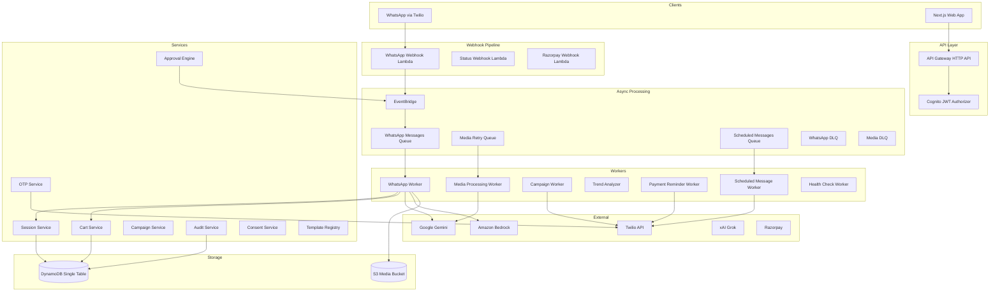
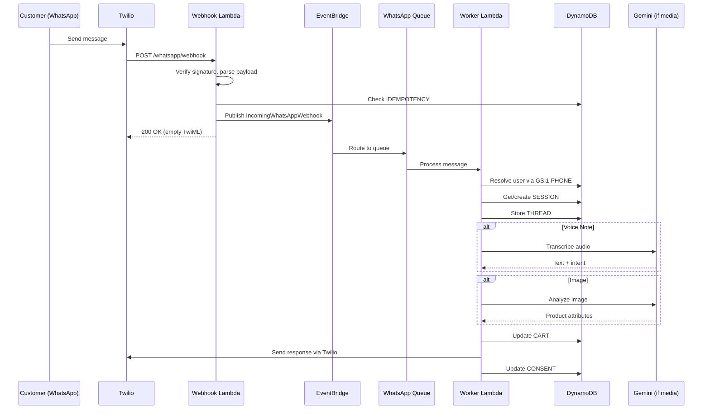
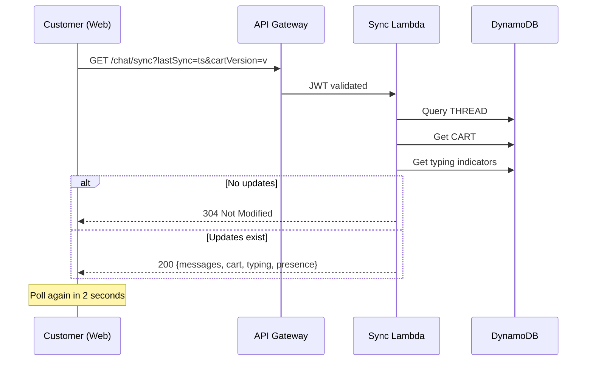
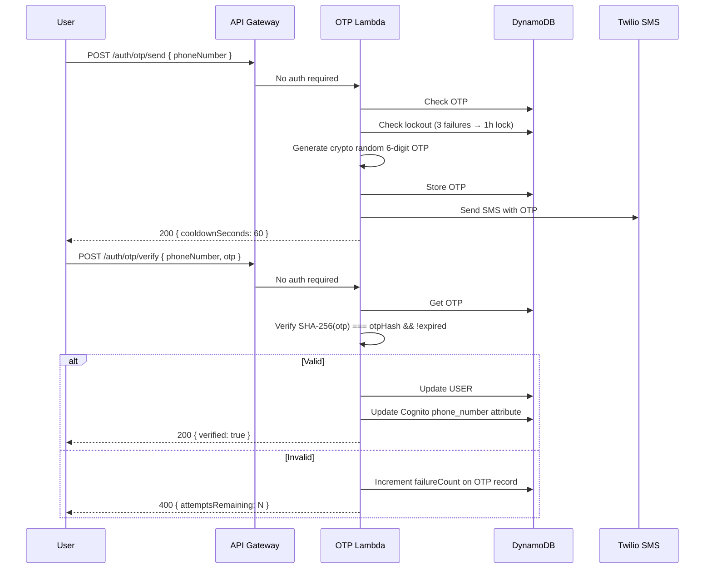

# Design Document: Omnichannel Commerce Productization

## Overview

This design transforms VyaparGyan from a WhatsApp-only prototype into a production-grade omnichannel commerce platform. The architecture extends the existing single-table DynamoDB design, Lambda pipeline, and Twilio integration with new entities, APIs, queues, and frontend components — without replacing any working patterns.

### Key Architectural Decisions

1. **Session model migrates from phone-keyed to userId-keyed** — enables cross-channel identity resolution while preserving WhatsApp phone lookup via GSI1.
2. **Cart becomes a first-class DynamoDB entity** — extracted from the session context blob into `PK: CART#{userId}, SK: ACTIVE` with version-based optimistic concurrency.
3. **Approval engine is a generic workflow** — reusable across discount, campaign, price_change, stock_alert, and reorder_suggestion action types.
4. **Real-time sync uses HTTP polling with ETag** — 2-second interval with documented WebSocket migration path, avoiding premature complexity.
5. **Media processing gets a dedicated retry queue** — separating voice/image failures from the main WhatsApp DLQ for independent retry policies.
6. **WhatsApp policy compliance is enforced at the adapter layer** — service window tracking, template registry, quiet hours, and frequency caps are checked before every outbound send.

### Design Principles

- Extend, don't replace — all new entities and handlers coexist with existing ones
- Thin Lambda handlers delegating to service/repository layers
- DynamoDB conditional writes for all concurrent-access entities
- EventBridge for cross-domain communication, SQS for reliable processing
- Zod schemas for all API request/response validation
- Structured JSON logging with requestId correlation throughout

## Architecture

### High-Level System Architecture



### Request Flow: WhatsApp Message



### Request Flow: Web Chat Polling




## Components and Interfaces

### 1. DynamoDB Entity Design

All new entities extend the existing single-table (`vyapargyan-{env}-main`). Existing entities (PRODUCT, ORDER, CUSTOMER, CATEGORY, SELLER, IDEMPOTENCY, SESSION with old PK pattern) remain unchanged — new code writes to new key patterns while a migration path handles legacy data.

#### 1.0 Data Migration Strategy

The codebase currently uses phone-keyed patterns: `SESSION#{customerId}` with `SK: WHATSAPP#{phone}` and `CUSTOMER#{phone}`. Migration to the new userId-keyed patterns (`SESSION#{userId}`, `CART#{userId}`, `THREAD#{userId}`) uses a **lazy migration with dual-read fallback**:

1. **New registrations** write directly to new key patterns (`USER#{userId}`, `SESSION#{userId}`, etc.)
2. **Existing WhatsApp users** (auto-created `CUSTOMER#{phone}` records) are migrated on first contact after deployment:
   - Worker resolves phone via GSI1 `PHONE#{phone}` → if no `USER#` record found, check legacy `CUSTOMER#{phone}`
   - If legacy record found, create a new `USER#{userId}` record with data from the legacy customer, link phone via GSI1
   - Create new `SESSION#{userId} ACTIVE` from legacy session data, mark old session as `migrated`
   - Extract cart items from legacy `session.context` JSON blob into `CART#{userId} ACTIVE` entity
3. **Message history** is NOT migrated — old messages remain under legacy keys, new messages write to `THREAD#{userId}`. The chat history handler queries both patterns and merges results during the transition period (configurable flag `ENABLE_LEGACY_MESSAGE_QUERY`).
4. **Cleanup**: A scheduled `legacy-data-cleanup-worker` (EventBridge, monthly) scans for migrated legacy records older than 90 days and deletes them. This worker is optional and disabled by default.
5. **Rollback safety**: Legacy records are never deleted during migration — only marked with `migratedToUserId` field. The old `CustomerRepository.resolveOrCreate` and `SessionRepository.resolveOrCreate` continue to work as fallback until the migration flag is turned off.

#### 1.1 User Profile Entity (NEW)

```
PK: USER#{userId}
SK: PROFILE
GSI1PK: PHONE#{phoneNumber}    GSI1SK: USER#{userId}
GSI2PK: ROLE#{role}            GSI2SK: USER#{userId}
```

| Field | Type | Description |
|-------|------|-------------|
| userId | string | UUID |
| role | enum | admin \| seller \| customer |
| displayName | string | User display name |
| phoneNumber | string | E.164 format |
| phoneVerificationStatus | enum | unverified \| pending_otp \| verified \| failed |
| preferredChannel | enum | whatsapp \| web \| both |
| whatsappConnected | boolean | WhatsApp linked status |
| businessName | string? | Seller only |
| businessAddress | string? | Seller only |
| gstNumber | string? | Seller only |
| sellerStatus | enum? | pending_approval \| approved \| rejected \| suspended |
| cognitoId | string | Cognito sub |
| status | enum | active \| deleted |
| deletedAt | string? | ISO timestamp if deleted |
| createdAt | string | ISO timestamp |
| updatedAt | string | ISO timestamp |

#### 1.2 Unified Session Entity (REPLACES old SESSION pattern)

```
PK: SESSION#{userId}
SK: ACTIVE
GSI1PK: PHONE#{phoneNumber}    GSI1SK: SESSION#{userId}
```

| Field | Type | Description |
|-------|------|-------------|
| userId | string | User UUID (not phone) |
| state | enum | greeting \| browsing \| product_inquiry \| ordering \| payment \| tracking \| idle \| closed |
| lastActiveChannel | enum | whatsapp \| web |
| lastActivityAt | string | ISO timestamp |
| phoneNumber | string | For GSI lookup |
| createdAt | string | ISO timestamp |
| expiresAt | number | TTL — lastActivityAt + 30 days (epoch seconds) |

#### 1.3 Cart Entity (NEW — extracted from session context)

```
PK: CART#{userId}
SK: ACTIVE
```

| Field | Type | Description |
|-------|------|-------------|
| userId | string | User UUID |
| items | CartItem[] | Array of cart items |
| subtotal | number | Sum of line totals |
| itemCount | number | Total item count |
| cartVersion | number | Optimistic concurrency version |
| updatedAt | string | ISO timestamp |
| expiresAt | number | TTL — updatedAt + 7 days (epoch seconds) |

**CartItem structure:**
```typescript
interface CartItem {
  productId: string;
  sellerId: string;
  name: string;
  price: number;
  quantity: number;
  thumbnailUrl?: string;
}
```

#### 1.4 Unified Message Thread Entity (REPLACES old SESSION-scoped messages)

```
PK: THREAD#{userId}
SK: MSG#{timestamp}#{messageId}
```

| Field | Type | Description |
|-------|------|-------------|
| userId | string | Thread owner |
| messageId | string | UUID or Twilio SID |
| direction | enum | inbound \| outbound |
| channel | enum | whatsapp \| web |
| senderRole | enum | customer \| seller \| system |
| messageType | enum | text \| image \| audio \| interactive \| product_card \| system |
| content | object | Message payload (text body, media URL, etc.) |
| deliveryStatus | enum | queued \| sent \| delivered \| read \| failed |
| sentAt | string? | ISO timestamp |
| deliveredAt | string? | ISO timestamp |
| readAt | string? | ISO timestamp |
| failedAt | string? | ISO timestamp |
| errorCode | string? | Twilio error code if failed |
| createdAt | string | ISO timestamp |
| expiresAt | number | TTL — 30 days (epoch seconds) |

#### 1.5 OTP Entity (NEW)

```
PK: OTP#{phoneNumber}
SK: LATEST
```

| Field | Type | Description |
|-------|------|-------------|
| phoneNumber | string | E.164 format |
| otpHash | string | SHA-256 hash of OTP (never store plaintext) |
| failureCount | number | Consecutive failures |
| lockoutUntil | string? | ISO timestamp if locked |
| createdAt | string | ISO timestamp |
| expiresAt | number | TTL — createdAt + 10 minutes (epoch seconds) |

#### 1.6 Approval Record Entity (NEW)

```
PK: APPROVAL#{approvalId}
SK: METADATA
GSI1PK: SELLER#{sellerId}     GSI1SK: STATUS#{status}#TS#{createdAt}
```

| Field | Type | Description |
|-------|------|-------------|
| approvalId | string | UUID |
| sellerId | string | Seller UUID |
| type | enum | discount \| campaign \| price_change \| stock_alert \| reorder_suggestion |
| status | enum | draft \| pending_review \| approved \| rejected \| edited_approved \| executed |
| payload | object | Proposed action details |
| originalPayload | object? | Original if edited |
| aiRationale | string | AI explanation text |
| estimatedImpact | number | Revenue impact in rupees |
| affectedProductIds | string[] | Product UUIDs |
| priorityScore | number | Computed priority |
| approvedAt | string? | ISO timestamp |
| approvedBy | string? | User UUID |
| rejectionReason | string? | Seller-provided reason |
| scheduledFor | string? | ISO timestamp for deferred execution |
| createdAt | string | ISO timestamp |
| updatedAt | string | ISO timestamp |

#### 1.7 Consent Record Entity (NEW)

```
PK: CONSENT#{userId}
SK: WHATSAPP_OPTIN          — opt-in record
PK: CONSENT#{userId}
SK: SERVICE_WINDOW           — service window tracking
```

**WHATSAPP_OPTIN:**

| Field | Type | Description |
|-------|------|-------------|
| optedIn | boolean | Current opt-in status |
| optedInAt | string? | ISO timestamp |
| optInMethod | enum | registration \| user_initiated \| settings |
| optedOut | boolean | Promotional opt-out |
| optedOutAt | string? | ISO timestamp |
| optOutMethod | string? | How they opted out |
| suppressPromotional | boolean | Suppress promos |

**SERVICE_WINDOW:**

| Field | Type | Description |
|-------|------|-------------|
| serviceWindowExpiresAt | string | ISO timestamp (last inbound + 24h) |
| promotionalMessageCount | number | Rolling 24h count |
| lastPromotionalResetAt | string | ISO timestamp of last reset |

#### 1.8 Template Registry Entity (NEW)

```
PK: TEMPLATE#{templateSid}
SK: METADATA
```

| Field | Type | Description |
|-------|------|-------------|
| templateSid | string | Twilio template SID |
| templateName | string | Human-readable name |
| category | enum | marketing \| utility \| authentication |
| language | string | e.g., "en", "hi" |
| parameterSchema | object | Zod-compatible schema for required variables |
| approvalStatus | enum | approved \| pending \| rejected |
| createdAt | string | ISO timestamp |

#### 1.9 Campaign Entity (EXTENDS existing pattern)

```
PK: CAMPAIGN#{campaignId}
SK: METADATA
GSI1PK: SELLER#{sellerId}     GSI1SK: CAMPAIGN#TS#{createdAt}
```

| Field | Type | Description |
|-------|------|-------------|
| campaignId | string | UUID |
| sellerId | string | Seller UUID |
| approvalId | string? | Linked approval record |
| status | enum | draft \| scheduled \| sending \| sent \| failed |
| messageText | string | Campaign message body |
| templateSid | string? | Twilio template if out-of-window |
| audienceFilters | object | Targeting criteria |
| estimatedReach | number | Pre-send count |
| sentCount | number | Messages sent |
| deliveredCount | number | Delivered count |
| readCount | number | Read count |
| conversionCount | number | Orders within 48h |
| scheduledAt | string? | Scheduled send time |
| executedAt | string? | Actual send time |
| createdAt | string | ISO timestamp |
| updatedAt | string | ISO timestamp |

#### 1.10 Audit Log Entity (NEW)

```
PK: AUDIT#{auditId}
SK: TS#{timestamp}
GSI1PK: ACTOR#{actorId}       GSI1SK: TS#{timestamp}
GSI2PK: RESOURCE#{resourceType}#{resourceId}  GSI2SK: TS#{timestamp}
```

| Field | Type | Description |
|-------|------|-------------|
| auditId | string | UUID |
| actorId | string | User UUID who performed action |
| actorRole | enum | admin \| seller \| system |
| actionType | string | e.g., approval_approved, campaign_sent, seller_suspended |
| resourceType | string | e.g., approval, campaign, order, product |
| resourceId | string | Resource UUID |
| oldValues | object? | Previous state |
| newValues | object? | New state |
| approvalId | string? | Linked approval if applicable |
| metadata | object? | Additional context |
| createdAt | string | ISO timestamp |
| — | — | No TTL — permanent retention |

#### 1.11 Restock Notification Entity (NEW)

```
PK: RESTOCK_NOTIFY#{productId}
SK: USER#{userId}
```

| Field | Type | Description |
|-------|------|-------------|
| productId | string | Product UUID |
| userId | string | Customer UUID |
| createdAt | string | ISO timestamp |
| expiresAt | number | TTL — 30 days |

#### 1.12 GSI Summary

| GSI | PK Pattern | SK Pattern | Purpose |
|-----|-----------|------------|---------|
| GSI1 | PHONE#{phone} | USER#{userId} | Phone → user lookup |
| GSI1 | SELLER#{sellerId} | STATUS#{status}#TS#{ts} | Seller approval queries |
| GSI1 | SELLER#{sellerId} | CAMPAIGN#TS#{ts} | Seller campaign queries |
| GSI1 | ACTOR#{actorId} | TS#{ts} | Audit by actor |
| GSI2 | ROLE#{role} | USER#{userId} | Users by role |
| GSI2 | RESOURCE#{type}#{id} | TS#{ts} | Audit by resource |
| GSI3 | (existing) | (existing) | Payment/status queries |
| PhoneIndex | phoneNumber | channelType | Legacy session lookup |
| CategoryIndex | categoryId | createdAt | Products by category |
| SellerStockIndex | sellerId | stockAddedDate | Dead stock detection |
| SellerOrdersIndex | sellerId | createdAt | Seller orders |
| CustomerOrdersIndex | customerId | createdAt | Customer orders |


### 2. API Design

All new endpoints use the existing API Gateway HTTP API (`vyapargyan-{env}-api`). Auth-protected routes use Cognito JWT authorizer. Webhook routes remain unauthenticated.

#### 2.1 Authentication & OTP APIs

| Method | Path | Auth | Handler | Description |
|--------|------|------|---------|-------------|
| POST | /api/v1/auth/otp/send | None | `otp-send-handler.ts` | Generate and send OTP |
| POST | /api/v1/auth/otp/verify | None | `otp-verify-handler.ts` | Verify OTP and link phone |
| POST | /api/v1/auth/register | None | `register-handler.ts` | Register customer or seller |

**POST /api/v1/auth/otp/send**
```typescript
// Request
const SendOTPSchema = z.object({
  phoneNumber: z.string().regex(/^[6-9]\d{9}$/), // Indian mobile
});

// Response 200
{ success: true, message: "OTP sent", cooldownSeconds: 60 }

// Response 429
{ error: "Too many requests", retryAfter: 3600 } // Locked out
```

**POST /api/v1/auth/otp/verify**
```typescript
// Request
const VerifyOTPSchema = z.object({
  phoneNumber: z.string().regex(/^[6-9]\d{9}$/),
  otp: z.string().length(6).regex(/^\d{6}$/),
  userId: z.string().uuid().optional(), // If linking to existing account
});

// Response 200
{ success: true, verified: true, userId: "uuid" }

// Response 400
{ error: "Invalid OTP", attemptsRemaining: 2 }
```

**POST /api/v1/auth/register**
```typescript
// Request
const RegisterSchema = z.object({
  role: z.enum(['customer', 'seller']),
  phoneNumber: z.string().regex(/^[6-9]\d{9}$/),
  displayName: z.string().min(2).max(100),
  password: z.string().min(8),
  // Seller-only fields
  businessName: z.string().min(2).max(100).optional(),
  businessAddress: z.string().max(500).optional(),
  gstNumber: z.string().regex(/^[0-9]{2}[A-Z]{5}[0-9]{4}[A-Z]{1}[1-9A-Z]{1}Z[0-9A-Z]{1}$/).optional(),
});

// Response 201
{ success: true, userId: "uuid", role: "customer" }

// Response 409
{ error: "Phone number already registered" }
```

#### 2.2 Chat & Sync APIs

| Method | Path | Auth | Handler | Description |
|--------|------|------|---------|-------------|
| GET | /api/v1/chat/sync | JWT | `chat-sync-handler.ts` | Poll for updates |
| POST | /api/v1/chat/messages | JWT | `chat-send-handler.ts` | Send message from web |
| POST | /api/v1/chat/typing | JWT | `chat-typing-handler.ts` | Typing indicator |
| GET | /api/v1/chat/history | JWT | `chat-history-handler.ts` | Load message history |

**GET /api/v1/chat/sync**
```typescript
// Query params
const SyncQuerySchema = z.object({
  lastSyncTimestamp: z.string().optional(),
  cartVersion: z.coerce.number().optional(),
});

// Response 200
{
  messages: Message[],
  cartState: Cart | null,       // null if unchanged
  typingIndicators: TypingEvent[],
  presenceUpdates: PresenceUpdate[],
  lastSyncTimestamp: "2026-01-15T10:30:00.000Z",
  cartVersion: 5
}

// Response 304 — no updates
// Headers: ETag, Cache-Control: no-cache
```

**POST /api/v1/chat/messages**
```typescript
// Request
const SendMessageSchema = z.object({
  content: z.string().min(1).max(4096),
  messageType: z.enum(['text', 'image', 'product_card']).default('text'),
  sellerId: z.string().uuid().optional(),  // For directed messages
  productContext: z.object({
    productId: z.string(),
    name: z.string(),
    price: z.number(),
  }).optional(),
});

// Response 201
{ messageId: "uuid", createdAt: "2026-01-15T10:30:00.000Z" }
```

#### 2.3 Cart APIs

| Method | Path | Auth | Handler | Description |
|--------|------|------|---------|-------------|
| GET | /api/v1/cart | JWT | `cart-get-handler.ts` | Get current cart |
| POST | /api/v1/cart/items | JWT | `cart-add-handler.ts` | Add item to cart |
| PUT | /api/v1/cart/items/{productId} | JWT | `cart-update-handler.ts` | Update quantity |
| DELETE | /api/v1/cart/items/{productId} | JWT | `cart-remove-handler.ts` | Remove item |
| POST | /api/v1/cart/checkout | JWT | `cart-checkout-handler.ts` | Validate and checkout |

**POST /api/v1/cart/items**
```typescript
// Request
const AddToCartSchema = z.object({
  productId: z.string(),
  quantity: z.coerce.number().int().min(1).max(99),
});

// Response 200
{
  cart: { items: CartItem[], subtotal: number, itemCount: number, cartVersion: number },
  addedItem: { productId: string, name: string, price: number, quantity: number }
}

// Response 409 — version conflict (retry with latest version)
{ error: "Cart was modified", currentVersion: 6 }
```

#### 2.4 Approval Engine APIs

| Method | Path | Auth | Handler | Description |
|--------|------|------|---------|-------------|
| GET | /api/v1/seller/approvals | JWT (seller) | `approvals-list-handler.ts` | List approvals |
| GET | /api/v1/seller/approvals/{id} | JWT (seller) | `approval-detail-handler.ts` | Get approval detail |
| PUT | /api/v1/seller/approvals/{id}/approve | JWT (seller) | `approval-approve-handler.ts` | Approve action |
| PUT | /api/v1/seller/approvals/{id}/reject | JWT (seller) | `approval-reject-handler.ts` | Reject action |
| PUT | /api/v1/seller/approvals/{id}/edit-approve | JWT (seller) | `approval-edit-handler.ts` | Edit and approve |
| PUT | /api/v1/seller/approvals/{id}/schedule | JWT (seller) | `approval-schedule-handler.ts` | Schedule for later |

**GET /api/v1/seller/approvals**
```typescript
// Query params
const ApprovalsQuerySchema = z.object({
  status: z.enum(['pending_review', 'approved', 'rejected', 'all']).default('pending_review'),
  limit: z.coerce.number().min(1).max(50).default(20),
  cursor: z.string().optional(),
});

// Response 200
{
  approvals: ApprovalSummary[],
  nextCursor: string | null
}
```

**PUT /api/v1/seller/approvals/{id}/approve**
```typescript
// Response 200
{ success: true, approvalId: "uuid", status: "approved", executionTriggered: true }
```

**PUT /api/v1/seller/approvals/{id}/reject**
```typescript
// Request
const RejectSchema = z.object({
  rejectionReason: z.string().min(1).max(500),
});
```

#### 2.5 Campaign APIs

| Method | Path | Auth | Handler | Description |
|--------|------|------|---------|-------------|
| POST | /api/v1/seller/campaigns | JWT (seller) | `campaign-create-handler.ts` | Create campaign |
| GET | /api/v1/seller/campaigns/{id} | JWT (seller) | `campaign-detail-handler.ts` | Get campaign detail |
| POST | /api/v1/seller/campaigns/{id}/schedule | JWT (seller) | `campaign-schedule-handler.ts` | Schedule send |
| GET | /api/v1/seller/campaigns/{id}/analytics | JWT (seller) | `campaign-analytics-handler.ts` | Campaign metrics |
| POST | /api/v1/seller/campaigns/estimate-reach | JWT (seller) | `campaign-reach-handler.ts` | Estimate audience |

**POST /api/v1/seller/campaigns**
```typescript
const CreateCampaignSchema = z.object({
  approvalId: z.string().uuid().optional(),
  messageText: z.string().min(1).max(1024),
  templateSid: z.string().optional(),
  audienceFilters: z.object({
    pastPurchasers: z.array(z.string()).optional(),
    cartAbandoners: z.boolean().optional(),
    highSpenders: z.boolean().optional(),
    categoryInterest: z.array(z.string()).optional(),
  }),
  scheduledAt: z.string().datetime().optional(),
});
```

#### 2.6 Seller Inbox & Chat APIs

| Method | Path | Auth | Handler | Description |
|--------|------|------|---------|-------------|
| GET | /api/v1/seller/inbox | JWT (seller) | `seller-inbox-handler.ts` | List conversations |
| GET | /api/v1/seller/inbox/{userId}/messages | JWT (seller) | `seller-messages-handler.ts` | Get conversation |
| POST | /api/v1/seller/inbox/{userId}/reply | JWT (seller) | `seller-reply-handler.ts` | Reply to customer |
| GET | /api/v1/seller/inbox/{userId}/context | JWT (seller) | `seller-context-handler.ts` | Customer context |

#### 2.7 Account Management APIs

| Method | Path | Auth | Handler | Description |
|--------|------|------|---------|-------------|
| GET | /api/v1/account/profile | JWT | `account-profile-handler.ts` | Get profile |
| PUT | /api/v1/account/preferences | JWT | `account-preferences-handler.ts` | Update preferences |
| POST | /api/v1/account/phone/change | JWT | `phone-change-handler.ts` | Initiate phone change |
| POST | /api/v1/account/whatsapp/disconnect | JWT | `whatsapp-disconnect-handler.ts` | Disconnect WhatsApp |
| DELETE | /api/v1/account | JWT | `account-delete-handler.ts` | Delete account |

#### 2.8 Catalog APIs (Customer-facing)

| Method | Path | Auth | Handler | Description |
|--------|------|------|---------|-------------|
| GET | /api/v1/catalog/products | Optional JWT | `catalog-products-handler.ts` | Browse products |
| GET | /api/v1/catalog/products/{id} | Optional JWT | `catalog-product-detail-handler.ts` | Product detail |
| GET | /api/v1/catalog/categories | None | `catalog-categories-handler.ts` | List categories |
| GET | /api/v1/catalog/search | Optional JWT | `catalog-search-handler.ts` | Search products |

#### 2.9 Admin APIs (NEW)

| Method | Path | Auth | Handler | Description |
|--------|------|------|---------|-------------|
| GET | /api/v1/admin/audit | JWT (admin) | `admin-audit-handler.ts` | Query audit logs |
| POST | /api/v1/admin/media/reprocess | JWT (admin) | `admin-media-reprocess-handler.ts` | Reprocess failed media |
| GET | /api/v1/admin/messaging/config | JWT (admin) | `admin-messaging-config-handler.ts` | Get messaging config |
| PUT | /api/v1/admin/messaging/config | JWT (admin) | `admin-messaging-config-handler.ts` | Update messaging config |

#### 2.10 Webhook APIs

| Method | Path | Auth | Handler | Description |
|--------|------|------|---------|-------------|
| POST | /api/v1/whatsapp/webhook | Twilio sig | `webhook.ts` (existing) | Inbound messages |
| POST | /api/v1/whatsapp/status | Twilio sig | `status-webhook-handler.ts` | Delivery status callbacks |
| POST | /api/webhooks/razorpay | Razorpay sig | `razorpay-webhook.ts` (existing) | Payment callbacks |


### 3. Lambda Function Architecture

#### 3.1 New Lambda Handlers (API Gateway → Lambda)

| Handler File | Event Source | Timeout | Memory | Description |
|-------------|-------------|---------|--------|-------------|
| `handlers/auth/otp-send-handler.ts` | API Gateway | 10s | 256MB | Generate OTP, send via Twilio SMS |
| `handlers/auth/otp-verify-handler.ts` | API Gateway | 10s | 256MB | Verify OTP, update user record |
| `handlers/auth/register-handler.ts` | API Gateway | 15s | 512MB | Create Cognito user + DynamoDB profile |
| `handlers/chat/chat-sync-handler.ts` | API Gateway | 5s | 256MB | Poll for messages, cart, typing |
| `handlers/chat/chat-send-handler.ts` | API Gateway | 10s | 256MB | Send web chat message |
| `handlers/chat/chat-typing-handler.ts` | API Gateway | 3s | 128MB | Record typing indicator |
| `handlers/chat/chat-history-handler.ts` | API Gateway | 10s | 256MB | Load paginated message history |
| `handlers/cart/cart-get-handler.ts` | API Gateway | 5s | 256MB | Get current cart state |
| `handlers/cart/cart-add-handler.ts` | API Gateway | 10s | 256MB | Add item with version check |
| `handlers/cart/cart-update-handler.ts` | API Gateway | 10s | 256MB | Update quantity with version check |
| `handlers/cart/cart-remove-handler.ts` | API Gateway | 10s | 256MB | Remove item with version check |
| `handlers/cart/cart-checkout-handler.ts` | API Gateway | 30s | 512MB | Validate stock, create order |
| `handlers/seller/approvals-list-handler.ts` | API Gateway | 10s | 256MB | Query GSI1 for seller approvals |
| `handlers/seller/approval-approve-handler.ts` | API Gateway | 15s | 512MB | Approve + publish event |
| `handlers/seller/approval-reject-handler.ts` | API Gateway | 10s | 256MB | Reject + publish event |
| `handlers/seller/approval-edit-handler.ts` | API Gateway | 15s | 512MB | Edit payload + approve |
| `handlers/seller/seller-inbox-handler.ts` | API Gateway | 10s | 256MB | List conversations |
| `handlers/seller/seller-reply-handler.ts` | API Gateway | 15s | 512MB | Reply to customer |
| `handlers/seller/campaign-create-handler.ts` | API Gateway | 10s | 256MB | Create campaign record |
| `handlers/seller/campaign-schedule-handler.ts` | API Gateway | 10s | 256MB | Schedule campaign |
| `handlers/catalog/catalog-products-handler.ts` | API Gateway | 10s | 256MB | Browse products |
| `handlers/catalog/catalog-search-handler.ts` | API Gateway | 10s | 256MB | Search products |
| `handlers/account/account-profile-handler.ts` | API Gateway | 5s | 256MB | Get/update profile |
| `handlers/account/account-delete-handler.ts` | API Gateway | 30s | 512MB | Delete account flow |
| `handlers/whatsapp/status-webhook-handler.ts` | API Gateway | 10s | 256MB | Twilio status callbacks |
| `handlers/admin/admin-audit-handler.ts` | API Gateway | 15s | 256MB | Query audit logs |
| `handlers/admin/admin-media-reprocess-handler.ts` | API Gateway | 10s | 256MB | Reprocess media DLQ |

#### 3.2 New Lambda Workers (SQS/EventBridge → Lambda)

| Worker File | Event Source | Timeout | Memory | Description |
|------------|-------------|---------|--------|-------------|
| `handlers/workers/media-processing-worker.ts` | SQS (media-retry) | 120s | 1024MB | Voice transcription + image analysis via Gemini |
| `handlers/workers/approval-execution-worker.ts` | EventBridge (ApprovalApproved) | 60s | 512MB | Execute approved actions (price update, campaign trigger) |
| `handlers/workers/campaign-execution-worker.ts` | EventBridge (CampaignScheduled) | 300s | 1024MB | Send campaign messages with consent checks |
| `handlers/workers/payment-reminder-worker.ts` | EventBridge (scheduled) | 60s | 256MB | Send payment reminders |
| `handlers/workers/scheduled-message-worker.ts` | SQS (scheduled-messages) | 60s | 256MB | Send quiet-hours-deferred messages at 09:00 IST |
| `handlers/workers/cart-abandonment-worker.ts` | EventBridge (scheduled daily) | 120s | 512MB | Send cart abandonment reminders |
| `handlers/workers/session-cleanup-worker.ts` | EventBridge (scheduled daily) | 120s | 256MB | Mark expired sessions as closed |
| `handlers/workers/audit-export-worker.ts` | EventBridge (scheduled monthly) | 300s | 512MB | Export old audit logs to S3 |
| `handlers/workers/health-check-worker.ts` | EventBridge (scheduled daily) | 60s | 256MB | Verify external service connectivity |
| `handlers/workers/notification-router-worker.ts` | EventBridge (CustomerMessageSent) | 30s | 256MB | Route messages to seller's preferred channel |

#### 3.3 Notification Router — Cross-Channel Message Bridging

The `notification-router-worker.ts` is the key component for web-to-WhatsApp and WhatsApp-to-web message bridging. When a customer sends a message via web chat (`POST /api/v1/chat/messages`), the handler publishes a `CustomerMessageSent` event. The notification router then:

1. Looks up the seller's `preferredChannel` from their user profile
2. If seller prefers WhatsApp → sends the customer's message to the seller's WhatsApp via TwilioAdapter (checking service window / template requirements)
3. If seller prefers web → the message is already in `THREAD#{sellerId}` and will appear on next inbox poll
4. If seller prefers both → delivers to both channels

When a seller replies (from WhatsApp copilot via `replyToCustomer` tool, or from web inbox via `POST /api/v1/seller/inbox/{userId}/reply`), the same router handles reverse delivery:

1. Looks up the customer's `preferredChannel` and `lastActiveChannel`
2. If customer's last active channel was WhatsApp → send reply via TwilioAdapter (with service window check)
3. If customer's last active channel was web → message is in `THREAD#{userId}` and appears on next sync poll
4. If customer has `preferredChannel: both` → deliver to both

This ensures that a customer who starts on web chat and a seller who replies from WhatsApp still have a connected conversation, with all messages stored in both `THREAD#{userId}` (customer view) and `THREAD#{sellerId}` (seller inbox view).


### 4. Event-Driven Architecture

#### 4.1 EventBridge Events

All events published to the existing event bus (`vyapargyan-{env}-events`).

| Event Source | Detail Type | Payload | Consumers |
|-------------|------------|---------|-----------|
| `vyapargyan.cart` | `CartUpdated` | { userId, cartVersion, itemCount, channel } | Web sync polling |
| `vyapargyan.approval` | `ApprovalCreated` | { approvalId, sellerId, type, priorityScore } | Notification router |
| `vyapargyan.approval` | `ApprovalApproved` | { approvalId, sellerId, type, payload } | Approval execution worker |
| `vyapargyan.approval` | `ApprovalRejected` | { approvalId, sellerId, rejectionReason } | Audit logger |
| `vyapargyan.approval` | `ApprovalEditedApproved` | { approvalId, sellerId, originalPayload, payload } | Approval execution worker |
| `vyapargyan.campaign` | `CampaignScheduled` | { campaignId, sellerId, scheduledAt } | Campaign execution worker |
| `vyapargyan.chat` | `CustomerMessageSent` | { userId, sellerId, messageId, channel } | Notification router |
| `vyapargyan.media` | `VoiceNoteReceived` | { userId, sessionId, s3Key, mediaType } | Media retry queue |
| `vyapargyan.media` | `ImageSearchRequested` | { userId, sessionId, s3Key, sellerContext } | Media retry queue |
| `vyapargyan.inventory` | `ProductOutOfStock` | { productId, sellerId, productName } | Seller notification, restock tracking |
| `vyapargyan.order` | `OrderAutoCancel` | { orderId, customerId, sellerId, reason } | Notification router |
| `vyapargyan.whatsapp` | `IncomingWhatsAppWebhook` | (existing) | WhatsApp messages queue |

#### 4.2 SQS Queues

| Queue Name | Visibility Timeout | Retention | DLQ | Max Receive | Purpose |
|-----------|-------------------|-----------|-----|-------------|---------|
| `{prefix}-whatsapp-messages` | 180s | 4 days | `{prefix}-whatsapp-dlq` | 3 | Existing — WhatsApp message processing |
| `{prefix}-media-processing-retry` | 300s | 4 days | `{prefix}-media-processing-dlq` | 3 | Voice/image AI processing retries |
| `{prefix}-scheduled-messages` | 60s | 7 days | `{prefix}-scheduled-messages-dlq` | 3 | Quiet-hours deferred messages |

**Media Retry Queue Configuration:**
- Visibility timeout: 300s (5 min — allows Gemini API call + retries)
- Delay between retries: Managed via visibility timeout + redrivePolicy
- Message format includes: userId, sessionId, s3Key, mediaType, attemptCount, originalTimestamp

#### 4.3 EventBridge Rules

| Rule Name | Pattern | Target |
|-----------|---------|--------|
| `{prefix}-whatsapp-webhook` | source: vyapargyan.whatsapp, detail-type: IncomingWhatsAppWebhook | WhatsApp messages queue (existing) |
| `{prefix}-media-processing` | source: vyapargyan.media | Media retry queue |
| `{prefix}-approval-execution` | source: vyapargyan.approval, detail-type: ApprovalApproved \| ApprovalEditedApproved | Approval execution worker |
| `{prefix}-campaign-execution` | source: vyapargyan.campaign, detail-type: CampaignScheduled | Campaign execution worker |
| `{prefix}-customer-message-route` | source: vyapargyan.chat, detail-type: CustomerMessageSent | Notification router worker |
| `{prefix}-payment-reminder` | schedule: rate(15 minutes) | Payment reminder worker |
| `{prefix}-cart-abandonment` | schedule: cron(0 15 * * ? *) (8:30 PM IST) | Cart abandonment worker |
| `{prefix}-session-cleanup` | schedule: cron(0 18 * * ? *) (11:30 PM IST) | Session cleanup worker |
| `{prefix}-audit-export` | schedule: cron(0 0 1 * ? *) (1st of month) | Audit export worker |
| `{prefix}-health-check` | schedule: cron(0 6 * * ? *) (11:30 AM IST) | Health check worker |
| `{prefix}-scheduled-messages-trigger` | schedule: cron(31 3 * * ? *) (09:01 IST) | Scheduled message worker |


### 5. Twilio Integration Design

#### 5.1 Policy Compliance Layer

The `ConsentService` enforces all WhatsApp Business API policies before any outbound message. It wraps the existing `TwilioAdapter`.

```typescript
// services/consent-service.ts
class ConsentService {
  /**
   * Check if a message can be sent to a user.
   * Returns { allowed: true } or { allowed: false, reason, action }.
   */
  async checkSendPermission(userId: string, messageType: 'transactional' | 'promotional'): Promise<SendPermission> {
    // 1. Transactional messages always allowed (OTP, order updates)
    if (messageType === 'transactional') return { allowed: true };

    // 2. Check opt-out status
    const consent = await this.getConsent(userId);
    if (consent.optedOut) return { allowed: false, reason: 'opted_out' };

    // 3. Check quiet hours (22:00-09:00 IST)
    if (this.isQuietHours()) return { allowed: false, reason: 'quiet_hours', action: 'queue_for_morning' };

    // 4. Check frequency cap (3 per 24h rolling window)
    if (consent.promotionalMessageCount >= 3) return { allowed: false, reason: 'frequency_cap' };

    // 5. Check service window
    if (!this.hasActiveServiceWindow(consent)) {
      return { allowed: true, requiresTemplate: true };
    }

    return { allowed: true, requiresTemplate: false };
  }
}
```

#### 5.2 Template Registry

Pre-approved Twilio templates stored in DynamoDB and validated before send:

| Template Name | Category | Parameters | Usage |
|--------------|----------|------------|-------|
| `welcome_customer` | utility | { name } | Post-registration welcome |
| `welcome_seller` | utility | { name, businessName } | Post-registration welcome |
| `otp_verification` | authentication | { otp } | Phone verification |
| `payment_reminder` | utility | { orderNumber, amount, paymentLink } | Payment reminders |
| `order_confirmation` | utility | { orderNumber, items, total } | Order placed |
| `order_shipped` | utility | { orderNumber, trackingNumber } | Shipping update |
| `cart_reminder` | marketing | { itemCount, subtotal } | Cart abandonment |
| `promotion` | marketing | { sellerName, message, productLink } | Campaign messages |

#### 5.3 TwilioAdapter Changes for Status Callbacks

The existing `TwilioAdapter.sendWithRetry()` method currently calls `this.client.messages.create()` without a `statusCallback` URL. To receive delivery status updates, every outbound message must include the callback URL:

```typescript
// adapters/twilio-adapter.ts — modification to sendWithRetry
const message = await this.client.messages.create({
  to: options.to,
  from: options.from,
  body: options.body,
  ...(options.mediaUrl && { mediaUrl: [options.mediaUrl] }),
  // NEW: Add statusCallback for delivery tracking
  statusCallback: `${this.apiBaseUrl}/api/v1/whatsapp/status`,
});
```

The `apiBaseUrl` is loaded from config (environment variable `API_BASE_URL` set in CDK). The `sendWhatsAppMessage` and `sendSMS` methods both flow through `sendWithRetry`, so all outbound messages automatically get status tracking.

Additionally, the `SendMessageResult` interface is extended:
```typescript
export interface SendMessageResult {
  messageId: string;
  status: string;
  dateCreated: Date;
  statusCallbackConfigured: boolean; // NEW: confirms callback was set
}
```

#### 5.4 Status Webhook Handler

New dedicated endpoint `POST /api/v1/whatsapp/status` processes Twilio StatusCallback:

```typescript
// handlers/whatsapp/status-webhook-handler.ts
// Twilio sends: MessageSid, MessageStatus (sent|delivered|read|failed), ErrorCode, ErrorMessage
// Handler updates THREAD#{userId} MSG#{ts}#{messageId} deliveryStatus field
// Uses idempotency check on MessageSid + MessageStatus combination
// Verifies Twilio request signature using X-Twilio-Signature header (same pattern as webhook.ts)
```

The status webhook receives a different Twilio payload format than the inbound message webhook. The existing `webhook.ts` uses `transformTwilioToWhatsAppFormat` for inbound messages — the status handler does NOT use this transformation. It processes the raw Twilio StatusCallback fields directly:
- `MessageSid` → lookup message in THREAD by messageId
- `MessageStatus` → map to deliveryStatus enum (queued|sent|delivered|read|failed)
- `ErrorCode` + `ErrorMessage` → store on failed messages
- `To` → resolve userId for the THREAD query

#### 5.5 Service Window Tracking

Every inbound WhatsApp message updates the consent record:
```typescript
// In WhatsApp worker, after processing inbound message:
await consentService.recordInboundMessage(userId);
// Sets serviceWindowExpiresAt = now + 24 hours
```

### 6. AI Processing Pipeline

#### 6.1 Voice Note Processing Flow

```mermaid
graph LR
    A[WhatsApp Worker] -->|audio message| B[Download from Twilio MediaUrl]
    B --> C[Store in S3 voice/{userId}/{ts}.ogg]
    C --> D[Publish VoiceNoteReceived to SQS media-retry]
    D --> E[Media Processing Worker]
    E --> F[Call Gemini API with audio + language hint]
    F -->|success| G[Extract products + confidence scores]
    G -->|confidence >= 80%| H[Add to cart + confirm]
    G -->|confidence < 80%| I[Send clarification message]
    F -->|failure| J{Attempt < 3?}
    J -->|yes| D
    J -->|no| K[Send fallback text message]
```

**Gemini API call for voice transcription:**
```typescript
// adapters/gemini-adapter.ts — new method (extends existing GeminiAdapter class)
// Current adapter only has parseKhataBookImage(). Two new methods are required:
async transcribeVoiceNote(audioBuffer: Buffer, languageHint: string, browsingContext: string[]): Promise<VoiceTranscription> {
  const model = this.client.getGenerativeModel({ model: 'gemini-1.5-flash' });
  const prompt = `Transcribe this audio and extract shopping intent.
    Language hint: ${languageHint}
    Recent browsing context: ${browsingContext.join(', ')}
    Return JSON: { transcript: string, products: [{ name, quantity, confidence }] }`;
  // ... structured output parsing
}

// adapters/gemini-adapter.ts — new method for image search
async analyzeProductImage(imageBuffer: Buffer, mimeType: string): Promise<ProductImageAnalysis> {
  const model = this.client.getGenerativeModel({ model: 'gemini-1.5-flash' });
  const prompt = `Analyze this product image and extract attributes.
    Return JSON: { category, color, material, style, brand, description }`;
  // ... structured output parsing with inlineData
}

interface VoiceTranscription {
  transcript: string;
  products: Array<{ name: string; quantity: number; confidence: number }>;
  detectedLanguage: string;
}

interface ProductImageAnalysis {
  category: string;
  color: string;
  material: string;
  style: string;
  brand: string | null;
  description: string;
}
```

**Supported languages:** English, Hindi, Tamil, Telugu, Marathi, Bengali, Gujarati, Kannada — passed as `languageHint` to Gemini.

#### 6.2 Image Search Processing Flow

```mermaid
graph LR
    A[WhatsApp/Web] -->|image| B[Store in S3 image-search/{userId}/{ts}.{ext}]
    B --> C[Publish ImageSearchRequested to SQS media-retry]
    C --> D[Media Processing Worker]
    D --> E[Call Gemini Vision API]
    E --> F[Extract: category, color, material, style, brand]
    F --> G[Weighted catalog search]
    G -->|matches found| H[Return top 5 as carousel]
    G -->|no matches > 40%| I[Suggest category browse]
    E -->|failure after 3 retries| J[Send fallback text message]
```

**Weighted matching formula:**
```
similarityScore = (categoryMatch × 0.40) + (colorMatch × 0.20) + (materialMatch × 0.15) + (styleMatch × 0.15) + (brandMatch × 0.10)
```

#### 6.3 Fallback Patterns

| Failure | Retries | Fallback |
|---------|---------|----------|
| Voice transcription | 3 (media retry queue) | "I couldn't understand the voice note. Could you type what you'd like to order?" |
| Image recognition | 3 (media retry queue) | "I couldn't analyze that image. Could you describe what you're looking for?" |
| Intent confidence < 50% | 0 | Show top 3 candidates as quick-reply buttons |
| Bedrock unavailable | 0 | Rule-based command parser for seller copilot |
| Gemini unavailable | 0 | Disable voice/image for session, notify customer |
| Processing > 10s | 0 | Send "🔄 Analyzing your request..." indicator |

#### 6.4 Seller Copilot Tool Extensions

The current `seller-copilot.ts` defines only 2 Bedrock Converse tools: `updateProductPrice` and `checkInventory`. To support Req 11 (seller WhatsApp routing with expanded capabilities), the `SELLER_TOOLS` array is extended with these additional tool definitions:

| Tool Name | Description | Input Schema |
|-----------|-------------|-------------|
| `viewPendingApprovals` | List pending approval records for the seller | `{}` (no params) |
| `approveAction` | Approve a pending approval by ID | `{ approvalId: string }` |
| `rejectAction` | Reject a pending approval with reason | `{ approvalId, rejectionReason }` |
| `viewRecentOrders` | List recent orders for the seller | `{ limit?: number, status?: string }` |
| `replyToCustomer` | Send a reply to a customer on their preferred channel | `{ customerName: string, message: string }` |

The `replyToCustomer` tool resolves the customer by name search (fuzzy match against recent conversations), determines their `preferredChannel`, and routes the message accordingly:
- If customer has active service window → send free-form WhatsApp message via TwilioAdapter
- If no service window → send via `utility` template or queue for web delivery
- All replies are stored in `THREAD#{sellerId}` with `senderRole: seller` and `channel: whatsapp`

Seller-to-system commands (tool invocations) vs seller-to-customer messages are distinguished by Bedrock's intent classification. The copilot's system prompt is updated to instruct the model to use `replyToCustomer` tool for customer-directed messages and to use other tools for store management commands. Classification decisions are logged in the audit trail.

#### 6.5 Campaign Worker Trigger Coexistence

The existing campaign worker (`handlers/ai/campaign-worker.ts`) is triggered by DynamoDB Streams filtering on `INSIGHT#` SK prefix — it fires when an insight's status changes to `approved`. This mechanism continues to work for the existing AI insight → campaign flow.

The new `campaign-execution-worker.ts` (Section 3.2) is triggered by EventBridge `CampaignScheduled` events from the approval engine. Both workers coexist:

| Worker | Trigger | Use Case |
|--------|---------|----------|
| `campaign-worker.ts` (existing) | DynamoDB Streams on `INSIGHT#` items | Legacy: AI insight approved → auto-send discount campaign |
| `campaign-execution-worker.ts` (new) | EventBridge `CampaignScheduled` event | New: Approval engine → scheduled campaign with audience targeting |

Over time, the existing campaign worker should be migrated to use the approval engine flow (AI creates approval record → seller approves → EventBridge triggers campaign execution). This migration is tracked as a future task and is NOT required for this phase — both paths work independently.


### 7. Real-Time Sync Architecture

#### 7.1 HTTP Polling Design

The web client polls `GET /api/v1/chat/sync` every 2 seconds. The handler is optimized for minimal DynamoDB reads:

```typescript
// handlers/chat/chat-sync-handler.ts
export const handler = async (event: APIGatewayProxyEvent): Promise<APIGatewayProxyResult> => {
  const userId = extractUserIdFromJWT(event);
  const { lastSyncTimestamp, cartVersion } = parseSyncQuery(event);

  // 1. Query new messages since lastSyncTimestamp
  const messages = await threadRepo.getMessagesSince(userId, lastSyncTimestamp);

  // 2. Get cart only if version differs
  let cartState = null;
  const currentCart = await cartRepo.getCart(userId);
  if (currentCart && currentCart.cartVersion !== cartVersion) {
    cartState = currentCart;
  }

  // 3. Get typing indicators (ephemeral — stored in-memory or short TTL)
  const typing = await getTypingIndicators(userId);

  // 4. Get presence updates
  const presence = await getPresenceUpdates(userId);

  // 5. If nothing changed, return 304
  if (messages.length === 0 && !cartState && typing.length === 0) {
    return { statusCode: 304, body: '' };
  }

  return {
    statusCode: 200,
    headers: { 'ETag': `"${currentCart?.cartVersion || 0}"`, 'Cache-Control': 'no-cache' },
    body: JSON.stringify({
      messages,
      cartState,
      typingIndicators: typing,
      presenceUpdates: presence,
      lastSyncTimestamp: new Date().toISOString(),
      cartVersion: currentCart?.cartVersion || 0,
    }),
  };
};
```

**Client-side polling with exponential backoff:**
```typescript
// apps/web/lib/sync-client.ts
const POLL_INTERVALS = [2000, 4000, 8000, 16000, 30000]; // backoff on errors
let backoffIndex = 0;

async function poll() {
  try {
    const res = await fetch(`/api/v1/chat/sync?lastSyncTimestamp=${lastSync}&cartVersion=${cartVer}`);
    if (res.status === 304) { /* no updates */ }
    else if (res.ok) {
      const data = await res.json();
      applyUpdates(data);
      backoffIndex = 0; // reset on success
    }
  } catch {
    backoffIndex = Math.min(backoffIndex + 1, POLL_INTERVALS.length - 1);
  }
  setTimeout(poll, POLL_INTERVALS[backoffIndex]);
}
```

#### 7.2 WebSocket Migration Path (Future)

When polling load exceeds cost-effectiveness threshold:

1. Add API Gateway WebSocket API (`$connect`, `$disconnect`, `$default` routes)
2. Store connections in DynamoDB: `PK: WS_CONN#{userId}, SK: CONN#{connectionId}`
3. DynamoDB Streams on THREAD and CART entities → Lambda → `@connections` POST
4. Client upgrades: detect WebSocket support, fall back to polling
5. No changes to backend services — only the delivery mechanism changes

### 8. Frontend Architecture

#### 8.1 Next.js Page Structure

```
apps/web/app/
├── (auth)/
│   ├── login/page.tsx              — Login with phone + password
│   ├── register/page.tsx           — Role selection + registration
│   └── verify/page.tsx             — OTP verification screen
├── (customer)/
│   ├── catalog/page.tsx            — Product grid with search/filters
│   ├── catalog/[productId]/page.tsx — Product detail
│   ├── chat/page.tsx               — Customer web chat + cart panel
│   ├── orders/page.tsx             — Order history
│   ├── orders/[orderId]/page.tsx   — Order detail with timeline
│   └── account/page.tsx            — Account settings + preferences
├── seller/
│   ├── page.tsx                    — Seller dashboard (existing)
│   ├── inbox/page.tsx              — Unified inbox (enhanced)
│   ├── approvals/page.tsx          — Approval inbox (NEW)
│   ├── campaigns/page.tsx          — Campaign management (enhanced)
│   ├── campaigns/new/page.tsx      — Campaign composer (NEW)
│   ├── orders/page.tsx             — Order management (existing)
│   ├── products/page.tsx           — Product management (existing)
│   └── insights/page.tsx           — AI insights (existing)
├── admin/
│   ├── page.tsx                    — Admin dashboard (existing)
│   ├── sellers/page.tsx            — Seller management (existing)
│   ├── audit/page.tsx              — Audit log viewer (NEW)
│   └── system/page.tsx             — System health (existing)
└── store/[sellerId]/page.tsx       — Public store page (existing)
```

#### 8.2 Key Component Hierarchy

```
CustomerChatPage
├── ChatHeader (seller name, presence indicator, online status)
├── MessageList
│   ├── MessageBubble (text, image, product card, system)
│   │   ├── DeliveryStatusIcon (sent/delivered/read/failed)
│   │   └── ChannelIndicator (WhatsApp/web icon)
│   └── TypingIndicator ("Seller is typing...")
├── ChatComposer (text input, image upload, voice note button)
└── CartSidePanel (collapsible)
    ├── CartItemRow (thumbnail, name, quantity selector, price)
    ├── CartSummary (subtotal, GST, total)
    ├── CheckoutButton
    └── EmptyCartState

SellerInboxPage
├── ConversationList (left pane)
│   ├── FilterTabs (Active | Resolved | All)
│   ├── SearchBar
│   └── ConversationRow (name, channel icon, preview, unread badge, timestamp)
├── ChatPanel (right pane)
│   ├── ChatHeader
│   ├── MessageList (with channel indicators)
│   ├── QuickActions (Send Payment Link, Share Product, Create Order, View History)
│   └── ChatComposer
└── CustomerContextSidebar (name, phone, orders, spend, preferred channel)

ApprovalInboxPage
├── ApprovalList
│   └── ApprovalCard (type badge, product count, impact, rationale preview, timestamp)
├── ApprovalDetailModal
│   ├── AIRationale
│   ├── AffectedProductsTable (current vs proposed values)
│   ├── ImpactBreakdown
│   └── ActionButtons (Approve, Edit & Approve, Reject, Schedule)
└── ApprovalHistory
```

#### 8.3 State Management

- **Server state**: React Query (TanStack Query) for API data fetching, caching, and polling
- **Polling**: `useQuery` with `refetchInterval: 2000` for chat sync endpoint
- **Cart state**: Optimistic updates via `useMutation` with rollback on conflict (409)
- **Auth state**: Cognito Amplify library for JWT management, stored in memory + refresh token in httpOnly cookie
- **Local state**: React `useState`/`useReducer` for UI-only state (panel open/closed, typing)

### 9. Security Design

#### 9.1 OTP Flow



#### 9.2 Cognito Integration Changes

- Add `customer` group to existing Cognito User Pool (alongside `admin`, `seller`)
- Customer registration creates Cognito user with `phone_number` attribute and adds to `customer` group
- JWT authorizer on API Gateway validates tokens for all `/api/v1/*` routes (except webhooks and auth)
- Lambda handlers extract `userId` and `groups` from JWT claims for RBAC

#### 9.3 RBAC Matrix

| Endpoint Pattern | admin | seller | customer | unauthenticated |
|-----------------|-------|--------|----------|-----------------|
| /api/v1/auth/* | — | — | — | ✅ |
| /api/v1/chat/* | — | — | ✅ | — |
| /api/v1/cart/* | — | — | ✅ | — |
| /api/v1/catalog/* | ✅ | ✅ | ✅ | ✅ (read only) |
| /api/v1/seller/* | — | ✅ | — | — |
| /api/v1/admin/* | ✅ | — | — | — |
| /api/v1/account/* | ✅ | ✅ | ✅ | — |
| /api/v1/whatsapp/* | — | — | — | Twilio signature |

#### 9.4 Consent Management

- Explicit WhatsApp opt-in collected during onboarding (Req 33)
- Opt-out via "STOP"/"Unsubscribe"/"रुको"/"बंद करो" keywords
- Consent records stored with full audit trail
- No promotional WhatsApp messages without opt-in
- Transactional messages (OTP, order updates) exempt from opt-in/opt-out


### 10. Infrastructure (CDK)

#### 10.1 New CDK Constructs and Stack Changes

**EventsStack additions** (`infra/cdk/lib/stacks/events-stack.ts`):

```typescript
// New SQS queues
const mediaProcessingDLQ = new Queue(this, 'MediaProcessingDLQ', {
  queueName: `${config.resourcePrefix}-media-processing-dlq`,
  retentionPeriod: Duration.days(14),
});

const mediaProcessingQueue = new Queue(this, 'MediaProcessingQueue', {
  queueName: `${config.resourcePrefix}-media-processing-retry`,
  visibilityTimeout: Duration.seconds(300),
  retentionPeriod: Duration.days(4),
  deadLetterQueue: { queue: mediaProcessingDLQ, maxReceiveCount: 3 },
});

const scheduledMessagesDLQ = new Queue(this, 'ScheduledMessagesDLQ', {
  queueName: `${config.resourcePrefix}-scheduled-messages-dlq`,
  retentionPeriod: Duration.days(14),
});

const scheduledMessagesQueue = new Queue(this, 'ScheduledMessagesQueue', {
  queueName: `${config.resourcePrefix}-scheduled-messages`,
  visibilityTimeout: Duration.seconds(60),
  retentionPeriod: Duration.days(7),
  deadLetterQueue: { queue: scheduledMessagesDLQ, maxReceiveCount: 3 },
});

// New EventBridge rules
new Rule(this, 'MediaProcessingRule', {
  eventPattern: { source: ['vyapargyan.media'] },
  targets: [new SqsQueue(mediaProcessingQueue)],
});

new Rule(this, 'ApprovalExecutionRule', {
  eventPattern: {
    source: ['vyapargyan.approval'],
    detailType: ['ApprovalApproved', 'ApprovalEditedApproved'],
  },
  targets: [new LambdaFunction(approvalExecutionWorker)],
});

// Scheduled rules for payment reminders, cleanup, health checks
new Rule(this, 'PaymentReminderSchedule', {
  schedule: Schedule.rate(Duration.minutes(15)),
  targets: [new LambdaFunction(paymentReminderWorker)],
});

new Rule(this, 'ScheduledMessagesTrigger', {
  schedule: Schedule.cron({ minute: '31', hour: '3' }), // 09:01 IST
  targets: [new LambdaFunction(scheduledMessageWorker)],
});

new Rule(this, 'HealthCheckSchedule', {
  schedule: Schedule.cron({ minute: '0', hour: '6' }), // 11:30 AM IST
  targets: [new LambdaFunction(healthCheckWorker)],
});
```

**APIStack additions** (`infra/cdk/lib/stacks/api-stack.ts`):

- Add Cognito JWT authorizer for all `/api/v1/*` routes (except auth and webhooks)
- Add new Lambda functions for all handlers in Section 3.1
- Add new API routes for all endpoints in Section 2
- Add status webhook route: `POST /api/v1/whatsapp/status`
- Add `API_BASE_URL` environment variable to all Lambda functions that send Twilio messages (for statusCallback URL)

**JWT Authorizer Migration (Cross-Cutting Concern):**

The current API stack has zero JWT authorizers — all existing routes use header-based auth (`x-user-id`, `x-user-role`). This phase introduces a proper Cognito JWT authorizer:

```typescript
// In api-stack.ts
import { HttpUserPoolAuthorizer } from 'aws-cdk-lib/aws-apigatewayv2-authorizers';

const jwtAuthorizer = new HttpUserPoolAuthorizer('CognitoAuthorizer', userPool, {
  userPoolClients: [userPoolClient],
  identitySource: '$request.header.Authorization',
});
```

Migration approach:
1. **New routes** (cart, chat, approvals, account, catalog auth-required) use JWT authorizer from day one
2. **Existing routes** (`/api/insights`, `/api/seller/*`, `/api/admin/*`) are migrated incrementally:
   - Phase A: Add JWT authorizer alongside existing header-based auth (Lambda checks both)
   - Phase B: Remove header-based fallback after frontend migration to Cognito tokens
3. **Webhook routes** (`/api/v1/whatsapp/webhook`, `/api/v1/whatsapp/status`, `/api/webhooks/razorpay`) remain unauthenticated — they use signature verification instead
4. **Auth routes** (`/api/v1/auth/*`) remain unauthenticated by design

Existing Lambda handlers need a utility function update:
```typescript
// core/auth.ts — updated to support both auth methods during migration
function extractUserId(event: APIGatewayProxyEvent): string {
  // Try JWT first (new path)
  const jwtClaims = event.requestContext?.authorizer?.jwt?.claims;
  if (jwtClaims?.sub) return jwtClaims.sub;
  // Fallback to header (legacy path — remove after migration)
  const headerUserId = event.headers['x-user-id'];
  if (headerUserId) return headerUserId;
  throw new UnauthorizedError('No valid authentication found');
}
```

**DatabaseStack** — no changes needed. Existing GSI1, GSI2, GSI3 support all new access patterns. The `expiresAt` TTL attribute is already configured.

#### 10.2 CloudWatch Resources

**Custom Metrics** (published by Lambda handlers):

| Metric Name | Namespace | Dimensions | Unit |
|------------|-----------|------------|------|
| WhatsAppWebhookLatency | VyaparGyan/Messaging | Channel=whatsapp | Milliseconds |
| MessageProcessingLatency | VyaparGyan/Messaging | Channel | Milliseconds |
| CartSyncLatency | VyaparGyan/Sync | — | Milliseconds |
| AIProcessingLatency | VyaparGyan/AI | Service=gemini\|bedrock\|grok | Milliseconds |
| TwilioSendLatency | VyaparGyan/Messaging | — | Milliseconds |
| PollResponseLatency | VyaparGyan/Sync | — | Milliseconds |
| MessagesReceived | VyaparGyan/Messaging | Channel | Count |
| MessagesSent | VyaparGyan/Messaging | Channel | Count |
| CartUpdates | VyaparGyan/Cart | — | Count |
| ApprovalActions | VyaparGyan/Approval | Action=approve\|reject | Count |
| AIFailureRate | VyaparGyan/AI | Service | Percent |
| MediaDLQDepth | VyaparGyan/Queues | — | Count |
| WhatsAppDLQDepth | VyaparGyan/Queues | — | Count |
| SystemHealthScore | VyaparGyan/Health | — | Count (0-100) |

**CloudWatch Alarms:**

| Alarm | Metric | Threshold | Period | Action |
|-------|--------|-----------|--------|--------|
| WhatsAppDLQHigh | WhatsAppDLQDepth | > 5 | 5 min | SNS notification |
| MediaDLQHigh | MediaDLQDepth | > 10 | 5 min | SNS notification |
| MessageProcessingErrors | Errors (Lambda) | > 5% | 5 min | SNS notification |
| TwilioSendFailures | TwilioSendLatency errors | > 3% | 5 min | SNS notification |
| AIFailureHigh | AIFailureRate | > 5% per service | 5 min | SNS notification |

**CloudWatch Dashboard** (`OmnichannelHealth`):
- Message volume by channel (time series)
- Error rates across all Lambda functions
- DLQ depths (WhatsApp + Media)
- AI processing latency (p50/p95/p99)
- Active session count
- Cart sync latency

#### 10.3 X-Ray Tracing

Enable X-Ray active tracing on all Lambda functions in the messaging pipeline:
```typescript
// In CDK Lambda function definition
tracing: Tracing.ACTIVE,
```

This enables distributed trace visualization from webhook receipt → EventBridge → SQS → worker → Twilio/Gemini.

