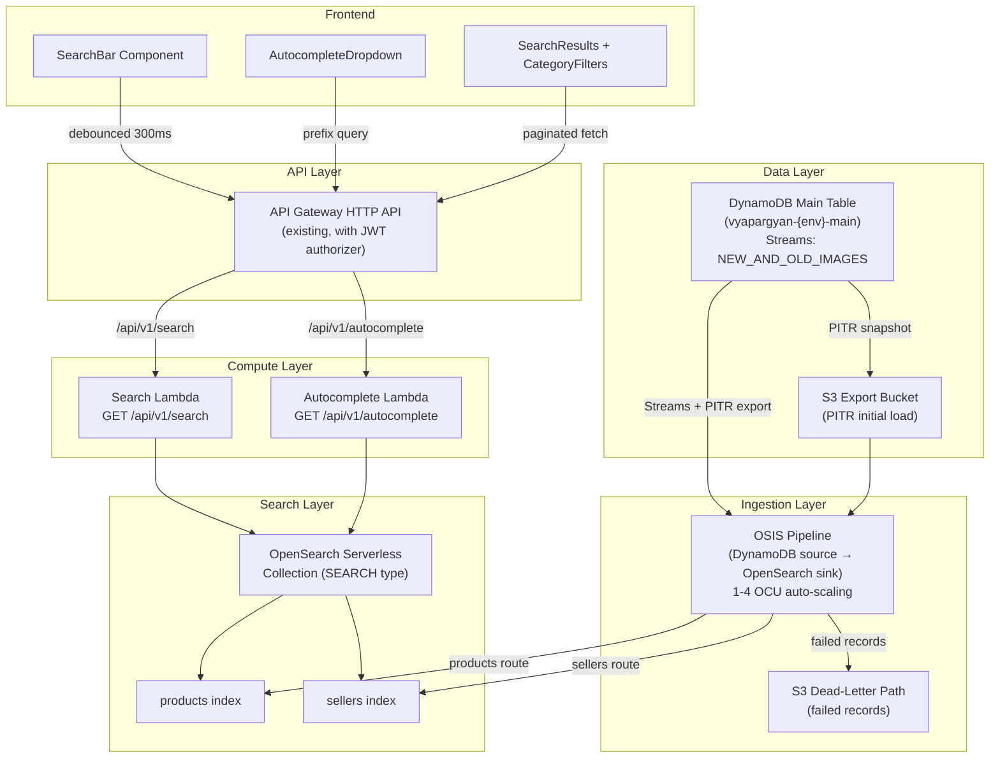

# Design Document: OpenSearch Integration

## Overview

This design replaces VyaparGyan's current DynamoDB Scan-based product search (`catalog-search-handler.ts`) with an OpenSearch Serverless-powered full-text search system. The integration uses a zero-ETL pipeline (OSIS) to automatically sync product and seller records from the existing DynamoDB single-table to OpenSearch Serverless indexes, enabling fuzzy matching, autocomplete, and faceted filtering.

The system introduces a new `SearchStack` CDK construct, a reusable `OpenSearchAdapter` for SigV4-signed queries, two Lambda handlers (search + autocomplete), two new API Gateway routes, and frontend components (SearchBar, AutocompleteDropdown, SearchResults, CategoryFilters) integrated into the customer catalog and seller inventory pages.

## Architecture



### Key Design Decisions

1. **OpenSearch Serverless over Managed Domain** — No cluster management, scales to zero when idle, pay-per-OCU (~$2-5/day at current scale). Native zero-ETL support from DynamoDB.

2. **Zero-ETL via OSIS** — Eliminates custom ETL code. The pipeline reads DynamoDB Streams for ongoing changes and PITR export for initial backfill. Only product and seller records are routed; all other entity types are discarded.

3. **Separate Search Lambda (not modifying existing catalog handler)** — The existing `catalog-search-handler.ts` continues to work as a DynamoDB fallback. The new `/api/v1/search` and `/api/v1/autocomplete` routes are additive. The frontend switches to the new endpoints.

4. **SigV4 signing via OpenSearch client adapter** — OpenSearch Serverless requires IAM-based auth. A reusable adapter handles signing, connection reuse, and timeout management, following the existing adapter pattern (`dynamodb-adapter.ts`).

## Components and Interfaces

### 1. SearchStack (CDK)

New CDK stack at `infra/cdk/lib/stacks/search-stack.ts`.

```typescript
export interface SearchStackProps extends cdk.StackProps {
  config: EnvironmentConfig;
  table: Table;           // from DatabaseStack
  httpApi: HttpApi;        // from APIStack
  jwtAuthorizer: HttpUserPoolAuthorizer; // from APIStack
}

export class SearchStack extends cdk.Stack {
  public readonly collection: CfnCollection;
  public readonly searchFunction: Function;
  public readonly autocompleteFunction: Function;
  public readonly exportBucket: Bucket;
  public readonly pipeline: CfnPipeline;
}
```

Resources provisioned:
- `CfnCollection` — OpenSearch Serverless collection (type: SEARCH), named `{resourcePrefix}-products`
- `CfnEncryptionPolicy` — AWS-owned key encryption
- `CfnNetworkPolicy` — Public access for Lambda execution roles
- `CfnAccessPolicy` (read) — Search Lambda role gets `aoss:ReadDocument`, `aoss:DescribeIndex`
- `CfnAccessPolicy` (write) — OSIS pipeline role gets `aoss:WriteDocument`, `aoss:CreateIndex`, `aoss:UpdateIndex`
- `Bucket` — S3 bucket for PITR export with 30-day lifecycle expiration
- `CfnPipeline` — OSIS pipeline with DynamoDB source, route filters, OpenSearch sink
- `Function` (search) — Lambda for `/api/v1/search`
- `Function` (autocomplete) — Lambda for `/api/v1/autocomplete`
- IAM roles for OSIS (DynamoDB read, S3 read, OpenSearch write) and Lambda (OpenSearch read)
- API Gateway routes added to existing `httpApi`

### 2. OpenSearch Client Adapter

New adapter at `services/api/src/adapters/opensearch-adapter.ts`, following the existing adapter pattern.

```typescript
import { Client } from '@opensearch-project/opensearch';
import { AwsSigv4Signer } from '@opensearch-project/opensearch/aws';

export interface SearchResult<T> {
  hits: T[];
  total: number;
}

export interface SuggestionResult {
  suggestions: Array<{
    name: string;
    category: string;
    productId: string;
  }>;
}

export class OpenSearchAdapter {
  private client: Client; // reused across invocations (Lambda warm start)

  constructor(endpoint?: string);

  /** Execute a search query against an index */
  async search<T>(index: string, body: Record<string, unknown>): Promise<SearchResult<T>>;

  /** Execute a prefix-based suggestion query */
  async suggest(index: string, prefix: string, limit?: number): Promise<SuggestionResult>;
}
```

- Reads endpoint from `OPENSEARCH_ENDPOINT` env var
- Signs requests with SigV4 using `aoss` service name
- 5-second request timeout; throws descriptive `OpenSearchTimeoutError`
- HTTP keep-alive for connection reuse within Lambda execution context

### 3. Search Lambda Handler

New handler at `services/api/src/handlers/catalog/search-handler.ts`.

```typescript
// GET /api/v1/search?q=&category=&seller=&page=1&size=20
export interface SearchRequest {
  q?: string;
  category?: string;
  seller?: string;
  page?: number;  // default 1
  size?: number;  // default 20, max 100
}

export interface SearchResponse {
  items: SearchProductItem[];
  total: number;
  page: number;
  pageSize: number;
}

export interface SearchProductItem {
  productId: string;
  productName: string;
  description: string;
  category: string;
  sellerId: string;
  price: number;
  stockQuantity: number;
  imageUrls: string[];
  createdAt: string;
}
```

Query construction:
- `multi_match` on `productName^3`, `description`, `tags^2` with `fuzziness: "AUTO"`
- `term` filter on `status: "Active"`
- Optional `term` filters for `category` and `sellerId`
- If no `q` provided, `match_all` ordered by relevance
- Pagination via `from` / `size`

### 4. Autocomplete Lambda Handler

New handler at `services/api/src/handlers/catalog/autocomplete-handler.ts`.

```typescript
// GET /api/v1/autocomplete?q=&limit=5
export interface AutocompleteRequest {
  q: string;
  limit?: number; // default 5, max 10
}

export interface AutocompleteResponse {
  suggestions: Array<{
    name: string;
    category: string;
    productId: string;
  }>;
}
```

- Returns empty `suggestions` array if `q` has fewer than 2 characters
- Prefix query on `productName.keyword`
- Filters to `status: "Active"` only
- On OpenSearch unreachable: returns empty `suggestions` with HTTP 200 (graceful degradation)

### 5. Frontend Components

All new components under `apps/web/components/search/`.

```typescript
// SearchBar.tsx
interface SearchBarProps {
  placeholder?: string;
  onSearch: (query: string) => void;
  sellerScope?: string; // for seller inventory page
}

// AutocompleteDropdown.tsx
interface AutocompleteDropdownProps {
  suggestions: AutocompleteSuggestion[];
  isLoading: boolean;
  onSelect: (suggestion: AutocompleteSuggestion) => void;
  visible: boolean;
}

// SearchResults.tsx
interface SearchResultsProps {
  items: SearchProductItem[];
  total: number;
  page: number;
  pageSize: number;
  isLoading: boolean;
  onPageChange: (page: number) => void;
}

// CategoryFilters.tsx
interface CategoryFiltersProps {
  categories: string[];
  selected: string | null;
  onSelect: (category: string | null) => void;
}
```

### 6. API Client Functions

New functions in `apps/web/lib/api-search.ts`, following the existing `api-catalog.ts` pattern.

```typescript
export async function searchProducts(params: {
  q?: string;
  category?: string;
  seller?: string;
  page?: number;
  size?: number;
}): Promise<SearchResponse>;

export async function getAutocompleteSuggestions(
  q: string,
  limit?: number
): Promise<AutocompleteResponse>;
```

## Data Models

### Product Index Mapping (`products`)

```json
{
  "mappings": {
    "properties": {
      "productId":     { "type": "keyword" },
      "productName":   { "type": "text", "analyzer": "standard", "fields": { "keyword": { "type": "keyword" } } },
      "description":   { "type": "text", "analyzer": "standard" },
      "category":      { "type": "keyword" },
      "tags":          { "type": "keyword" },
      "sellerId":      { "type": "keyword" },
      "status":        { "type": "keyword" },
      "price":         { "type": "float" },
      "stockQuantity": { "type": "integer" },
      "imageUrls":     { "type": "keyword" },
      "createdAt":     { "type": "date" }
    }
  }
}
```

### Seller Index Mapping (`sellers`)

```json
{
  "mappings": {
    "properties": {
      "sellerId":    { "type": "keyword" },
      "storeName":   { "type": "text", "analyzer": "standard", "fields": { "keyword": { "type": "keyword" } } },
      "description": { "type": "text", "analyzer": "standard" },
      "categories":  { "type": "keyword" },
      "city":        { "type": "keyword" },
      "status":      { "type": "keyword" }
    }
  }
}
```

### OSIS Pipeline Configuration

```yaml
version: "2"
dynamodb-pipeline:
  source:
    dynamodb:
      tables:
        - table_arn: "${tableArn}"
          stream:
            start_position: "LATEST"
          export:
            s3_bucket: "${exportBucketName}"
            s3_region: "${region}"
            s3_prefix: "ddb-export/"
  route:
    - products: '/PK startsWith "SELLER#" and SK startsWith "PRODUCT#"'
    - sellers: '/PK startsWith "SELLER#" and SK == "PROFILE"'
  sink:
    - opensearch:
        hosts: ["${collectionEndpoint}"]
        index: "products"
        routes: ["products"]
        aws:
          sts_role_arn: "${osisWriteRoleArn}"
          region: "${region}"
          serverless: true
    - opensearch:
        hosts: ["${collectionEndpoint}"]
        index: "sellers"
        routes: ["sellers"]
        aws:
          sts_role_arn: "${osisWriteRoleArn}"
          region: "${region}"
          serverless: true
  processor:
    - dead_letter_queue:
        s3_bucket: "${exportBucketName}"
        s3_prefix: "dlq/"
```

### API Request/Response Schemas (Zod)

```typescript
// Search request validation
const SearchQuerySchema = z.object({
  q: z.string().optional(),
  category: z.string().optional(),
  seller: z.string().optional(),
  page: z.coerce.number().int().min(1).default(1),
  size: z.coerce.number().int().min(1).max(100).default(20),
});

// Autocomplete request validation
const AutocompleteQuerySchema = z.object({
  q: z.string().min(1),
  limit: z.coerce.number().int().min(1).max(10).default(5),
});

// Search response schema
const SearchResponseSchema = z.object({
  items: z.array(z.object({
    productId: z.string(),
    productName: z.string(),
    description: z.string(),
    category: z.string(),
    sellerId: z.string(),
    price: z.number(),
    stockQuantity: z.number().int(),
    imageUrls: z.array(z.string()),
    createdAt: z.string(),
  })),
  total: z.number().int().min(0),
  page: z.number().int().min(1),
  pageSize: z.number().int().min(1).max(100),
});

// Autocomplete response schema
const AutocompleteResponseSchema = z.object({
  suggestions: z.array(z.object({
    name: z.string(),
    category: z.string(),
    productId: z.string(),
  })),
});
```


## Correctness Properties

*A property is a characteristic or behavior that should hold true across all valid executions of a system — essentially, a formal statement about what the system should do. Properties serve as the bridge between human-readable specifications and machine-verifiable correctness guarantees.*

### Property 1: Search query construction correctness

*For any* valid search request parameters (query string `q`, optional `category`, optional `seller`), the constructed OpenSearch query body SHALL contain a `multi_match` clause with fields `productName^3`, `description`, `tags^2` and `fuzziness: "AUTO"`, a `term` filter for `status: "Active"`, and conditional `term` filters for `category` and `sellerId` if and only if those parameters are provided.

**Validates: Requirements 5.1, 5.2, 5.3, 5.4, 5.5**

### Property 2: Pagination calculation correctness

*For any* page number (≥1) and page size (1–100), the computed OpenSearch `from` value SHALL equal `(page - 1) * size`, and the `size` value SHALL be clamped to the range [1, 100] with a default of 20.

**Validates: Requirements 5.6**

### Property 3: Autocomplete query construction correctness

*For any* prefix string of 2 or more characters, the constructed autocomplete query SHALL contain a `prefix` query on `productName.keyword` with the given prefix value, and a `term` filter for `status: "Active"`.

**Validates: Requirements 6.1, 6.3**

### Property 4: Autocomplete limit clamping

*For any* integer limit value, the effective limit used in the autocomplete query SHALL be clamped to the range [1, 10] with a default of 5 when not provided.

**Validates: Requirements 6.2**

### Property 5: Short prefix returns empty suggestions

*For any* string of length 0 or 1, the autocomplete handler SHALL return an empty `suggestions` array without querying OpenSearch.

**Validates: Requirements 6.5**

### Property 6: Product data round-trip preservation

*For any* valid Product object with `productId`, `productName`, `price`, `category`, and `sellerId` fields, transforming it to an OpenSearch document (index format) and then formatting it back from an OpenSearch hit to a `SearchProductItem` SHALL preserve the values of all five fields.

**Validates: Requirements 11.1**

### Property 7: Search response schema conformance

*For any* valid search query string and any mock OpenSearch response (with 0 or more hits), the Search Lambda's formatted response SHALL conform to the `SearchResponse` Zod schema containing `items` (array), `total` (non-negative integer), `page` (positive integer), and `pageSize` (1–100).

**Validates: Requirements 5.7, 11.2**

### Property 8: Autocomplete response schema conformance

*For any* valid autocomplete prefix string of 2 or more characters and any mock OpenSearch response, the Autocomplete Lambda's formatted response SHALL conform to the `AutocompleteResponse` Zod schema containing a `suggestions` array where each element has `name`, `category`, and `productId` string fields.

**Validates: Requirements 6.4, 11.3**

## Error Handling

### OpenSearch Unavailability

| Scenario | Search Lambda Behavior | Autocomplete Lambda Behavior |
|---|---|---|
| Connection refused / DNS failure | HTTP 503 `{ error: "Search is temporarily unavailable" }` | HTTP 200 `{ suggestions: [] }` |
| Request timeout (>5s) | HTTP 503 `{ error: "Search request timed out" }` | HTTP 200 `{ suggestions: [] }` |
| 5xx from OpenSearch | HTTP 503 `{ error: "Search service error" }` | HTTP 200 `{ suggestions: [] }` |
| Index not found | HTTP 503 `{ error: "Search index not available" }` | HTTP 200 `{ suggestions: [] }` |

Design rationale: Search failures return 503 so the frontend can show an explicit "search unavailable" state. Autocomplete failures return 200 with empty suggestions so the dropdown silently disappears — users can still type and press Enter to attempt a full search.

### Input Validation Errors

| Scenario | Response |
|---|---|
| `size` > 100 | Clamped to 100 (no error) |
| `page` < 1 or non-integer | HTTP 400 `{ error: "Invalid query parameters" }` |
| `q` is empty string for search | Treated as "no query" — returns all active products |
| `q` is empty string for autocomplete | Returns empty suggestions (< 2 chars) |

### OSIS Pipeline Failures

- Failed records written to S3 dead-letter path `s3://{exportBucket}/dlq/`
- CloudWatch alarm on DLQ object count > 0
- Pipeline auto-retries transient failures (built-in OSIS behavior)
- No impact on search availability — stale data served until pipeline recovers

### Frontend Graceful Degradation

- If `/api/v1/search` returns 503, the frontend shows "Search is temporarily unavailable. Try again later." with a retry button
- If `/api/v1/autocomplete` returns empty suggestions, the dropdown is hidden (no error shown)
- Network timeout on frontend (5s): abort request, show retry option
- The existing DynamoDB-based catalog browsing (`/api/v1/catalog/products`) remains functional as a fallback

## Testing Strategy

### Unit Tests

Focus on specific examples and edge cases:

- **Query builder**: Verify `match_all` when no `q` provided; verify correct field boosts; verify filter combinations
- **Response formatter**: Verify empty hits produce `{ items: [], total: 0, page: 1, pageSize: 20 }`
- **OpenSearch adapter**: Verify SigV4 signer configuration; verify timeout error handling; verify connection reuse (singleton)
- **Autocomplete handler**: Verify 1-char prefix returns empty; verify graceful degradation on OpenSearch error
- **Zod schemas**: Verify schema rejects malformed responses
- **Frontend components**: Verify SearchBar renders input/icon/clear button; verify debounce timing; verify autocomplete dropdown visibility; verify empty state rendering

### Property-Based Tests

Using `fast-check` (TypeScript property-based testing library). Minimum 100 iterations per property.

Each property test references its design document property:

1. **Feature: opensearch-integration, Property 1: Search query construction correctness** — Generate random `{q, category, seller}` tuples, verify constructed query body structure
2. **Feature: opensearch-integration, Property 2: Pagination calculation correctness** — Generate random `{page, size}` pairs, verify `from`/`size` computation
3. **Feature: opensearch-integration, Property 3: Autocomplete query construction correctness** — Generate random strings of length ≥2, verify prefix query structure
4. **Feature: opensearch-integration, Property 4: Autocomplete limit clamping** — Generate random integers, verify clamping to [1, 10]
5. **Feature: opensearch-integration, Property 5: Short prefix returns empty suggestions** — Generate random strings of length 0-1, verify empty response
6. **Feature: opensearch-integration, Property 6: Product data round-trip preservation** — Generate random Product objects, verify field preservation through transform → format cycle
7. **Feature: opensearch-integration, Property 7: Search response schema conformance** — Generate random query strings + mock hit arrays, validate output against Zod schema
8. **Feature: opensearch-integration, Property 8: Autocomplete response schema conformance** — Generate random prefixes + mock hit arrays, validate output against Zod schema

### Integration Tests

- **CDK snapshot tests**: Verify SearchStack synthesizes expected CloudFormation resources (collection, policies, pipeline, Lambda, routes)
- **OSIS pipeline sync**: Put product/seller records in DynamoDB, verify they appear in OpenSearch within 60s
- **OSIS filtering**: Put non-product records, verify they do NOT appear in OpenSearch
- **End-to-end search**: Create product via DynamoDB → wait for sync → call `/api/v1/search?q=productName` → verify result
- **End-to-end autocomplete**: Create product → wait for sync → call `/api/v1/autocomplete?q=prefix` → verify suggestion
- **JWT auth**: Call search/autocomplete without token → verify 401
