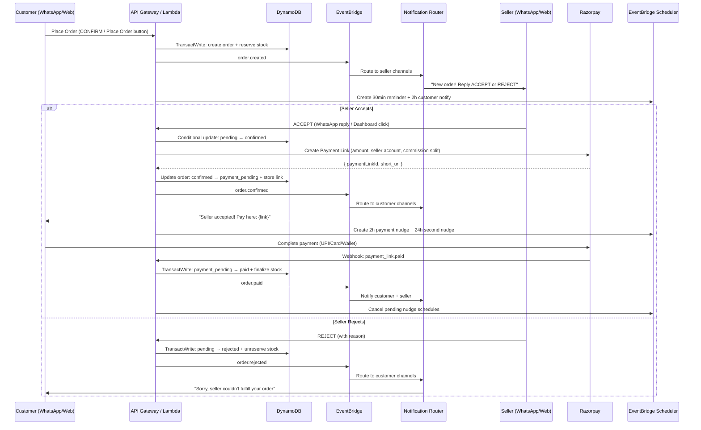
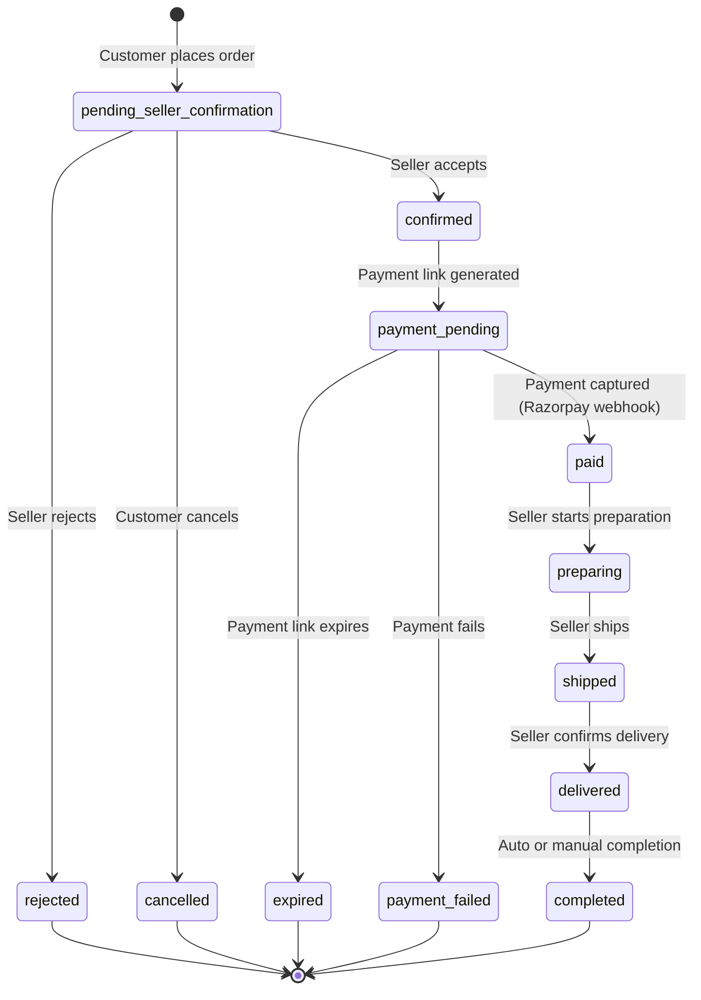

# Order Confirmation Flow — Design

## Overview

This design introduces a seller confirmation step into the VyaparGyan order lifecycle. Today, orders go directly from cart → `PENDING_PAYMENT` → `PAID`. The new flow inserts a seller acceptance gate: cart → `pending_seller_confirmation` → `confirmed` → `payment_pending` → `paid` → `preparing` → `shipped` → `delivered` → `completed`.

The design touches every layer of the stack: the DynamoDB order state machine, the OrderService transaction boundaries, the Razorpay payment link generation trigger, the WhatsApp conversation router, the EventBridge notification fan-out, the seller web dashboard, and the customer order tracking UI.

### Key Design Decisions

1. **Seller confirmation before payment** — Payment links are generated only after seller acceptance, preventing customers from paying for orders that won't be fulfilled.
2. **Stock reservation at order creation** — `reserved_stock` is incremented atomically when the order is created (not when payment completes), ensuring no overselling during the seller review window.
3. **Stock finalization at payment** — `stock_quantity` and `reserved_stock` are both decremented atomically when payment is captured, converting the reservation into a sale.
4. **EventBridge Scheduler for nudges** — One-time schedules for payment reminders (2h, 24h) and seller confirmation timeouts (30min, 2h) instead of polling workers.
5. **Idempotent webhook processing** — Razorpay event_id stored with conditional writes to prevent duplicate processing.
6. **Omnichannel notification fan-out** — Every order status change publishes to EventBridge; the existing notification router and message fan-out Lambda deliver to all active channels.

## Architecture

### High-Level Order Flow



### Order State Machine



### Status Transition Table

| From | To | Actor | Side Effects |
|------|----|-------|-------------|
| — | `pending_seller_confirmation` | Customer | Reserve stock (TransactWrite), create seller/customer index entries, publish `order.created`, schedule seller reminders |
| `pending_seller_confirmation` | `confirmed` | Seller | Conditional update (status = pending_seller_confirmation), publish `order.confirmed`, cancel seller reminder schedules |
| `pending_seller_confirmation` | `rejected` | Seller | Unreserve stock (TransactWrite), store rejection reason, publish `order.rejected`, cancel seller reminder schedules |
| `pending_seller_confirmation` | `cancelled` | Customer | Unreserve stock (TransactWrite), publish `order.cancelled`, cancel seller reminder schedules |
| `confirmed` | `payment_pending` | System | Generate Razorpay payment link, store paymentLinkId/Url, schedule payment nudges |
| `confirmed` | `cancelled` | Customer | Unreserve stock (TransactWrite), publish `order.cancelled` |
| `payment_pending` | `paid` | Razorpay webhook | Finalize stock (TransactWrite), store razorpayPaymentId, publish `order.paid`, cancel nudge schedules |
| `payment_pending` | `expired` | Razorpay webhook | Unreserve stock (TransactWrite), publish `order.expired`, cancel nudge schedules |
| `payment_pending` | `payment_failed` | Razorpay webhook | Publish `order.payment_failed` (stock stays reserved for retry) |
| `paid` | `preparing` | Seller | Publish `order.preparing` |
| `preparing` | `shipped` | Seller | Publish `order.shipped` |
| `shipped` | `delivered` | Seller | Publish `order.delivered` |
| `delivered` | `completed` | System/Seller | Publish `order.completed` |

## Components and Interfaces

### Order State Machine (Pure Function)

The state machine is implemented as a pure validation function, separate from side effects:

```typescript
// services/api/src/services/order-state-machine.ts

export type OrderStatus =
  | 'pending_seller_confirmation'
  | 'confirmed'
  | 'payment_pending'
  | 'paid'
  | 'preparing'
  | 'shipped'
  | 'delivered'
  | 'completed'
  | 'rejected'
  | 'cancelled'
  | 'payment_failed'
  | 'expired';

export type TransitionActor = 'customer' | 'seller' | 'system' | 'webhook';

interface TransitionRule {
  to: OrderStatus;
  actors: TransitionActor[];
}

const TRANSITIONS: Record<OrderStatus, TransitionRule[]> = {
  pending_seller_confirmation: [
    { to: 'confirmed', actors: ['seller'] },
    { to: 'rejected', actors: ['seller'] },
    { to: 'cancelled', actors: ['customer'] },
  ],
  confirmed: [
    { to: 'payment_pending', actors: ['system'] },
    { to: 'cancelled', actors: ['customer'] },
  ],
  payment_pending: [
    { to: 'paid', actors: ['webhook'] },
    { to: 'expired', actors: ['webhook'] },
    { to: 'payment_failed', actors: ['webhook'] },
  ],
  paid: [
    { to: 'preparing', actors: ['seller'] },
  ],
  preparing: [
    { to: 'shipped', actors: ['seller'] },
  ],
  shipped: [
    { to: 'delivered', actors: ['seller'] },
  ],
  delivered: [
    { to: 'completed', actors: ['system', 'seller'] },
  ],
  completed: [],
  rejected: [],
  cancelled: [],
  payment_failed: [],
  expired: [],
};

export interface TransitionResult {
  valid: boolean;
  from: OrderStatus;
  to: OrderStatus;
  error?: string;
}

/**
 * Validate whether a status transition is allowed.
 * Pure function — no side effects.
 */
export function validateTransition(
  from: OrderStatus,
  to: OrderStatus,
  actor: TransitionActor,
): TransitionResult {
  const rules = TRANSITIONS[from];
  if (!rules) {
    return { valid: false, from, to, error: `Unknown status: ${from}` };
  }

  const match = rules.find(r => r.to === to && r.actors.includes(actor));
  if (!match) {
    return {
      valid: false,
      from,
      to,
      error: `Transition ${from} → ${to} not allowed for actor ${actor}`,
    };
  }

  return { valid: true, from, to };
}

/**
 * Return all valid next statuses for a given status and actor.
 */
export function getValidTransitions(
  from: OrderStatus,
  actor: TransitionActor,
): OrderStatus[] {
  const rules = TRANSITIONS[from] || [];
  return rules
    .filter(r => r.actors.includes(actor))
    .map(r => r.to);
}

/**
 * Check if a status is terminal (no further transitions possible).
 */
export function isTerminalStatus(status: OrderStatus): boolean {
  return (TRANSITIONS[status] || []).length === 0;
}

/**
 * Check if a status requires stock unreservation on entry.
 */
export function requiresStockUnreservation(status: OrderStatus): boolean {
  return ['rejected', 'cancelled', 'expired'].includes(status);
}

/**
 * Check if a status requires stock finalization on entry.
 */
export function requiresStockFinalization(status: OrderStatus): boolean {
  return status === 'paid';
}
```

### Refactored OrderService

The existing `OrderService` is refactored to use the new state machine. Key changes:
- Initial status changes from `PENDING_PAYMENT` to `pending_seller_confirmation`
- Stock reservation uses `reserved_stock` instead of direct `stockQuantity` deduction
- New `transitionOrder()` method handles all status changes with conditional updates
- Audit log entries created for every transition

```typescript
// services/api/src/services/order-service.ts (refactored interface)

export interface CreateOrderInput {
  customerId: string;
  customerPhone: string;
  sellerId: string;
  items: OrderItem[];
  channel: 'whatsapp' | 'web';
  shippingAddress?: ShippingAddress;
}

export interface TransitionOrderInput {
  orderId: string;
  targetStatus: OrderStatus;
  actor: TransitionActor;
  actorId: string;
  reason?: string; // For rejections
}

export class OrderService {
  /**
   * Create order with status pending_seller_confirmation.
   * Atomic transaction: create order + reserve stock + create indexes + audit log.
   */
  async createOrder(input: CreateOrderInput): Promise<CreateOrderResult>;

  /**
   * Transition order to a new status with validation.
   * Uses conditional update: ConditionExpression status = expectedCurrentStatus.
   * Publishes EventBridge event and creates audit log.
   */
  async transitionOrder(input: TransitionOrderInput): Promise<TransitionResult>;

  /**
   * Get order by UUID (PK: ORDER#{orderId}, SK: METADATA).
   */
  async getOrder(orderId: string): Promise<Order | null>;

  /**
   * List orders for a seller, sorted by creation date descending.
   * Uses PK: SELLER#{sellerId}, SK begins_with ORDER#.
   */
  async listSellerOrders(sellerId: string, statusFilter?: OrderStatus): Promise<OrderSummary[]>;

  /**
   * List orders for a customer, sorted by creation date descending.
   * Uses PK: CUSTOMER#{customerId}, SK begins_with ORDER#.
   */
  async listCustomerOrders(customerId: string): Promise<OrderSummary[]>;
}
```

### Order Creation Transaction (Revised)

```typescript
// TransactWriteItems for order creation
const transactItems = [
  // 1. Create ORDER record
  {
    Put: {
      TableName,
      Item: marshall({
        PK: `ORDER#${orderUUID}`,
        SK: 'METADATA',
        orderId: humanReadableId, // VG-YYYYMMDD-NNNN
        customerId, sellerId, items, subtotal,
        commissionRate, commissionAmount, sellerAmount, totalAmount,
        status: 'pending_seller_confirmation',
        channel, // 'whatsapp' | 'web'
        createdAt: now, updatedAt: now,
      }),
      ConditionExpression: 'attribute_not_exists(PK)',
    },
  },
  // 2. Reserve stock for each item
  ...items.map(item => ({
    Update: {
      TableName,
      Key: marshall({ PK: `PRODUCT#${item.productId}`, SK: 'METADATA' }),
      UpdateExpression: 'SET reserved_stock = if_not_exists(reserved_stock, :zero) + :qty, updatedAt = :now',
      ConditionExpression: 'stockQuantity - if_not_exists(reserved_stock, :zero) >= :qty',
      ExpressionAttributeValues: marshall({ ':qty': item.quantity, ':now': now, ':zero': 0 }),
    },
  })),
  // 3. Seller index entry
  {
    Put: {
      TableName,
      Item: marshall({
        PK: `SELLER#${sellerId}`,
        SK: `ORDER#${now}#${orderUUID}`,
        orderId: humanReadableId, orderUUID, customerId,
        totalAmount, status: 'pending_seller_confirmation', createdAt: now,
      }),
    },
  },
  // 4. Customer index entry
  {
    Put: {
      TableName,
      Item: marshall({
        PK: `CUSTOMER#${customerId}`,
        SK: `ORDER#${now}#${orderUUID}`,
        orderId: humanReadableId, orderUUID, sellerId,
        totalAmount, status: 'pending_seller_confirmation', createdAt: now,
      }),
    },
  },
  // 5. Audit log entry
  {
    Put: {
      TableName,
      Item: marshall({
        PK: `AUDIT#${now.slice(0, 10)}#${auditUUID}`,
        SK: `ORDER#${orderUUID}`,
        actorId: customerId, actorRole: 'customer',
        oldStatus: null, newStatus: 'pending_seller_confirmation',
        timestamp: now,
      }),
    },
  },
];
```

### Payment Link Generation on Seller Acceptance

```typescript
// Triggered when order.confirmed event is received
async function generatePaymentLink(order: Order): Promise<void> {
  const razorpay = new RazorpayAdapter();

  const link = await razorpay.createPaymentLink({
    orderId: order.orderId,
    amount: order.totalAmount,
    customerPhone: order.customerPhone,
    customerName: order.customerDisplayName,
    description: `Order ${order.orderId}`,
    sellerAccountId: order.sellerRazorpayAccountId,
    commissionAmount: order.commissionAmount,
  });

  // Update order with payment link details and transition to payment_pending
  await orderService.updateOrderPaymentLink(order.id, {
    paymentLinkId: link.id,
    paymentLinkUrl: link.short_url,
    status: 'payment_pending',
  });

  // Publish order.payment_pending event
  await publishOrderEvent('order.payment_pending', {
    orderId: order.id,
    sellerId: order.sellerId,
    customerId: order.customerId,
    paymentLinkUrl: link.short_url,
    amount: order.totalAmount,
  });
}
```

### EventBridge Event Catalog

All order events use source `vyapargyan.orders` on the `vyapargyan-{env}-events` bus:

```typescript
interface OrderEvent {
  orderId: string;
  sellerId: string;
  customerId: string;
  oldStatus: OrderStatus;
  newStatus: OrderStatus;
  items: OrderItem[];
  amount: number;
  channel: 'whatsapp' | 'web';
  timestamp: string;
  // Event-specific fields:
  paymentLinkUrl?: string;     // order.payment_pending
  rejectionReason?: string;    // order.rejected
  razorpayPaymentId?: string;  // order.paid
  errorDescription?: string;   // order.payment_failed
}

// Event detail types:
// order.created           — new order placed, seller notification needed
// order.confirmed         — seller accepted, trigger payment link generation
// order.payment_pending   — payment link generated, customer notification needed
// order.paid              — payment captured, both parties notified
// order.preparing         — seller started preparation
// order.shipped           — seller shipped
// order.delivered         — seller confirmed delivery
// order.completed         — order lifecycle complete
// order.rejected          — seller rejected, customer notified
// order.cancelled         — customer cancelled
// order.expired           — payment link expired
// order.payment_failed    — payment attempt failed
```

### Notification Router Integration

The existing `notification-router` Lambda and `message-fanout` Lambda handle delivery. New EventBridge rules route order events:

```typescript
// New EventBridge rule in events-stack.ts
new Rule(this, 'OrderEventNotificationRule', {
  ruleName: `${config.resourcePrefix}-order-notification`,
  eventBus: this.eventBus,
  eventPattern: {
    source: ['vyapargyan.orders'],
    detailType: [
      'order.created', 'order.confirmed', 'order.payment_pending',
      'order.paid', 'order.preparing', 'order.shipped',
      'order.delivered', 'order.rejected', 'order.cancelled',
      'order.expired', 'order.payment_failed',
    ],
  },
  targets: [new LambdaFunction(this.notificationRouterFunction)],
});
```

### WhatsApp Conversation State Updates

The WhatsApp state router adds an `order_tracking` state and seller order management:

```typescript
// Updated router.ts state handling
switch (state) {
  case 'checkout':
    // Handles: cart management, CONFIRM → order creation
    await checkoutHandler(context);
    break;
  case 'tracking':
    // Handles: order status inquiries, PAY (regenerate link), REORDER
    await trackingHandler(context);
    break;
  // Seller-side states (seller copilot):
  case 'seller_orders':
    // Handles: ACCEPT, REJECT, ACCEPT {orderId}, REJECT {orderId}
    await sellerOrderHandler(context);
    break;
}
```

### REST API Endpoints

```typescript
// Order CRUD
POST   /api/v1/orders                    // Create order (from web checkout)
GET    /api/v1/orders/:orderId           // Get order detail
GET    /api/v1/orders                    // List customer's orders (auth: customer)

// Seller order management
GET    /api/v1/seller/orders             // List seller's orders (auth: seller)
GET    /api/v1/seller/orders/:orderId    // Get order detail (auth: seller)
POST   /api/v1/seller/orders/:orderId/accept   // Accept order (auth: seller)
POST   /api/v1/seller/orders/:orderId/reject   // Reject order (auth: seller, body: { reason })
POST   /api/v1/seller/orders/:orderId/status   // Update fulfillment status (auth: seller, body: { status })

// Customer actions
POST   /api/v1/orders/:orderId/cancel    // Cancel order (auth: customer)
POST   /api/v1/orders/:orderId/pay       // Get/regenerate payment info (auth: customer)

// Razorpay webhook
POST   /api/v1/webhooks/razorpay         // Razorpay webhook (no auth, signature verified)
```

### EventBridge Scheduler for Nudges and Timeouts

```typescript
// services/api/src/services/order-scheduler-service.ts

import { SchedulerClient, CreateScheduleCommand, DeleteScheduleCommand } from '@aws-sdk/client-scheduler';

const scheduler = new SchedulerClient({});

/**
 * Schedule seller confirmation reminders.
 * - 30min: Remind seller on all channels
 * - 2h: Notify customer that seller hasn't responded
 */
export async function scheduleSellerReminders(orderId: string, sellerId: string): Promise<void> {
  const now = new Date();

  // 30-minute seller reminder
  await scheduler.send(new CreateScheduleCommand({
    Name: `order-seller-remind-${orderId}`,
    GroupName: 'default',
    ScheduleExpression: `at(${addMinutes(now, 30).toISOString().slice(0, 19)})`,
    FlexibleTimeWindow: { Mode: 'OFF' },
    Target: {
      Arn: process.env.NOTIFICATION_ROUTER_ARN!,
      RoleArn: process.env.SCHEDULER_ROLE_ARN!,
      Input: JSON.stringify({
        type: 'seller_reminder',
        orderId,
        sellerId,
      }),
    },
  }));

  // 2-hour customer notification
  await scheduler.send(new CreateScheduleCommand({
    Name: `order-customer-notify-${orderId}`,
    GroupName: 'default',
    ScheduleExpression: `at(${addMinutes(now, 120).toISOString().slice(0, 19)})`,
    FlexibleTimeWindow: { Mode: 'OFF' },
    Target: {
      Arn: process.env.NOTIFICATION_ROUTER_ARN!,
      RoleArn: process.env.SCHEDULER_ROLE_ARN!,
      Input: JSON.stringify({
        type: 'seller_timeout_customer_notify',
        orderId,
        sellerId,
      }),
    },
  }));
}

/**
 * Schedule payment reminder nudges.
 * - 2h: First nudge with payment link
 * - 24h: Second nudge with urgency
 */
export async function schedulePaymentNudges(
  orderId: string,
  customerId: string,
  paymentLinkUrl: string,
): Promise<void> {
  const now = new Date();

  await scheduler.send(new CreateScheduleCommand({
    Name: `order-pay-nudge1-${orderId}`,
    GroupName: 'default',
    ScheduleExpression: `at(${addMinutes(now, 120).toISOString().slice(0, 19)})`,
    FlexibleTimeWindow: { Mode: 'OFF' },
    Target: {
      Arn: process.env.NOTIFICATION_ROUTER_ARN!,
      RoleArn: process.env.SCHEDULER_ROLE_ARN!,
      Input: JSON.stringify({
        type: 'payment_nudge_1',
        orderId,
        customerId,
        paymentLinkUrl,
      }),
    },
  }));

  await scheduler.send(new CreateScheduleCommand({
    Name: `order-pay-nudge2-${orderId}`,
    GroupName: 'default',
    ScheduleExpression: `at(${addMinutes(now, 1440).toISOString().slice(0, 19)})`,
    FlexibleTimeWindow: { Mode: 'OFF' },
    Target: {
      Arn: process.env.NOTIFICATION_ROUTER_ARN!,
      RoleArn: process.env.SCHEDULER_ROLE_ARN!,
      Input: JSON.stringify({
        type: 'payment_nudge_2',
        orderId,
        customerId,
        paymentLinkUrl,
      }),
    },
  }));
}

/**
 * Cancel all pending schedules for an order (on payment, cancellation, etc.)
 */
export async function cancelOrderSchedules(orderId: string): Promise<void> {
  const scheduleNames = [
    `order-seller-remind-${orderId}`,
    `order-customer-notify-${orderId}`,
    `order-pay-nudge1-${orderId}`,
    `order-pay-nudge2-${orderId}`,
  ];

  await Promise.allSettled(
    scheduleNames.map(name =>
      scheduler.send(new DeleteScheduleCommand({ Name: name, GroupName: 'default' }))
    ),
  );
}
```

### Razorpay Webhook Handler (Revised)

The existing webhook handler is updated to handle the new state machine:

```typescript
// services/api/src/handlers/payment/razorpay-webhook.ts (revised)

async function handlePaymentLinkPaid(webhookData: any): Promise<void> {
  const paymentLink = webhookData.payload.payment_link.entity;
  const orderId = paymentLink.reference_id;

  // Idempotency: check EVENT#{eventId}
  const eventId = webhookData.event_id || webhookData.payload.payment_link.entity.id;
  const alreadyProcessed = await checkIdempotency(eventId);
  if (alreadyProcessed) return;

  const order = await orderService.getOrder(orderId);
  if (!order || order.status !== 'payment_pending') return;

  // Validate amount matches
  const paidAmountRupees = paymentLink.amount_paid / 100;
  if (paidAmountRupees !== order.totalAmount) {
    logger.error('Amount mismatch', { orderId, expected: order.totalAmount, received: paidAmountRupees });
    return;
  }

  // Atomic transaction: update order + finalize stock + mark event processed
  await finalizePayment(order, paymentLink);

  // Cancel pending nudge schedules
  await cancelOrderSchedules(orderId);

  // Publish order.paid event
  await publishOrderEvent('order.paid', { orderId, ... });
}

async function handlePaymentLinkExpired(webhookData: any): Promise<void> {
  const paymentLink = webhookData.payload.payment_link.entity;
  const orderId = paymentLink.reference_id;

  const order = await orderService.getOrder(orderId);
  if (!order || order.status !== 'payment_pending') return;

  // Atomic transaction: update order to expired + unreserve stock
  await expireOrder(order);

  // Cancel pending nudge schedules
  await cancelOrderSchedules(orderId);

  // Publish order.expired event
  await publishOrderEvent('order.expired', { orderId, ... });
}
```

### Web UI Components

#### Customer Order Tracking Page (`/(customer)/orders/[orderId]`)

```typescript
// Key components:
// - OrderTimeline: Shows status transitions with timestamps and actors
// - StatusPill: Color-coded badge (yellow=pending, blue=in-progress, green=complete, red=failed)
// - PayNowButton: Renders Razorpay embedded checkout when status=payment_pending
// - CancelButton: Visible when status=pending_seller_confirmation or confirmed

interface OrderDetailPageProps {
  order: {
    orderId: string;
    status: OrderStatus;
    items: OrderItem[];
    subtotal: number;
    totalAmount: number;
    sellerName: string;
    timeline: TimelineEntry[];
    paymentLinkId?: string;
    paymentLinkUrl?: string;
    rejectionReason?: string;
    createdAt: string;
  };
}

interface TimelineEntry {
  status: OrderStatus;
  timestamp: string;
  actor: 'customer' | 'seller' | 'system';
  note?: string;
}
```

#### Seller Order Management Page (`/seller/orders`)

```typescript
// Key components:
// - OrderList: Filterable by status tabs (Pending, Confirmed, Paid, etc.)
// - OrderDetailModal: Shows order info + contextual action buttons
// - AcceptRejectButtons: For pending_seller_confirmation orders
// - FulfillmentButtons: Mark as Preparing / Shipped / Delivered
// - PendingBadge: Count of orders awaiting seller action

interface SellerOrdersPageState {
  orders: OrderSummary[];
  activeFilter: OrderStatus | 'all';
  pendingCount: number;
  selectedOrder: Order | null;
}
```

### Demo Data Seeding

The seed script (`scripts/seed-demo-data.ts`) is extended with:

```typescript
// Dragon Store products for order flow demo
const demoProducts = [
  {
    PK: 'PRODUCT#demo-amul-butter',
    SK: 'METADATA',
    id: 'demo-amul-butter',
    sellerId: 'seller-dragon',
    name: 'Amul Butter 500g',
    price: 280,
    stockQuantity: 45,
    reserved_stock: 0,
    isActive: true,
  },
  {
    PK: 'PRODUCT#demo-surf-excel',
    SK: 'METADATA',
    id: 'demo-surf-excel',
    sellerId: 'seller-dragon',
    name: 'Surf Excel 1kg',
    price: 199,
    stockQuantity: 30,
    reserved_stock: 0,
    isActive: true,
  },
  {
    PK: 'PRODUCT#demo-usbc-cable',
    SK: 'METADATA',
    id: 'demo-usbc-cable',
    sellerId: 'seller-dragon',
    name: 'USB-C Cable 1m',
    price: 149,
    stockQuantity: 100,
    reserved_stock: 0,
    isActive: true,
  },
];

// Dragon Store seller profile
const dragonSeller = {
  PK: 'USER#seller-dragon',
  SK: 'PROFILE',
  id: 'seller-dragon',
  role: 'seller',
  status: 'active',
  businessName: 'Dragon Store',
  phone: '+918927049085',
  razorpayAccountId: 'acc_test_dragon', // Razorpay test linked account
};

// Enigma customer profile
const enigmaCustomer = {
  PK: 'CUSTOMER#+917001124396',
  SK: 'PROFILE',
  id: 'cust-enigma',
  phoneNumber: '+917001124396',
  profileName: 'Enigma',
  phoneVerificationStatus: 'verified',
  preferredChannel: 'both',
};
```

## Data Models

### DynamoDB Order Record Schema

All records live in the single `vyapargyan-{env}-main` table.

#### Order Metadata Record

```
PK: ORDER#{orderUUID}
SK: METADATA
```

| Attribute | Type | Description |
|-----------|------|-------------|
| orderId | string | Human-readable ID: VG-YYYYMMDD-NNNN |
| customerId | string | Customer user ID |
| sellerId | string | Seller user ID |
| items | list | Array of { productId, name, quantity, unitPrice } |
| subtotal | number | Sum of line totals |
| commissionRate | number | Platform commission rate (default 0.15) |
| commissionAmount | number | subtotal × commissionRate |
| sellerAmount | number | subtotal − commissionAmount |
| totalAmount | number | Amount customer pays (= subtotal for now) |
| status | string | Current OrderStatus |
| channel | string | 'whatsapp' or 'web' |
| paymentLinkId | string? | Razorpay payment link ID |
| paymentLinkUrl | string? | Razorpay short URL |
| razorpayPaymentId | string? | Razorpay payment ID (after capture) |
| rejectionReason | string? | Seller's rejection reason |
| createdAt | string | ISO timestamp |
| confirmedAt | string? | When seller accepted |
| paidAt | string? | When payment captured |
| deliveredAt | string? | When marked delivered |
| updatedAt | string | ISO timestamp |

#### Order Item Records

```
PK: ORDER#{orderUUID}
SK: ITEM#{index}
```

| Attribute | Type | Description |
|-----------|------|-------------|
| productId | string | Product ID |
| productName | string | Denormalized product name |
| quantity | number | Ordered quantity |
| unitPrice | number | Price per unit at order time |
| lineTotal | number | quantity × unitPrice |

#### Seller Order Index

```
PK: SELLER#{sellerId}
SK: ORDER#{createdAt}#{orderUUID}
```

| Attribute | Type | Description |
|-----------|------|-------------|
| orderId | string | Human-readable order ID |
| orderUUID | string | Order UUID |
| customerId | string | Customer ID |
| totalAmount | number | Order total |
| status | string | Current status |
| createdAt | string | ISO timestamp |

#### Customer Order Index

```
PK: CUSTOMER#{customerId}
SK: ORDER#{createdAt}#{orderUUID}
```

Same attributes as seller index, with `sellerId` instead of `customerId`.

#### Audit Log Entry

```
PK: AUDIT#{date}#{auditUUID}
SK: ORDER#{orderUUID}
```

| Attribute | Type | Description |
|-----------|------|-------------|
| actorId | string | User ID or 'system' or 'webhook' |
| actorRole | string | 'customer', 'seller', 'system', 'webhook' |
| oldStatus | string? | Previous status |
| newStatus | string | New status |
| reason | string? | Rejection reason, etc. |
| timestamp | string | ISO timestamp |

#### Notification Record

```
PK: NOTIFICATION#{notificationUUID}
SK: METADATA
```

| Attribute | Type | Description |
|-----------|------|-------------|
| channel | string | 'whatsapp' or 'web' |
| recipientId | string | User ID |
| orderId | string | Related order |
| status | string | 'sent', 'delivered', 'failed' |
| messageTemplate | string | Template key used |
| timestamp | string | ISO timestamp |

### DynamoDB Transaction Boundaries Summary

| Transaction | Items in TransactWrite | Condition Expressions |
|-------------|----------------------|----------------------|
| **Order Creation** | 1 order + N stock reservations + 1 seller index + 1 customer index + 1 audit | `attribute_not_exists(PK)` on order; `stockQuantity - reserved_stock >= :qty` on each product |
| **Payment Confirmation** | 1 order update + N stock finalizations + 1 event idempotency + 1 audit | `status = payment_pending` on order; `reserved_stock >= :qty` on each product; `attribute_not_exists(PK)` on event |
| **Cancellation/Rejection** | 1 order update + N stock unreservations + 1 audit | `status = pending_seller_confirmation` on order; `reserved_stock >= :qty` on each product |
| **Seller Acceptance** | 1 order update + 1 audit | `status = pending_seller_confirmation` on order |
| **Fulfillment Updates** | 1 order update + 1 seller index update + 1 customer index update + 1 audit | `status = {expectedCurrentStatus}` on order |

## Correctness Properties

*A property is a characteristic or behavior that should hold true across all valid executions of a system — essentially, a formal statement about what the system should do. Properties serve as the bridge between human-readable specifications and machine-verifiable correctness guarantees.*

### Property 1: State Machine Transition Validity

*For any* order status, target status, and actor triple, `validateTransition(from, to, actor)` SHALL return `valid: true` if and only if the triple is defined in the transition table. All undefined triples SHALL return `valid: false` with an error message containing the current status and attempted target status.

**Validates: Requirements 1.3, 1.4, 1.7, 5.3, 5.4, 8.6, 8.7, 9.1, 9.2, 9.3**

### Property 2: Stock Reservation on Order Creation

*For any* valid cart (non-empty items, each with quantity > 0 and sufficient available stock), creating an order SHALL result in an order with status `pending_seller_confirmation` and `reserved_stock` on each product incremented by exactly the ordered quantity. The order's `totalAmount` SHALL equal the sum of (unitPrice × quantity) for all items.

**Validates: Requirements 1.2, 2.5, 3.4**

### Property 3: Stock Unreservation on Terminal States

*For any* order transitioning to `rejected`, `cancelled`, or `expired`, the `reserved_stock` on each product in the order SHALL be decremented by exactly the ordered quantity. After unreservation, `reserved_stock` SHALL be non-negative.

**Validates: Requirements 1.5, 5.4, 8.7**

### Property 4: Stock Finalization on Payment

*For any* order transitioning to `paid`, both `stock_quantity` and `reserved_stock` on each product SHALL be decremented by exactly the ordered quantity. After finalization, `stock_quantity >= 0` and `reserved_stock >= 0`.

**Validates: Requirements 1.6, 8.3**

### Property 5: Stock Conservation Invariant

*For any* sequence of order operations (create, accept, pay, cancel, reject, expire) on a set of products, the invariant `stock_quantity >= reserved_stock >= 0` SHALL hold at all times. Additionally, `stock_quantity + total_sold = initial_stock_quantity` and `reserved_stock = sum of quantities in non-terminal, non-paid orders`.

**Validates: Requirements 1.2, 1.5, 1.6**

### Property 6: Webhook Idempotency

*For any* Razorpay webhook event, processing the same event twice SHALL produce the same final order status and stock levels as processing it once. The second invocation SHALL return 200 OK without modifying any DynamoDB records.

**Validates: Requirements 8.8**

### Property 7: Razorpay Payload Construction

*For any* order with totalAmount > 0 and commissionRate in (0, 1), the generated Razorpay payment link payload SHALL have `amount` equal to `totalAmount × 100` (paise), `currency` equal to `INR`, `reference_id` equal to `orderId`, and `transfers[0].amount` equal to `(totalAmount - commissionAmount) × 100`. The `notify.sms` and `notify.whatsapp` fields SHALL be `false`.

**Validates: Requirements 7.6, 15.2, 15.3, 15.4**

### Property 8: Webhook Signature Verification Round-Trip

*For any* payload string and webhook secret, computing HMAC-SHA256 of the payload with the secret and then verifying with `verifyWebhookSignature(payload, signature)` SHALL return `true`. Modifying any character in the payload or signature SHALL cause verification to return `false`.

**Validates: Requirements 15.6**

### Property 9: Order ID Format

*For any* generated order ID, the ID SHALL match the regex pattern `^VG-\d{8}-\d{4}$` where the 8-digit portion represents a valid date in YYYYMMDD format.

**Validates: Requirements 14.6**

### Property 10: Notification Message Completeness

*For any* order event and notification channel (WhatsApp or Web), the formatted notification message SHALL contain the order ID. WhatsApp notifications for `order.created` (to seller) SHALL contain customer name, item list, total amount, and ACCEPT/REJECT instructions. WhatsApp notifications for `order.confirmed` (to customer) SHALL contain seller name, amount, and payment link URL.

**Validates: Requirements 2.2, 2.4, 2.7, 4.3, 10.5, 16.1–16.7**

### Property 11: Seller Command Parsing

*For any* message matching the pattern `ACCEPT {orderId}` or `REJECT {orderId}` (case-insensitive), the parser SHALL extract the correct orderId. For messages containing only `ACCEPT` or `REJECT` without an orderId, the parser SHALL return `null` for orderId (indicating "most recent pending order").

**Validates: Requirements 6.1, 6.2, 6.3**

### Property 12: Consent-Based Nudge Filtering

*For any* customer with `optedOut = true` in their consent record, the nudge system SHALL suppress all nudge messages. *For any* timestamp during quiet hours (22:00–09:00 IST), the nudge system SHALL suppress all nudge messages regardless of consent status.

**Validates: Requirements 11.6**

## Error Handling

### Error Categories

| Category | HTTP Status | Example | Recovery |
|----------|-------------|---------|----------|
| Invalid transition | 400 | `pending_seller_confirmation → shipped` | Return error with current status and valid transitions |
| Order not found | 404 | GET `/orders/nonexistent` | Return 404 |
| Insufficient stock | 409 | Cart item exceeds available stock | Return 409 with unavailable items and current quantities |
| Concurrent modification | 409 | Two sellers accepting same order | Conditional update fails, return 409 "Order already processed" |
| Razorpay API failure | 502 | Payment link creation fails | Retry 3 times with exponential backoff, keep order in `confirmed` |
| Webhook signature invalid | 401 | Tampered webhook payload | Return 401, log security event |
| Webhook amount mismatch | 422 | Payment amount ≠ order total | Log fraud alert, do not transition order |
| DynamoDB transaction failure | 500 | TransactWrite condition check fails | Return 500, log error, no partial state changes |

### Retry Strategy

- **Razorpay payment link creation**: 3 retries with exponential backoff (1s, 5s, 30s)
- **EventBridge event publishing**: Fire-and-forget with CloudWatch alarm on failures
- **Notification delivery**: Best-effort per channel; failure on one channel doesn't block others
- **Webhook processing**: SQS handles retries (3 attempts), then DLQ for manual review

### Idempotency Keys

| Operation | Idempotency Mechanism |
|-----------|----------------------|
| Order creation | `attribute_not_exists(PK)` on ORDER record |
| Webhook processing | `attribute_not_exists(PK)` on EVENT#{eventId} record with 30-day TTL |
| Status transition | `ConditionExpression: status = :expectedStatus` on ORDER record |
| Payment link creation | `reference_id = orderId` (Razorpay deduplicates by reference_id) |
| Notification delivery | Notification record with `attribute_not_exists(PK)` |

## Testing Strategy

### Property-Based Tests

Property-based tests use `fast-check` with minimum 100 iterations per property. Each test references its design property.

```typescript
// services/api/src/__tests__/order-confirmation-flow.property.test.ts
import fc from 'fast-check';

// Generators
const orderStatusArb = fc.constantFrom(
  'pending_seller_confirmation', 'confirmed', 'payment_pending',
  'paid', 'preparing', 'shipped', 'delivered', 'completed',
  'rejected', 'cancelled', 'payment_failed', 'expired',
);

const actorArb = fc.constantFrom('customer', 'seller', 'system', 'webhook');

const orderItemArb = fc.record({
  productId: fc.uuid(),
  name: fc.string({ minLength: 1, maxLength: 50 }),
  quantity: fc.integer({ min: 1, max: 100 }),
  unitPrice: fc.integer({ min: 1, max: 100000 }),
});

const orderItemsArb = fc.array(orderItemArb, { minLength: 1, maxLength: 10 });
```

Property tests to implement:

| Property | Test File | Tag |
|----------|-----------|-----|
| 1: State Machine Transition Validity | `order-state-machine.property.test.ts` | Feature: order-confirmation-flow, Property 1: State machine transition validity |
| 2: Stock Reservation on Order Creation | `order-service.property.test.ts` | Feature: order-confirmation-flow, Property 2: Stock reservation on order creation |
| 3: Stock Unreservation on Terminal States | `order-service.property.test.ts` | Feature: order-confirmation-flow, Property 3: Stock unreservation on terminal states |
| 4: Stock Finalization on Payment | `order-service.property.test.ts` | Feature: order-confirmation-flow, Property 4: Stock finalization on payment |
| 5: Stock Conservation Invariant | `order-service.property.test.ts` | Feature: order-confirmation-flow, Property 5: Stock conservation invariant |
| 6: Webhook Idempotency | `razorpay-webhook.property.test.ts` | Feature: order-confirmation-flow, Property 6: Webhook idempotency |
| 7: Razorpay Payload Construction | `razorpay-adapter.property.test.ts` | Feature: order-confirmation-flow, Property 7: Razorpay payload construction |
| 8: Webhook Signature Round-Trip | `razorpay-adapter.property.test.ts` | Feature: order-confirmation-flow, Property 8: Webhook signature round-trip |
| 9: Order ID Format | `order-service.property.test.ts` | Feature: order-confirmation-flow, Property 9: Order ID format |
| 10: Notification Message Completeness | `notification-formatter.property.test.ts` | Feature: order-confirmation-flow, Property 10: Notification message completeness |
| 11: Seller Command Parsing | `seller-command-parser.property.test.ts` | Feature: order-confirmation-flow, Property 11: Seller command parsing |
| 12: Consent-Based Nudge Filtering | `nudge-filter.property.test.ts` | Feature: order-confirmation-flow, Property 12: Consent-based nudge filtering |

### Unit Tests (Example-Based)

| Area | Test Cases |
|------|-----------|
| Order creation — empty cart | Verify 400 error |
| Order creation — multi-seller cart | Verify rejection (MVP: single-seller only) |
| Seller acceptance — already accepted | Verify 409 "already processed" |
| Payment link — embedded checkout response | Verify response contains paymentLinkId and keyId |
| Web UI — StatusPill colors | Verify color mapping for each status |
| Web UI — OrderTimeline rendering | Snapshot test with sample timeline data |
| Seed script — idempotency | Run twice, verify no duplicates |

### Integration Tests

| Flow | Description |
|------|-------------|
| WhatsApp order flow | CONFIRM → order.created → ACCEPT → payment link → webhook → paid |
| Web order flow | Place Order → order.created → Accept → Pay Now → webhook → paid |
| Seller rejection flow | order.created → REJECT → stock unreserved → customer notified |
| Payment expiry flow | payment_pending → payment_link.expired webhook → expired → stock unreserved |
| Concurrent acceptance | Two sellers accepting same order → one succeeds, one gets 409 |

### Test Configuration

- **PBT library**: `fast-check` (already in devDependencies)
- **Minimum iterations**: 100 per property test
- **Test runner**: Jest with `--run` flag for CI
- **Mocking**: DynamoDB operations mocked with in-memory state for property tests
- **Tag format**: `Feature: order-confirmation-flow, Property {N}: {title}`
