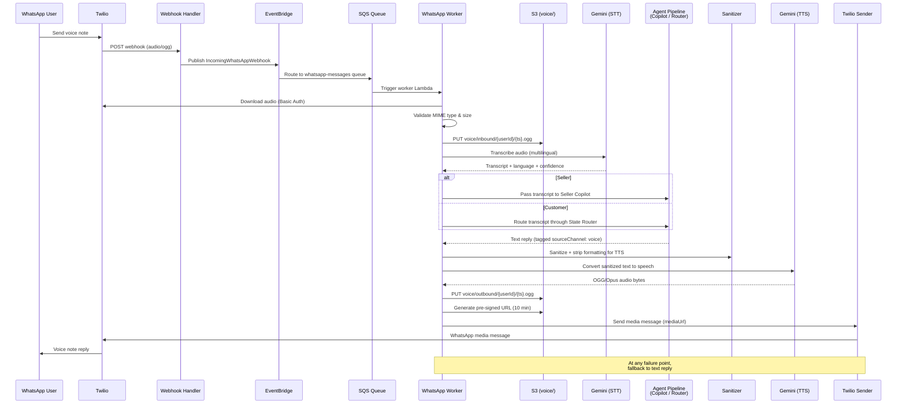
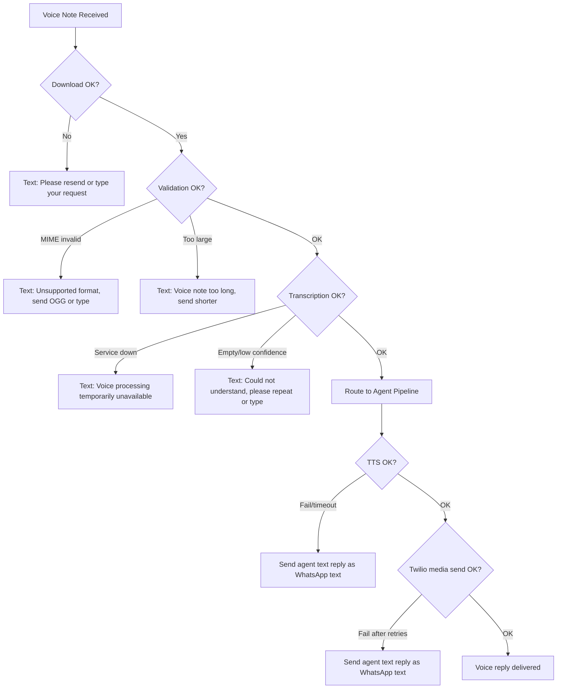

# Design Document: WhatsApp Voice Pipeline

## Overview

The WhatsApp Voice Pipeline extends VyaparGyan's existing WhatsApp messaging channel with end-to-end voice note support. When a seller or customer sends a voice note, the system downloads the audio from Twilio, transcribes it via Gemini, feeds the transcript into the existing agent/copilot pipeline, generates a spoken reply via Gemini TTS, and delivers the voice reply back through Twilio as a WhatsApp audio message.

The design follows an additive approach — voice processing is layered onto the existing Twilio webhook → EventBridge → SQS → worker architecture without modifying the text message flow. Every stage has a graceful text fallback so users always receive a response.

### Key Design Decisions

1. **Inline processing in WhatsApp Worker** — Voice transcription and TTS happen directly in the worker Lambda rather than being offloaded to the media-processing-worker. This keeps the voice round-trip latency low (single Lambda invocation) and avoids an extra SQS hop. The existing media-processing-worker continues to handle customer-only voice-to-cart flows.

2. **Gemini for both STT and TTS** — Reuses the existing Gemini adapter for transcription and adds a new `textToSpeech` method. This avoids introducing a new AI provider and keeps credentials management simple.

3. **S3 as audio relay** — Outbound TTS audio is stored in S3 with a pre-signed URL that Twilio fetches. Inbound audio is also stored in S3 for traceability. Both use a `voice/` prefix with 24-hour lifecycle expiry.

4. **`sourceChannel` tagging** — Agent replies originating from voice input are tagged with `sourceChannel: 'voice'` so the sender service knows to generate a TTS reply instead of a text-only reply.

5. **Seller voice support** — Unlike the existing media-processing-worker (customer-only), this pipeline supports both seller copilot commands and customer shopping flows via voice.

## Architecture

### Data Flow



### Component Placement

The voice pipeline lives entirely within the existing WhatsApp worker Lambda (`worker.ts`). No new Lambda functions are needed. The changes are:

| Component | File | Change Type |
|-----------|------|-------------|
| Audio type detection | `webhook.ts` | No change (already detects `audio/`) |
| Voice processing orchestrator | `worker.ts` | Modify `handleVoiceNote` for sellers, add seller voice routing |
| Audio validation | `worker.ts` | New `validateAudio()` helper |
| Gemini transcription | `gemini-adapter.ts` | Modify `transcribeVoiceNote` to return confidence score |
| Gemini TTS | `gemini-adapter.ts` | New `textToSpeech()` method |
| TTS sanitization | `whatsapp-sanitizer.ts` | New `sanitizeForTTS()` function |
| Voice media send | `twilio-adapter.ts` | Already supports `mediaUrl` parameter |
| Voice message persistence | `whatsapp-sender.ts` | Add `messageType: 'audio'` support |
| S3 lifecycle rule | `storage-stack.ts` | Add `voice/` prefix 24h expiry rule |
| CloudWatch metrics | `worker.ts` | New voice pipeline metrics |


## Components and Interfaces

### 1. Webhook Handler (`webhook.ts`) — No Changes Required

The existing `transformTwilioToWhatsAppFormat` already detects `audio/` MIME types and sets `messageType: 'audio'` with the media URL. No modifications needed.

### 2. WhatsApp Worker — Voice Orchestrator (`worker.ts`)

The existing `handleVoiceNote` function is refactored to support both sellers and customers with the full voice round-trip pipeline.

```typescript
/** Voice pipeline configuration */
const VOICE_CONFIG = {
  maxAudioSizeBytes: 16 * 1024 * 1024, // 16 MB
  supportedMimeTypes: ['audio/ogg', 'audio/opus', 'audio/mpeg', 'audio/mp4'],
  maxTTSTextLength: 500,
  presignedUrlExpirySeconds: 600, // 10 minutes
  s3InboundPrefix: 'voice/inbound',
  s3OutboundPrefix: 'voice/outbound',
} as const;

interface VoiceContext {
  message: any;
  userId: string;
  phoneNumber: string;
  userRole: 'seller' | 'customer';
  requestId: string;
  // Seller-specific fields (populated when userRole === 'seller')
  userProfile?: any;
}

/** Validate inbound audio MIME type and file size */
function validateAudio(
  mimeType: string,
  sizeBytes: number,
): { valid: boolean; reason?: string } {
  if (!VOICE_CONFIG.supportedMimeTypes.includes(mimeType as any)) {
    return { valid: false, reason: 'unsupported_mime_type' };
  }
  if (sizeBytes > VOICE_CONFIG.maxAudioSizeBytes) {
    return { valid: false, reason: 'file_too_large' };
  }
  return { valid: true };
}
```

**Updated `handleSellerMessage`** — When `message.type === 'audio'`, route to the voice pipeline instead of extracting `message.text.body`:

```typescript
// In handleSellerMessage:
if (message.type === 'audio') {
  await handleVoiceNote({
    message, userId, phoneNumber,
    userRole: 'seller', requestId, userProfile,
  });
  return;
}
```

**Updated `handleVoiceNote`** — Full voice round-trip:

```typescript
async function handleVoiceNote(context: VoiceContext): Promise<void> {
  const { message, userId, phoneNumber, userRole, requestId } = context;
  const pipelineStart = Date.now();

  // 1. Download audio from Twilio
  const mediaUrl = resolveMediaUrl(message);
  // ... download with fallback on failure

  // 2. Validate MIME type and size
  const validation = validateAudio(mimeType, buffer.length);
  // ... send text fallback on validation failure

  // 3. Store inbound audio in S3
  const inboundKey = `${VOICE_CONFIG.s3InboundPrefix}/${userId}/${Date.now()}.ogg`;
  // ... PutObject with tags { mediaType: 'voice', direction: 'inbound' }

  // 4. Transcribe via Gemini
  const transcript = await geminiAdapter.transcribeVoiceNote(buffer, 'auto', []);
  // ... fallback on empty/low-confidence transcript

  // 5. Route transcript to agent pipeline
  let agentReply: string;
  if (userRole === 'seller') {
    agentReply = await handleSellerWhatsAppCommand({ ... transcript.text ... });
  } else {
    agentReply = await routeTranscriptAsText({ ... transcript.text ... });
  }

  // 6. Sanitize reply for TTS
  const ttsInput = sanitizeForTTS(agentReply, userRole);

  // 7. Generate TTS audio via Gemini
  const ttsAudio = await geminiAdapter.textToSpeech(ttsInput, transcript.detectedLanguage);
  // ... fallback to text on TTS failure

  // 8. Store outbound audio in S3 and generate pre-signed URL
  const outboundKey = `${VOICE_CONFIG.s3OutboundPrefix}/${userId}/${Date.now()}.ogg`;
  // ... PutObject + getSignedUrl

  // 9. Send voice reply via Twilio
  await twilioAdapter.sendWhatsAppMessage(phoneNumber, '', presignedUrl);
  // ... fallback to text on send failure

  // 10. Emit metrics
  publishLatencyMetric('VoicePipelineE2ELatency', Date.now() - pipelineStart);
}
```

### 3. Gemini Adapter — New TTS Method (`gemini-adapter.ts`)

```typescript
interface TranscriptionResult {
  transcript: string;
  detectedLanguage: string;
  confidence: number; // 0-100
  products: Array<{ name: string; quantity: number; confidence: number }>;
}

/** New method: Convert text to speech audio via Gemini */
async textToSpeech(
  text: string,
  language: string,
  voiceStyle: 'conversational' = 'conversational',
): Promise<Buffer> {
  // Uses Gemini's multimodal generation with TTS output config
  // Returns OGG/Opus audio buffer
  // Throws on failure (caller handles fallback)
}
```

The existing `transcribeVoiceNote` method is updated to return a `confidence` score (0-100) at the transcript level, in addition to per-product confidence scores.

### 4. TTS Sanitizer (`whatsapp-sanitizer.ts`)

New `sanitizeForTTS` function that extends the existing sanitization with speech-specific rules:

```typescript
/**
 * Sanitize text for TTS conversion.
 * Strips WhatsApp formatting markers that don't translate to speech.
 */
export function sanitizeForTTS(
  text: string,
  audience: MessageAudience = 'customer',
): string {
  // 1. Apply existing sanitizeForWhatsApp rules
  let cleaned = sanitizeForWhatsApp(text, audience);

  // 2. Remove WhatsApp bold markers: *text* → text
  cleaned = cleaned.replace(/\*([^*]+)\*/g, '$1');

  // 3. Remove emoji bullet prefixes: "📋 " → ""
  cleaned = cleaned.replace(/^[\u{1F300}-\u{1FAFF}\u{2600}-\u{27BF}]\s*/gmu, '');

  // 4. Remove numbered list formatting: "1. " → ""
  cleaned = cleaned.replace(/^\d+\.\s+/gm, '');

  // 5. Truncate to 500 chars for concise voice replies
  if (cleaned.length > 500) {
    cleaned = cleaned.substring(0, 497) + '...';
  }

  // 6. Fallback if empty
  if (!cleaned || cleaned.length < 2) {
    return audience === 'seller'
      ? "Sorry, I couldn't process that right now. Please try again."
      : "Sorry, something went wrong. Please try again in a moment.";
  }

  return cleaned;
}
```

### 5. WhatsApp Sender — Audio Message Support (`whatsapp-sender.ts`)

The `sendMessage` method is extended to support a new `AudioMessage` type:

```typescript
export interface AudioMessage {
  type: 'audio';
  mediaUrl: string; // Pre-signed S3 URL
  fallbackText: string; // Text to send if media delivery fails
}

export type OutboundMessage = TextMessage | InteractiveButtonMessage | InteractiveListMessage | AudioMessage;
```

When `message.type === 'audio'`, the sender calls `twilioAdapter.sendWhatsAppMessage` with the `mediaUrl` parameter and persists the message with `messageType: 'audio'`.

### 6. S3 Lifecycle Rule (`storage-stack.ts`)

A new lifecycle rule on the `productImagesBucket` (which is reused for voice media):

```typescript
{
  id: 'expire-voice-media',
  enabled: true,
  prefix: 'voice/',
  expiration: Duration.days(1), // 24-hour cleanup
  tagFilters: { mediaType: 'voice' },
}
```

### 7. CloudWatch Metrics

New metrics emitted by the voice pipeline:

| Metric Name | Unit | Dimensions | Description |
|-------------|------|------------|-------------|
| `VoiceMessagesReceived` | Count | `Channel: whatsapp`, `Role: seller\|customer` | Inbound voice notes |
| `VoiceTranscriptionLatency` | Milliseconds | `Channel: whatsapp` | Gemini STT call duration |
| `VoiceTTSLatency` | Milliseconds | `Channel: whatsapp` | Gemini TTS call duration |
| `VoicePipelineE2ELatency` | Milliseconds | `Channel: whatsapp` | Full voice round-trip |
| `VoiceFallbackToText` | Count | `Stage: download\|validation\|transcription\|tts\|delivery` | Fallback events by stage |


## Data Models

### Transcript Result (Gemini Adapter Response)

```typescript
interface TranscriptionResult {
  /** Full transcription text */
  transcript: string;
  /** Detected spoken language (e.g., 'Hindi', 'English') */
  detectedLanguage: string;
  /** Overall transcript confidence score (0-100) */
  confidence: number;
  /** Extracted product intents (for customer shopping flow) */
  products: Array<{
    name: string;
    quantity: number;
    confidence: number;
  }>;
}
```

### Voice Pipeline Context (Internal)

```typescript
interface VoiceContext {
  message: any; // WhatsApp message object with audio.url, audio.mime_type
  userId: string;
  phoneNumber: string;
  userRole: 'seller' | 'customer';
  requestId: string;
  userProfile?: any; // Full user profile for seller routing
}
```

### Audio Validation Result

```typescript
interface AudioValidationResult {
  valid: boolean;
  reason?: 'unsupported_mime_type' | 'file_too_large';
}
```

### S3 Object Tagging

All voice media objects stored in S3 carry these tags:

| Tag Key | Values | Purpose |
|---------|--------|---------|
| `mediaType` | `voice` | Identifies voice media for lifecycle rules |
| `direction` | `inbound` \| `outbound` | Distinguishes user audio from TTS audio |
| `userId` | User ID string | Traceability |
| `requestId` | Request ID string | Correlation with logs |

### S3 Key Patterns

```
voice/inbound/{userId}/{timestamp}.ogg   — Downloaded user voice note
voice/outbound/{userId}/{timestamp}.ogg  — Generated TTS reply audio
```

### Outbound Audio Message (WhatsApp Sender)

```typescript
interface AudioMessage {
  type: 'audio';
  mediaUrl: string;      // Pre-signed S3 URL (10-min expiry)
  fallbackText: string;  // Text reply if media send fails
}
```

### Message Repository Record (for audio messages)

The existing message repository record is extended with audio-specific fields:

```typescript
{
  sessionId: string;
  waMessageId: string;
  direction: 'outbound';
  messageType: 'audio';        // New value alongside 'text' and 'interactive'
  content: {
    mediaUrl: string;          // S3 pre-signed URL used for delivery
    s3Key: string;             // Permanent S3 key for traceability
    fallbackText: string;      // Text that was converted to speech
  };
  waStatus: 'sent' | 'failed';
}
```


## Correctness Properties

*A property is a characteristic or behavior that should hold true across all valid executions of a system — essentially, a formal statement about what the system should do. Properties serve as the bridge between human-readable specifications and machine-verifiable correctness guarantees.*

### Property 1: Audio validation accepts exactly the supported formats and sizes

*For any* MIME type string and file size in bytes, `validateAudio(mimeType, size)` returns `{ valid: true }` if and only if the MIME type is one of `audio/ogg`, `audio/opus`, `audio/mpeg`, `audio/mp4` AND the size is at most 16,777,216 bytes (16 MB). Otherwise it returns `{ valid: false }` with the appropriate reason.

**Validates: Requirements 2.1, 2.2**

### Property 2: S3 key pattern correctness for voice media

*For any* userId string and direction (`inbound` or `outbound`), the generated S3 key matches the pattern `voice/{direction}/{userId}/{timestamp}.ogg` where timestamp is a positive integer. Inbound audio is stored under `voice/inbound/` and outbound TTS audio under `voice/outbound/`.

**Validates: Requirements 1.3, 6.3, 9.1**

### Property 3: Low-confidence or empty transcripts trigger clarification, not agent routing

*For any* transcription result where `confidence < 30` or `transcript` is an empty string, the voice pipeline must not route the transcript to the agent pipeline and must instead produce a clarification text message.

**Validates: Requirements 3.3**

### Property 4: Transcription result always contains required fields with valid ranges

*For any* valid Gemini response parsed by the adapter, the returned `TranscriptionResult` has a `transcript` of type string, a `detectedLanguage` of type string, and a `confidence` that is a number between 0 and 100 inclusive.

**Validates: Requirements 3.2**

### Property 5: Voice transcripts are routed to the correct agent pipeline based on user role

*For any* user with a valid transcript, if the user's role is `seller` the transcript is passed to the Seller Copilot, and if the user's role is `customer` the transcript is routed through the State Router. The routing decision depends solely on the user's role.

**Validates: Requirements 4.1, 4.2, 10.1, 10.2**

### Property 6: Voice-originated replies are tagged with sourceChannel voice

*For any* agent reply produced from a voice-originated message, the reply carries a `sourceChannel: 'voice'` tag. Replies from text-originated messages do not carry this tag.

**Validates: Requirements 4.4**

### Property 7: TTS sanitization removes all machine artifacts and WhatsApp formatting

*For any* input string, `sanitizeForTTS` removes all JSON objects, XML tags, debug strings, stack traces, internal error messages, bold asterisk markers (`*text*`), emoji bullet prefixes, and numbered-list formatting (`1. `). The output contains none of these patterns.

**Validates: Requirements 5.1, 5.2**

### Property 8: TTS sanitization output is bounded and non-empty

*For any* input string, the output of `sanitizeForTTS` is at most 500 characters long. If the sanitized result would be empty or shorter than 2 characters, the output is a role-appropriate fallback message that is at least 2 characters long.

**Validates: Requirements 5.3, 5.4**

### Property 9: Sanitization audience matches sender role

*For any* voice message, when the sender role is `seller` the sanitizer is called with audience `seller`, and when the sender role is `customer` the sanitizer is called with audience `customer`. The audience parameter is never mismatched with the sender role.

**Validates: Requirements 10.3**

### Property 10: Audio outbound messages are persisted with correct messageType

*For any* outbound voice reply successfully sent via Twilio, the persisted message record has `messageType: 'audio'` and includes the session ID, media URL, and S3 key.

**Validates: Requirements 7.2**

### Property 11: S3 voice objects are tagged with mediaType and direction

*For any* audio file stored in S3 by the voice pipeline, the object tags include `mediaType: 'voice'` and `direction` set to either `'inbound'` or `'outbound'` matching the actual direction of the audio.

**Validates: Requirements 9.3**

### Property 12: Webhook audio detection round-trip

*For any* Twilio webhook payload where `MediaContentType0` starts with `audio/`, the `transformTwilioToWhatsAppFormat` function produces a message with `type: 'audio'` and an `audio.url` field containing the original media URL. For payloads where `MediaContentType0` does not start with `audio/`, the message type is not `audio`.

**Validates: Requirements 1.1**

### Property 13: Text message processing is unchanged by voice pipeline addition

*For any* text-type WhatsApp message, the processing path through the worker (role detection, session resolution, state routing, sanitization, and response sending) produces identical results whether or not the voice pipeline code is present. Text messages never trigger voice processing logic.

**Validates: Requirements 12.1, 12.2, 12.3, 12.4**


## Error Handling

The voice pipeline follows a cascading fallback strategy — every failure point degrades gracefully to a text response so the user is never left without an answer.

### Fallback Chain



### Error Categories and Responses

| Stage | Error | User-Facing Response | Metric |
|-------|-------|---------------------|--------|
| Download | Twilio URL unreachable / non-200 | "I couldn't process that voice note. Could you try sending it again or type your request?" | `VoiceFallbackToText{Stage=download}` |
| Validation | Unsupported MIME type | "That audio format isn't supported. Please send an OGG voice note or type your request." | `VoiceFallbackToText{Stage=validation}` |
| Validation | File > 16 MB | "That voice note is too long. Please send a shorter message or type your request." | `VoiceFallbackToText{Stage=validation}` |
| Transcription | Gemini unavailable / timeout | "Voice processing is temporarily unavailable. Please type your request instead." | `VoiceFallbackToText{Stage=transcription}` |
| Transcription | Empty or confidence < 30 | "I couldn't quite understand that. Could you repeat it or type your request?" | `VoiceFallbackToText{Stage=transcription}` |
| TTS | Gemini TTS fails / timeout | Send agent's text reply as standard WhatsApp text | `VoiceFallbackToText{Stage=tts}` |
| Delivery | Twilio media send fails after 3 retries | Send agent's text reply as standard WhatsApp text | `VoiceFallbackToText{Stage=delivery}` |
| S3 | PutObject fails | Log error, continue with text fallback | `VoiceFallbackToText{Stage=storage}` |

### Timeout Budget

The entire voice pipeline must complete within the WhatsApp worker Lambda's 60-second timeout. Budget allocation:

| Stage | Budget | Notes |
|-------|--------|-------|
| Audio download from Twilio | 5s | Authenticated HTTP fetch |
| Audio validation | <1s | In-memory MIME/size check |
| S3 inbound upload | 3s | Depends on file size |
| Gemini transcription | 15s | Largest variable cost |
| Agent pipeline processing | 10s | Seller copilot or state router |
| TTS sanitization | <1s | String processing |
| Gemini TTS generation | 10s | Second largest variable cost |
| S3 outbound upload + presign | 3s | Small audio file |
| Twilio media send | 5s | With retry budget |
| **Total budget** | **~52s** | **8s buffer before Lambda timeout** |

If any stage exceeds its budget, the pipeline falls back to text at that point rather than risking a Lambda timeout.

### Error Propagation Rules

1. **Never throw from the voice pipeline** — All errors are caught and result in a text fallback message. The worker Lambda should not fail due to voice processing errors.
2. **Always send a response** — Even if every stage fails, the user receives a text message asking them to type their request.
3. **Log every failure** — Each catch block logs the stage name, error message, userId, and requestId for debugging.
4. **Emit fallback metrics** — Every fallback event publishes a `VoiceFallbackToText` metric with the stage dimension for monitoring.


## Testing Strategy

### Dual Testing Approach

The voice pipeline requires both unit tests and property-based tests for comprehensive coverage:

- **Unit tests** — Verify specific examples, edge cases, integration points, and error conditions
- **Property-based tests** — Verify universal properties across randomly generated inputs using `fast-check`

### Property-Based Testing Configuration

- **Library**: `fast-check` (already available in the project's Jest ecosystem)
- **Minimum iterations**: 100 per property test
- **Tag format**: `Feature: whatsapp-voice-pipeline, Property {N}: {title}`
- Each correctness property from the design is implemented as a single `fast-check` property test

### Property Tests

Each of the 13 correctness properties maps to one property-based test:

| Property | Test Description | Generator Strategy |
|----------|-----------------|-------------------|
| P1: Audio validation | Generate random MIME types and file sizes, verify validation result matches spec | `fc.tuple(fc.string(), fc.nat())` with known-good MIME types mixed in |
| P2: S3 key pattern | Generate random userIds and directions, verify key matches regex pattern | `fc.tuple(fc.string(), fc.constantFrom('inbound', 'outbound'))` |
| P3: Confidence gating | Generate transcripts with random confidence 0-100 and random text, verify routing decision | `fc.record({ confidence: fc.nat(100), transcript: fc.string() })` |
| P4: Transcription result shape | Generate random Gemini-like JSON responses, verify parsed result has correct types and ranges | `fc.record(...)` mimicking Gemini response shapes |
| P5: Role-based routing | Generate random user roles and transcripts, verify correct pipeline is invoked | `fc.tuple(fc.constantFrom('seller', 'customer'), fc.string())` |
| P6: Voice source tagging | Generate messages with random sourceChannel values, verify tagging logic | `fc.constantFrom('voice', 'text', undefined)` |
| P7: TTS sanitization content | Generate strings with embedded JSON, XML, formatting markers, verify all removed | `fc.string()` with injected artifacts |
| P8: TTS sanitization bounds | Generate arbitrary strings, verify output length ≤ 500 and ≥ 2 (or fallback) | `fc.string()` |
| P9: Audience matching | Generate random roles, verify sanitizer audience parameter matches | `fc.constantFrom('seller', 'customer')` |
| P10: Audio message persistence | Generate audio message payloads, verify persisted record has messageType 'audio' | `fc.record(...)` |
| P11: S3 object tagging | Generate random directions and store operations, verify tags are correct | `fc.constantFrom('inbound', 'outbound')` |
| P12: Webhook audio detection | Generate Twilio payloads with random MediaContentType0 values, verify type detection | `fc.record(...)` with random MIME types |
| P13: Text message preservation | Generate text-type messages, verify they never enter voice processing | `fc.record(...)` with type='text' |

### Unit Tests

Unit tests cover specific examples, integration points, and edge cases not suited for property testing:

| Test Area | Test Cases |
|-----------|-----------|
| Audio download | Successful download with auth header, 404 response triggers fallback, timeout triggers fallback |
| Gemini transcription | Successful multilingual transcription, empty response handling, API timeout handling |
| Gemini TTS | Successful audio generation, language passthrough, API failure fallback |
| S3 operations | Inbound upload with correct tags, outbound upload with correct tags, pre-signed URL generation with 10-min expiry |
| Twilio delivery | Media message send with mediaUrl, retry on 5xx, fallback to text on persistent failure |
| Fallback chain | Each stage failure triggers correct fallback message, full chain completes within timeout budget |
| Metrics | Correct metric names and dimensions emitted at each stage |
| CDK lifecycle rule | S3 lifecycle rule for `voice/` prefix with 24h expiry |

### Test File Organization

```
services/api/src/
├── handlers/whatsapp/__tests__/
│   ├── voice-pipeline.test.ts          # Unit tests for voice orchestrator
│   └── voice-pipeline.property.test.ts # Property tests (P1-P13)
├── utils/__tests__/
│   └── whatsapp-sanitizer.test.ts      # Extended with TTS sanitization tests
└── adapters/__tests__/
    └── gemini-adapter.test.ts          # Extended with TTS method tests
```

### Mocking Strategy

- **Gemini API** — Mock `GoogleGenerativeAI` client to return controlled transcription and TTS responses
- **Twilio API** — Mock `twilio.messages.create` to verify media message parameters
- **S3** — Mock `S3Client.send` to capture PutObject commands and verify keys/tags
- **DynamoDB** — Mock `getUserByPhone` and `putMessage` for user resolution and message persistence
- **WhatsApp Sender** — Mock `sendMessage` to capture outbound messages and verify type/content
